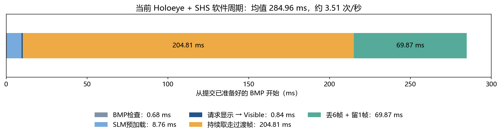
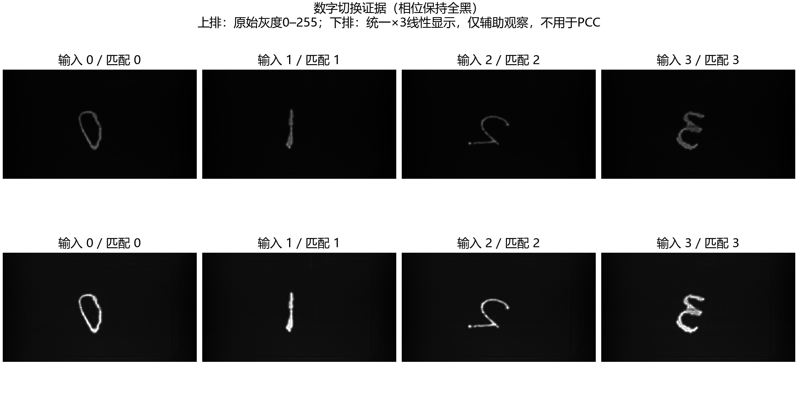
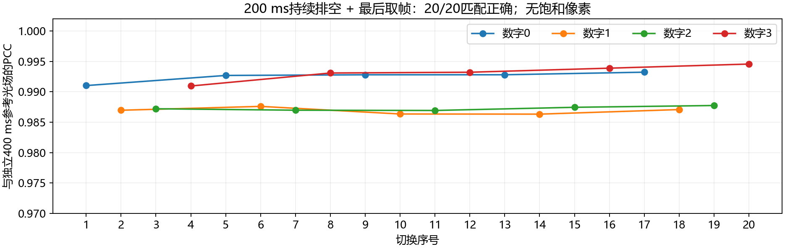

# SLM → 光路 → SHS相机：时序说明与实测记录

记录日期：2026-09-12。对象：师弟电脑上的 Holoeye HE PLUTO-2.1 振幅SLM、SHS-202-M、Magewell Flex I/O Quad CXP-12 Enhanced。相位SLM由实验人员保持全黑，本次没有改变相位。另一套高速SLM仅查手册/出厂报告，没有在本次接线中实测。

## 1. 先看结论：四种速度不是一回事

|口径|结果|应如何使用|
|---|---:|---|
|当前 Holoeye + 相机：已生成BMP → 原始图进入CPU内存|平均 **284.963 ms/张，3.509次/秒**|本次20次数字切换的实际软件周期，不是完整神经网络推理时间|
|相机单独：获取/归还DMA缓冲，不复制像素|约 **2250帧/秒**，三轮各1000帧，帧ID无跳号|仅证实短时缓冲交付吞吐；不是2250次推理/秒，也未逐帧验证像素完整性|
|相机单独：正式安全读取路径，复制全幅像素并检查完整性|三轮 **709.6 / 494.2 / 772.1帧/秒**，均有跳帧|当前Python实现的实测范围；不能宣称已完成满速逐帧处理|
|当前Holoeye标准输入接口|60 Hz，周期16.667 ms|硬件输入刷新能力，不代表液晶16.667 ms内一定稳定|
|高速Meadowlark接口 + SHS规格约束|标准刷新边界约1436.1 Hz；相机满幅2250 fps|仅接口瓶颈上界，不能直接写成完整光电推理速度|

**相机100 fps表示相机每10 ms产生一帧；软件200 ms等待表示换SLM后暂不接受这些过渡帧。** 等待期间相机还在拍，我们持续读取并丢弃；最后再丢6帧、保留第7帧。因此当前软件输出仅约3.51张/秒，两者并不矛盾。

Holoeye 60 Hz来自[官方PLUTO-2.1规格](https://holoeye.com/products/spatial-light-modulators/pluto-2-1-lcos-phase-only-refl/)；Meadowlark的696 μs刷新边界和1436.1 Hz来自[官方1024×1024数据手册，第5页](https://www.meadowlark.com/wp-content/uploads/2022/03/SLM-HSP-UHSP-1024-x-1024-Data-Sheet-Rev.0822.pdf)。精确设备响应另见下文出厂报告，不混为同一指标。

## 2. 从下发一张图开始，完整发生了什么

```text
上游网络计算，生成BMP（本次周期计时之前，未计入）
  ↓ 开始本次计时
检查BMP → 预加载到显示端 → 请求显示并等待SDK Visible
  ↓
持续从相机取帧并丢弃，直到200 ms窗口结束
  ↓
再取7帧：丢弃前6帧，复制并检查最后1帧
  ↓ 结束本次计时：1920×1080 Mono8原始图已在CPU内存
四点校正/478×478重采样 → 电子处理 → 下一个SLM输入
（以上后处理本次未计入，ROI尚未完成；磁盘保存也不在本次周期内）
```



|步骤 / 记录字段|平均耗时|说明|
|---|---:|---|
|`bmp_validate_ms`|0.683 ms|检查1920×1080、8-bit灰度BMP，不包含生成BMP|
|`slm_preload_ms`|8.759 ms|当前代码每次调用预加载，涉及文件/SDK/显示资源准备；不是纯PCIe或HDMI线传输延迟|
|`slm_show_to_visible_ms`|0.842 ms|调用显示至SDK返回Visible，不是液晶光学稳定时间|
|`settle_actual_ms`|204.809 ms|请求200 ms，末次阻塞取帧跨过截止时间，因此实际稍长；期间持续排空过渡帧|
|`final_fresh_ms`|69.870 ms|100 fps下丢6帧、留1帧，约7×10 ms；含最后原图复制/检查|
|`capture_total_ms`|**284.963 ms**|以上五项相加，P95=290.352 ms，范围279.430～290.547 ms|

旧字段 `display_visible_ms` 包含“预加载+显示到Visible”，本次平均9.601 ms；不要再与这两个分项相加。`visible_to_capture_ms` 包含“等待+最后取帧”，平均274.679 ms，也不是相机曝光时间。

### Visible、曝光、光电转换分别属于谁？

- **Visible属于Holoeye SDK显示状态**。它说明显示流程已到该状态，不是光电探测器测出的液晶稳定时刻，也不是SHS曝光开始信号。显示端0.842 ms返回不意味着面板能以1188 Hz稳定切图。
- **150 μs=0.150 ms属于相机曝光积分时间**，即一帧接收光能的窗口。100 fps的10 ms是帧周期，不是曝光10 ms。未接硬触发时，该窗口与SLM更新不自动锁相。
- **液晶电光响应**：电压变化后液晶重新取向，光场随之变化。它在软件等待期间发生，但不能把整个200 ms都归因于液晶。
- **相机光电转换**：曝光期间光子形成电荷；后续还需读出、ADC、CXP传输和DMA。不是在“曝光时间”之外再凭空加一个同样长的光电转换时间。现有手册未单列这些环节的端到端延迟。
- 一次开相机有2秒预热，**只在开流时一次**，不属于每张输入的周期。

### 为什么仍保留200 ms？能不能更短？

之前直接sleep、醒来仅丢6帧会取到旧图；现在已改为等待期间持续排空。既有左右交替短测中，0/20/50/100 ms分别只有1/4、3/4、2/4、3/4正确，200和400 ms均4/4正确。随后200 ms重复20次均正确。本次数字又确认20/20正确。

因此200 ms是**当前显示、队列、相机读取组合下已验证的工作点**，不是测出的物理最小响应。最后丢6帧的70 ms也是软件保守策略，未来可以研究减少；本次没有直接删掉它后宣称仍可靠。换相位、刷新率、相机帧率或复杂输入后，应重新验证。

## 3. 手写数字切换证据

相机1920×1080、Mono8、100 fps、150 μs、Gain_X4，InternalSync、Normal图像模式。使用已有 `A_DIGIT_0.bmp` 至 `A_DIGIT_3.bmp`，输入SLM仍为1920×1080。先为每个数字独立采一张400 ms等待参考，再按0→1→2→3循环5遍，在200 ms等待条件下采20张。

比较的是**实际图对该数字独立参考光场的PCC**，四个参考中PCC最大者作为时序身份。没有用理论图修改实际图，没有配准/翻转/降噪，没有选择性删除失败样本。20张全部纳入统计。相位保持全黑，所以这不是加载训练相位后的MNIST分类准确率。

- 身份匹配20/20，最低同数字PCC=0.9863322973；本次未观察到错帧。
- 饱和像素比例最大0。
- 循环5.699571秒，20/总时长=3.509036次/秒。
- 这是有限样本验证，不证明所有输入、所有曝光、长期运行都零错帧。





完整原始记录：`results/digit_timing_20260912/report.json`。实验电脑保存24张短测PNG，本地保存4张测试图和4张参考图；正式推理的最小存储策略没有改变。PNG在计时循环结束后才写盘，诊断全幅PNG单张平均33.189 ms，**不能把它当正式478×478保存耗时**。

## 4. 相机不受SLM限制时，到底能多快？

测试将相机设为2250 fps、150 μs，1920×1080 Mono8，SLM不切换；每轮初始化预热后，再以同一种读取方法预热至少2秒，然后测1000帧。两种方法各3轮，结束均恢复相机原设置。

|读取方法|第1轮 fps / 跳过ID数|第2轮|第3轮|
|---|---:|---:|---:|
|完整原图复制+解码+完整性检查|709.586 / 2170|494.236 / 3549|772.096 / 1912|
|仅SDK缓冲get/return+缓存元信息|2250.062 / 0|2250.570 / 0|2252.380 / 0|

第二行统一表述为“约2250 fps”。短窗口边界/调度导致0.1%左右差异，不能声称突破传感器设定帧率。第一行丢的是未保留的传感器帧，接收到的帧通过完整性检查；仍不能宣称连续无丢帧。

缓冲模式不复制2 MB像素、不做逐帧完整性检查、不做GPU推理/校正/保存。它证明驱动缓冲交付链路有能力接近规格吞吐，**还不等于正式任务可以这样跑**。当前安全原图读取实测最高约772 fps，Windows负载影响明显，不称绝对硬件极限。

最初从慢速copy预热直接切到buffer计时得到约3021 fps，是积压帧被快速读出的过渡段，已废弃为相机帧率证据。现已在 `benchmark.py` 加入同模式2秒预热。旧记录仍保留以便审计，不挑最高的异常值。

相机手册第25页规定：SHS-202满幅1920×1080为2250 fps；69200 fps需要更小ROI，**不适用于当前全幅**。最短曝光100 ns只是曝光下限，不是图像输出时间。每帧周期1/2250=0.444444 ms；没有硬触发时还可能等待下一个曝光窗口，排队和主机复制另计。

## 5. 手册层面的理论：当前低速与高速两个版本

### 5.1 已查到的硬参数

|环节|当前Holoeye|高速Meadowlark SLM 7930|
|---|---|---|
|型号/像素|HE PLUTO-2.1，1920×1080，8 μm|UHSP1K-488-850-PC8，1024×1024，17 μm|
|标准输入/刷新|60 Hz；16.667 ms/周期|PCIe刷新边界0.696 ms，约1436.1 Hz|
|电光响应|当前资料未给这块面板的保证值，不能填16.667或200 ms|出厂实测 **0.53 ms**；532 nm保证 **≤0.6 ms**|
|报告中的Switching Frequency|不适用|实测1886 Hz、保证≥1666 Hz；数值约为液晶响应倒数，不能替代接口刷新规格|
|相机共同条件|SHS 1920×1080满幅2250 fps、周期0.444444 ms；本次曝光0.150 ms|同左|
|10 cm自由空间传播|约0.3336 ns = 0.0000003336 ms|同左|

SLM 7930出厂报告未标明测试温度和所有灰阶转换的稳定判据；不要仅凭LUT文件名里的70c断言本次在同温度。官方数据手册的响应测试采用相位光栅/平面切换及10%～90%光强判据，因此也不等于任意振幅图案达到1%误差的稳定时间。响应会与温度、驱动、波长及转换图案有关。[官方响应测试说明，第2页](https://www.meadowlark.com/wp-content/uploads/2022/03/SLM-HSP-UHSP-1024-x-1024-Data-Sheet-Rev.0822.pdf)

Meadowlark `ImageWriteComplete` 是“允许下一次DMA/避免部分图像”的硬件存储状态。随设备附带的PCIe User Manual Rev.1.12，印刷第25页（PDF第30页）说明1024×1024在DMA/触发后约0.696 ms就绪；**它同样不直接测量液晶光场已经达到稳定**。触发输出也不是光学稳定证据。

### 5.2 必须区分：一张图的延迟 vs 连续处理吞吐

一张依赖上一步结果的新图，理想的分解为：

```text
主机准备/传输
  + 等待更新边界、电子寻址（各项可能重叠）
  + 有效电光稳定时间
  + 10cm传播
  + 相机曝光积分
  + 曝光结束后读出/ADC/传输至可用内存的剩余时间
  + 后端计算（若统计完整任务）
```

**不应把“相机帧周期0.444 ms”当额外的完整读出延迟直接相加。** 读出与后续帧曝光可能重叠；也不应把SLM帧周期无条件当成寻址之外的额外等待。物理过程重叠情况需要同步信号/示波器测定。

可报告的接口约束上界（不是已实现速度）：

- 低速SLM：`min(60,2250)=60`个新输入/秒；**≤60次/秒**，实际稳定采集更低。本次工作点3.51次/秒。
- 高速SLM：标准刷新模式 `min(1436.1,2250)=1436.1`个新输入/秒；**≤约1436次/秒**。稳定曝光窗口、相机读出、后端处理会进一步收紧。没有用本机高速SLM实测此数。

为了规划串行“换图→等稳→曝光”的程序，还可给一个**不利用重叠的预算例子**，但不能叫严格理论最短时间：

|假设计算|可列出的部分和|尚缺什么|
|---|---:|---|
|高速：预加载好；计一个0.696 ms电子更新窗口 + 出厂响应0.53 ms + 0.150 ms曝光|**1.376 ms**|未计主机上传、可能的更新边界等待、剩余相机读出/传输/计算；响应与寻址串行是预算假设|
|高速：同上，用0.6 ms响应保证值留预算|**1.446 ms**|同上；不是实测总延迟，也不是严格下界|
|低速：计一个16.667 ms标准输入周期 + 曝光0.150 ms|**16.817 ms + 未知液晶响应**|仍缺传输、等待边界、读出等；帧周期也不等同于单图最短延迟|

因此不要直接把1.376 ms倒数填入“我们的实测速率”，也不要将60 Hz/1436 Hz乘并行视频数后当成包含电子头的实测吞吐。若论文需要严格的“光电周期理论值”，应明确全部假设；若要真实端到端数值，应增加示波器/触发信号测量。

高速改造值得做的顺序：预加载/显存复用 → SLM更新信号关联相机曝光 → 按光学稳定判据设置触发延迟 → 内存直传/减少完整性查询开销 → ROI确认后测电子处理。需要接线时另行确认；本次没有改成外触发模式。

## 6. 给老师记录时使用的表述

> 当前低速Holoeye振幅SLM与SHS高速相机的无硬触发闭环，在150 μs曝光、100 fps相机连续流、200 ms持续排空等待及最终丢6留1策略下，从已准备BMP到主机原图平均284.96 ms，20次数字切换全部匹配参考。相机单独的缓冲交付可达约2250 fps，但安全像素复制路径本次约494～772 fps。高速SLM 7930的出厂液晶响应实测0.53 ms，标准PCIe刷新周期0.696 ms；这些是不同环节的参数，不能直接冒充完整网络推理时间。

## 7. 复现、位置和来源

实验电脑：`E:\code\guest\2026OpticsMoE\ABO_Lab_SHS_8um`。
本地：`C:\Users\Xml12\OneDrive\2026OpticsMoE\ABO_Lab_SHS_8um`。
入口命令见 [COMMAND.md](COMMAND.md) 的“时序分项记录”。数字测试代码commit `94c8db65`；相机同模式预热修正commit `fd0597af`。文档/图表后续提交不改变上述原始记录。

- [精简证据JSON及原始报告SHA](reports/timing_20260912/evidence_summary.json)，逐轮原始数据位于对应 `results` 子目录。
- 数字采集：`digit_timing.py`；相机独立吞吐：`benchmark.py`；计时分项：`slm_camera.py`；图表：`timing_figures.py`。
- 私有出厂报告：`C:\Users\Xml12\OneDrive\2026OpticsModel\实验设备\00-SLM-Meadowlark Optics\Blink Plus\测试报告SLM Test Report- SLM7930.pdf`，第1页，型号/序列号已经视觉核对。
- 同目录 `PCIe User Manual.pdf`，Rev.1.12，印刷第14–15、25页（PDF第19–20、30页）。
- 项目 `vendor/manuals/SHS 硬件使用手册 20260309.pdf` 第25页为满幅速度表，第19–20页为SYNC/EPO触发接口说明。
- 厂商私有PDF不提交GitHub；报告只整理必要参数，不包含SSH密码。计时与图表源代码及精简证据提交专用硬件分支 `hardware/shs-joint-20260912`。
