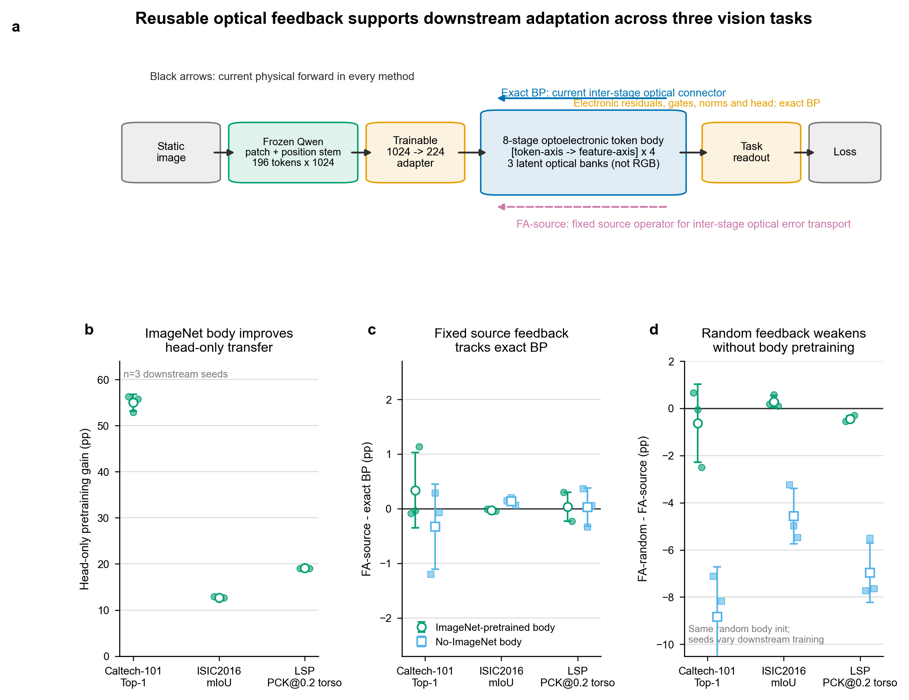
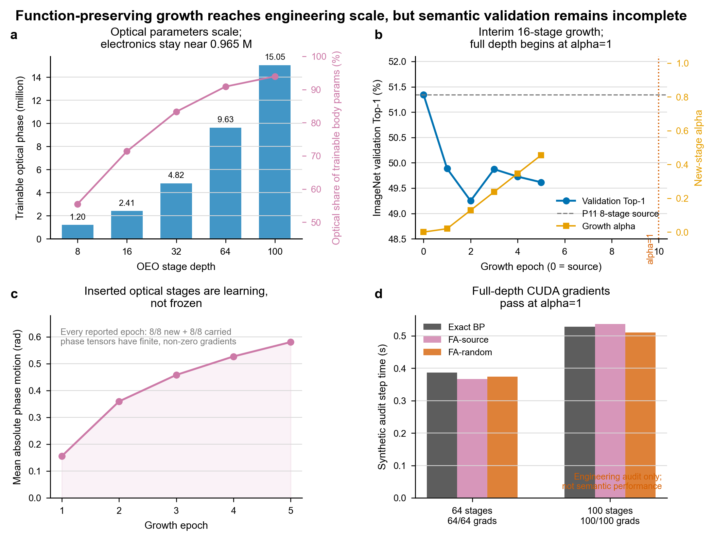

# 面向老师汇报的项目主线、阶段结果与 Nature 风格论文骨架

- 更新：2026-09-01 10:43 CST
- 建议英文题目：**Reusable optical feedback for scalable adaptation of semantics-aligned optoelectronic token backbones**
建议中文题目：**面向可扩展光电 Token 骨干适配的语义轴衍射与光学反馈复用**

> 一句话中心论点：在保留当前光学前向、本层相位导数和轻量电子模块精确反传的条件下，ImageNet 源光学算子可以被冻结并复用为下游适配时的层间误差连接；现有分类、分割和姿态任务结果表明，它能够达到当前算子 exact BP 的性能水平，而无需在每次下游更新后重新获取完整深光路的当前伴随关系。

这份文档把现有实验拆为“主结论、机制解释、规模工程和待验证主张”四层，避免继续把不同含义的指标放进同一个结论。图、源数据和绘图代码均随文档保存，可直接用于组会或论文初稿。

## 1. 先回答现在最关心的三个问题

### 1.1 16 层开展到哪里了

**已经开展，而且是实际 16-stage 计算图的正式 ImageNet 训练；但还没有最终 16 层性能。**

截至 2026-09-01 10:43 CST：

- 服务器进程 `PID 3527459` 存活，使用物理 GPU `0/3/4/5`；
- 正在训练 epoch `6/20`，最近日志约为 `8700/13345` micro-batches；
- 全局有效 batch 为 `24 × 4 ranks × accumulation 2 = 192`；
- 前 10 epoch 把新增 8 层的 `alpha` 从 0.02 渐升到 1，后 10 epoch 才是真正的 full-depth 训练；
- 已完成 epoch 1–5，最近一个完整验证点的 `alpha=0.4556`，因此还没有 `best_full_depth.pt`；
- 8 个新增 phase 和 8 个继承 phase 每轮都具有 finite、non-zero 梯度；epoch 5 的平均相位位移为 `0.581 rad`，说明新增光学层确实在学习。

P11 起点在 P13 中重新评估为 Top-1 `51.346%`、Top-5 `75.560%`。当前已完成的增长轨迹为：

| Epoch | 新层 alpha | Top-1 | Top-5 | 相对 8 层 Top-1 |
|---:|---:|---:|---:|---:|
| 1 | 0.0200 | 49.886% | 74.384% | −1.460 pp |
| 2 | 0.1289 | 49.250% | 73.836% | −2.096 pp |
| 3 | 0.2378 | 49.874% | 74.174% | −1.472 pp |
| 4 | 0.3467 | 49.728% | 74.322% | −1.618 pp |
| 5 | 0.4556 | 49.616% | 74.318% | −1.730 pp |

目前只能下两个结论：

1. 训练、梯度和相位更新是正常的，没有出现深度增长后的数值崩溃；
2. 暂时没有性能提升，且当前仍不是完整 16 层函数，必须等待 epoch 10–20，并补相同数据预算的 8 层 continuation，才能判断“加深是否有效”。

在这两个判据满足前，不应继续把 32/64/100 层语义训练排到 16 层之前。

### 1.2 “电残差 + 光计算”是不是混合精度运算

**不是。** 当前系统没有以 FP32/FP16/BF16/INT8 或不同量化位宽来定义两条路径，因此 `mixed-precision computing` 会让读者理解成数值位宽混合。

推荐术语是：

- 中文：**混合光电计算**、**光电异构协同**、**带轻量电子残差的光学主干**；
- 英文：**hybrid optoelectronic computing**、**optoelectronic co-processing**、**an optical backbone with lightweight electronic residuals**。

只有未来显式规定光学/电子路径的有效位深或量化精度，并报告精度—性能—能耗关系时，才可以在限定语境中使用 `mixed-precision optoelectronic computing`。

同样需要避免另一个误称：门控值 `gate ≥ 0.5` 只是张量融合系数，不等于 50% 光功率、50% MAC、50% 延迟或 50% 能耗。当前“光学占比”只指明确定义口径下的**可训练 body 参数占比**。

### 1.3 现在最清楚的结论是什么

当前最稳的结论不是“随机反馈也很好”，也不是“全网络不需要 BP”，而是：

> **固定的源光学算子反馈在三种下游输出形式上都追平了当前算子 exact BP；随机反馈之所以在联合适配中看起来不差，部分来自 exact-BP 电子残差和任务头的补偿。**

这个结论由四类相互补充的证据支持：三任务 3-seed 主结果、1–7 层梯度余弦、冻结电子 body 的 phase-only 面板，以及 P/E/H 参数移植与 Shapley 审计。

## 2. 系统到底是什么

**图 1｜固定源光学反馈及下游证据。** a，静态图像先经过一次性从 Qwen3-VL checkpoint 提取并冻结的 Patch/Position Stem；这里只包含 patch convolution 和位置编码，不包含 Transformer、attention 或语言模型。`196 × 1024` token 经可训练 `1024→224` adapter 后进入 8-stage 光电 token body。黑色箭头表示所有方法都使用当前物理前向；不同训练方法只改变跨光学 stage 的误差连接。b，ImageNet 训练后的 body 相对 No-ImageNet body 的 head-only 下游增益；圆点为 3 个下游 seed，空心点和误差条为均值±样本 SD。c，FA-source 相对 exact BP 的配对差。d，FA-random 相对 FA-source 的配对差；No-ImageNet 的三个 run 共用一个 `init_seed=2026` body，因此误差条不包含独立 backbone 初始化方差。

### 2.1 前端与 RGB

RGB 不会被复制成“每层三套 RGB 相位”。RGB 已由冻结 Qwen patch convolution 融合进 1024 维 token。后续三个 optical banks 是三个**潜在光学路径**，不是 R/G/B 三个波段。

### 2.2 光学主体

- 输入表示：`196 tokens × 1024 hidden`；
- adapter：`1024→224`；
- P11：8 个 OEO stage，按 `[token-axis → feature-axis] × 4` 交替执行轴向相位衍射；
- 三个 latent optical banks；
- 光学相位参数：`1,204,224`。

“token-axis / feature-axis”不是简单把普通二维图像换个名字。它把语义 token 与 hidden feature 映射到两个正交物理坐标，并让光传播交替承担 token mixing 和 feature mixing。P09/P10/P11 的同预算筛选为：

| ImageNet-1K 架构 | 光学 mixing | Top-1 | Top-5 | 证据等级 |
|---|---|---:|---:|---|
| P09 | 普通二维 | 49.812% | 74.224% | 单 pretraining seed |
| P10 | 局部/全局双尺度 | 50.888% | 74.956% | 单 pretraining seed |
| P11 | token/feature 交替轴向 | **51.348%** | **75.552%** | 单 pretraining seed |

P11 相对 P09/P10 分别为 `+1.536/+0.460 pp`。这是受控架构筛选证据，不是统计显著性或 ImageNet SOTA 声明。

### 2.3 轻量电子残差

电子支路不是一个完整电子 Transformer。当前每个共享 mixer 的核心为：

`224 → LayerNorm → 96 channels → 3×3 depthwise spatial token mixer + sigmoid gate → channel MLP 96→192→96 + second sigmoid gate → 224 projection`。

两个门控残差分别控制局部空间 token mixing 和 channel mixing；残差尺度受限，之后与同层光学输出融合。可复用 body 中 adapter 为 `231,648` 参数，mixers/gates 约 `733,472` 参数，总电子 body 为 `965,120`；临时 ImageNet 分类头不计入通用 backbone 的光电参数口径。

在 8 层 P11 中：

- 光学 phase：`1,204,224`；
- 电子 body：`965,120`；
- 排除冻结 stem 和临时任务头后，光学可训练 body 参数占比：`55.51%`；
- 若把临时 ImageNet head 也计入，光学占比约为 `42.70%`。

所以准确表述应是“光学参数为主体之一、电子残差受限的混合光电 backbone”，而不是“纯光网络”。

## 3. 四组实验分别在比较什么

主表只保留四组，且所有组都使用同一个当前 forward：

| 组别 | 前向光学算子 | 本层 phase 导数 | 跨 stage 光学误差连接 | 电子模块/任务头 |
|---|---|---|---|---|
| NoFT / head-only | 当前、冻结 | 不更新 phase | 不适用 | 只训练任务头 |
| Exact BP | 当前、可更新 | 当前精确导数 | 当前算子 | exact BP |
| FA-source | 当前、可更新 | 当前精确导数 | 冻结的 ImageNet 源算子 | exact BP |
| FA-random | 当前、可更新 | 当前精确导数 | 冻结、谱和范数匹配的随机算子 | exact BP |

这里的 FA 只替代“把后一光学 stage 的误差送回前一 stage”所需的连接。本层 phase 梯度仍结合当前局部导数计算；adapter、mixer、norm、gate 和任务头仍使用正常 BP。因此论文措辞必须是：

> **fixed inter-stage optical feedback in an exact-electronic scaffold**

不能写成“整个混合网络无需反向传播”。

## 4. 主性能结果：只保留每个任务一个指标

为避免指标混乱，正文主性能层只保留：

- ImageNet backbone：Top-1；Top-5 只作次要诊断；
- Caltech-101 分类：Top-1；
- ISIC2016 分割：mIoU；
- LSP 姿态：躯干归一化 `PCK@0.2`。

不同任务的 Top-1、mIoU 和 PCK 不可求“总平均分”。更清楚的跨任务呈现方式是分别报告四组绝对值，并画 `FA − BP` 的百分点差。

### 4.1 ImageNet-pretrained P11 的正式 3-seed 迁移

每个任务、方法、seed 统一 50 epoch；表中为均值±样本 SD，`n=3`。

| 任务 | NoFT/head-only | Exact BP | FA-source | FA-random |
|---|---:|---:|---:|---:|
| Caltech-101 Top-1 | 76.961 ± 1.930% | 79.128 ± 0.847% | **79.464 ± 1.500%** | 78.832 ± 0.680% |
| ISIC2016 mIoU | 81.350 ± 0.376% | 84.021 ± 0.146% | 83.992 ± 0.152% | **84.278 ± 0.119%** |
| LSP PCK@0.2 torso | 50.333 ± 0.412% | 71.171 ± 0.343% | **71.205 ± 0.079%** | 70.750 ± 0.206% |

FA-source − BP 的配对均值为：

- Caltech：`+0.336 pp`；
- ISIC：`−0.029 pp`；
- LSP：`+0.033 pp`。

这支持“达到 BP 性能水平”，但 `n=3` 尚不足以宣称统计等效或稳定优于 BP。若论文使用“non-inferior/equivalent”，需事先定义实际意义上的等效界值，并补足独立重复。

### 4.2 No-ImageNet body 对照已经 36/36 完成

该对照保留同一个冻结的预训练 Qwen Patch/Position Stem，但随机初始化 adapter、phase、mixer、norm 和 gate，因此准确名称是 **No-ImageNet body initialization**，不是“全模型从零训练”。三个下游 seed 共用 `body init_seed=2026`，所以 SD 只反映数据划分、任务头与优化随机性。

| 任务 | NoFT/head-only | BP | FA-source-init | FA-random |
|---|---:|---:|---:|---:|
| Caltech-101 Top-1 | 21.976 ± 0.407% | **36.533 ± 1.838%** | 36.202 ± 2.432% | 27.366 ± 2.500% |
| ISIC2016 mIoU | 68.708 ± 0.154% | 81.859 ± 0.148% | **81.991 ± 0.166%** | 77.428 ± 1.059% |
| LSP PCK@0.2 torso | 31.188 ± 0.621% | 47.321 ± 0.379% | **47.350 ± 0.619%** | 40.383 ± 1.062% |

这里出现了更清楚的排序：FA-source-init 相对 FA-random 分别高 `8.837/4.563/6.967 pp`，而相对 BP 仅 `−0.331/+0.132/+0.029 pp`。

因此可以把两个作用拆开：

1. ImageNet 训练负责形成可迁移语义，head-only 的预训练增益分别约为 `54.99/12.64/19.15 pp`；
2. 与起始 forward 匹配的 fixed feedback 负责在适配阶段产生接近 BP 的更新。

若要把该面板升级为“随机 backbone 初始化方差”，还需独立训练 `body init_seed=2027/2028`，不能把现有三个下游 seed 误称为三个独立 body。

## 5. 为什么 FA-random 总分有时也很好

### 5.1 梯度方向比最终分数更有诊断性

选中 checkpoint 的 stage 1–7 phase 梯度相对 exact BP 的余弦为：

| 任务 | FA-source | FA-random |
|---|---:|---:|
| Caltech-101 | 0.99852 ± 0.00060 | 0.61976 ± 0.05182 |
| ISIC2016 | 0.999872 ± 0.000040 | 0.75273 ± 0.02170 |
| LSP | 0.99132 ± 0.00161 | 0.62413 ± 0.07367 |

FA-source 的更新方向在三个任务上都接近 BP；FA-random 明显偏离。报告 stage 1–7 是因为最后一层不需要再通过后一光学 stage 的层间 connector，不能把它混进同一个诊断。

### 5.2 冻结电子 body 的 phase-only 对照

冻结 `965,120` 个电子 body 参数，只训练 `1,204,224` 个 phase 和 exact-BP 任务头。当前为单 seed：

| 任务 | NoFT | BP | FA-source | FA-random |
|---|---:|---:|---:|---:|
| Caltech Top-1 | **78.644%** | 78.590% | 78.520% | 78.307% |
| ISIC mIoU | 81.710% | **82.453%** | 82.453% | 82.335% |
| LSP PCK@0.2 torso | 50.286% | 61.707% | **61.714%** | 59.964% |

冻结电子 body 后，FA-source 在 ISIC/LSP 仍与 BP 重合，而 FA-random 在 LSP 落后 `1.743 pp`。Caltech 在此协议下 phase 更新没有超过 head-only，所以它不适合作为该机制的主要任务。

### 5.3 P/E/H 归因直接看到电子补偿

LSP 的 FA-random Shapley 贡献（`n=3`）为：

- phase：`−5.121 ± 6.255 pp`；
- electronics：`+19.451 ± 2.837 pp`；
- head：`+6.096 ± 3.712 pp`。

也就是说，FA-random 的最终 PCK 可以接近 BP，但其 phase 本身平均可能是有害的，电子支路与任务头把分数补了回来。将 FA-source phase 放进相同的 BP electronics/head scaffold 后，可恢复 BP phase 收益的 `97.74 ± 13.60%`（Caltech）和 `100.02 ± 0.57%`（LSP）。ISIC 的 BP phase 分母太小，恢复率不稳定，不应展示为强结论。

因此“FA-random 也不差”不是推翻中心假设，而是在提醒我们：**联合适配的最终总分不足以单独证明光学更新质量**。正文应把梯度方向、phase-only 和参数移植放在总分之后解释这一点。

## 6. 深度扩展：已经证明什么，还没有证明什么

**图 2｜函数保持式扩深与当前 16 层状态。** a，深度增长时电子 body 近似保持在 0.965 M，光学 phase 增长到 100-stage 的 15.05 M；光学占比只针对排除冻结 stem 和临时 head 的可训练 body。b，P13 8→16 growth 的前五个完整验证点；epoch 10 才达到 `alpha=1`。c，phase 位移与全层非零梯度证明新层正在学习。d，64/100 stage 在三种反馈下的合成 post-adapter CUDA 审计；该面板是工程可反传性，不是 ImageNet 性能。

扩深采用：

`y = x + alpha × (Stage(x) − x)`

当 `alpha=0` 时严格保留旧函数；随后逐渐升到 1。8 个 P11 anchor 保留 width-96 mixer，新增层只增加 identity electronic skip 和标量深度门，因此电子参数几乎不随深度增长。

| Stage 数 | 光学 phase | 电子 body | 光学可训练 body 参数占比 |
|---:|---:|---:|---:|
| 8 | 1,204,224 | 965,120 | 55.51% |
| 16 | 2,408,448 | 965,128 | 71.39% |
| 32 | 4,816,896 | 965,144 | 83.31% |
| 64 | 9,633,792 | 965,176 | 90.89% |
| 100 | 15,052,800 | 965,212 | 93.97% |

64/100 stage 已在 `alpha=1` 下完成 BP、FA-source、FA-random 三种连接的真实 CUDA 审计，分别为 `64/64`、`100/100` 个 phase 张量具有 finite、non-zero 梯度；输入 amplitude 梯度也存在。这证明**计算图和反馈连接具有工程可扩展性**。

目前仍不能写：

- “16/64/100 层取得了更高 ImageNet 性能”；
- “百层光子 backbone 已具备可迁移语义”；
- “15.05 M 个相位像素都逐元素验证了非零梯度”；
- “100 个 stage 等同于已制造的 100 个无源光学平面”。

100-stage 是包含探测、归一化与重载的逻辑 OEO 链。完整主张还需要 `alpha=1` ImageNet 训练、同预算 8 层 control、drop/reset 新增层、完整深层 source capture，以及三任务下游迁移。

## 7. 建议凝练成的三项创新

### 创新 1：语义轴对齐的光学 token mixer

将视觉 token 和 hidden feature 映射到正交物理坐标，以 `[token-axis→feature-axis]×4` 交替衍射执行结构化 mixing，并用受限 width-96 电子 residual 稳定训练。现有 P09/P10/P11 单 seed 对比提供初步架构证据。

成熟度：**中等**。需要补 P11 独立预训练 seeds、硬件映射和轴泄漏/错位评估。

### 创新 2：预训练光学算子的固定层间反馈复用

下游 forward 和局部 phase 导数始终使用当前算子，只冻结 ImageNet 源算子作为层间 optical error connector；轻量电子 scaffold 保持 exact BP。这直接针对“部署后难以逐层获得和更新当前物理伴随关系”的痛点。

成熟度：**当前最强**。三任务 3-seed 总分、梯度余弦、phase-only 与 P/E/H 审计形成了闭环证据。

### 创新 3：电子参数近似恒定的函数保持式光学扩深

用 `x + alpha(Stage(x)-x)` 从 `8→16→32→64→100` 渐进扩展，光学参数可达 15.05 M、可训练 body 光学占比 93.97%，同时保留全深度 fixed-feedback 连接。

成熟度：**工程候选**。目前只验证了迁移等价、全层梯度和当前 16 层早期训练；语义有效性尚未完成。

三者中，论文中心应放在创新 2；创新 1 是模型载体，创新 3 是规模外推。这样即使深层模型最终没有超过 8 层，论文主线仍然成立，只是规模主张需要收缩。

## 8. 与相关工作的区别及主张边界

| 路线 | 反向所用关系 | 解决的问题 | 与本工作的关键区别 |
|---|---|---|---|
| In-situ/adjoint BP | 当前物理系统的精确伴随 | 得到精确梯度 | 仍需访问当前物理伴随过程 |
| Physics-aware training | 当前真实物理 forward + 可微数字模型 backward | 缓解模型失配 | backward 仍依赖当前系统数字模型 |
| Direct feedback alignment | 固定随机反馈投影 | 避免逐层 BP | 本工作重点是**复用预训练物理算子**，不是随机投影 |
| 本工作 | 当前 forward/局部导数 + 固定 source inter-stage connector | 下游适配时避免持续更新深光路伴随关系 | 轻量电子模块仍 exact BP；主张仅限光学层间反馈 |

相关的一手文献包括：[Deep physical neural networks trained with backpropagation（Nature, 2022）](https://www.nature.com/articles/s41586-021-04223-6)、[In-situ Backpropagation in Photonic Neural Networks](https://opg.optica.org/abstract.cfm?uri=FiO-2018-FW1C.3)、[Physical deep learning with biologically inspired training method](https://www.nature.com/articles/s41467-022-35216-2) 和 2026 年的 [Streamlined optical training of large-scale modern deep learning architectures with direct feedback alignment](https://doi.org/10.1073/pnas.2532022123)。后者已经把 optical DFA 扩展到现代大模型，因此我们不能声称“首次用非 BP 方法训练大模型光学网络”；更合适的差异点是**源物理算子/标定关系的跨任务复用**。

还必须保留以下边界：

- 当前 Qwen 部分只有冻结 Patch/Position Stem，不是完整 Qwen vision encoder，更不是 VLM/LLM；
- 当前主结果来自理想光学仿真，不代表真实硬件的漂移、量化、探测噪声或 OEO 能耗；
- 当前三个下游 seed 共用一个 P11 source backbone，不是三个独立 ImageNet pretraining runs；
- No-ImageNet body 仍保留预训练 Qwen stem；
- NoFT 是训练过任务头的 frozen-backbone baseline，不是 zero-shot；
- `gate≥0.5` 和光学参数占比都不是硬件光功率/计算量/能耗占比；
- growth 时新增层的固定反馈应称 `source-init feedback`；只有完整深层 source 预训练完再冻结用于下游时，才叫 `pretrained deep feedback`。

## 9. Nature 风格初步论文骨架

### 9.1 Draft title

**Reusable optical feedback for scalable adaptation of semantics-aligned optoelectronic token backbones**

### 9.2 Draft abstract

Adapting deep optical neural networks ordinarily requires error operators that remain matched to the evolving physical forward path. Here we construct a hybrid optoelectronic vision backbone that maps visual tokens and hidden features onto orthogonal optical coordinates and alternates token- and feature-axis phase propagation. The selected eight-stage architecture reaches 51.35% ImageNet-1K Top-1 accuracy in a controlled single-seed comparison. During downstream adaptation, we retain the current optical forward pass, exact local phase derivatives and exact optimization of lightweight electronic modules, but replace the inter-stage optical error connector with a frozen operator captured from the ImageNet source model. Across classification, segmentation and pose estimation with three paired downstream seeds, source-fixed feedback differs from exact backpropagation by +0.34, −0.03 and +0.03 percentage points, respectively. Gradient-direction and component-transplant audits show that source-trained phases remain transferable whereas random-feedback performance can be sustained by electronic compensation. Function-preserving growth further supports full-depth gradients through 100 optoelectronic stages and 15.05 million phase parameters, although semantic validation beyond eight stages remains in progress. These results suggest that pretrained optical operators can provide reusable feedback for adapting hybrid optical backbones without continually reacquiring the full current inter-stage adjoint.

### 9.3 Results 章节顺序

1. **A semantics-aligned optoelectronic token backbone** 
   说明 RGB→Qwen Patch/Position Stem→token/feature 轴向光学映射，给出 P09/P10/P11 同预算筛选。
2. **Reusing a source optical operator for downstream error transport** 
   用公式和计算图严格定义 NoFT、BP、FA-source、FA-random，强调 current forward 与 exact local derivative 不变。
3. **Source-fixed feedback matches exact BP across output structures** 
   分类、分割、姿态三任务，主指标只保留 Top-1/mIoU/PCK@0.2；展示 raw seeds、均值±SD 和相对 BP 差值。
4. **Pretraining separates transferable semantics from feedback quality** 
   ImageNet body 与 No-ImageNet body 对照，明确同一 random body 的统计口径。
5. **Electronic adaptation can mask poor optical updates** 
   梯度余弦→phase-only→P/E/H Shapley/参数移植，解释 FA-random。
6. **Function-preserving growth scales the optical parameter budget** 
   8→100 stage 参数曲线、16 层正式训练、全深度梯度；把工程证据与语义性能分开。
7. **Discussion** 
   真实硬件、对准漂移、OEO 开销、独立预训练 seeds、完整 Qwen vision/VLM 任务和规模证据的限制。

### 9.4 最终主图建议

1. Fig. 1：系统图与 current-forward/source-feedback 定义；
2. Fig. 2：P11 ImageNet 选择 + 三任务四组主结果；
3. Fig. 3：梯度余弦 + LSP P/E/H Shapley + phase transplant，专门解释 FA-random；
4. Fig. 4：8→100 参数规模、16/64/100 语义状态和硬件/扰动边界。

当前随报告生成的图 1 把最终 Fig. 1/2 压缩成一个汇报版，图 2 是最终 Fig. 4 的阶段版。论文投稿前应从服务器原始 P/E/H CSV 生成独立机制图，不应抄旧报告中那一处错误的 ISIC Shapley 汇总。

## 10. 指标分层：以后每次汇报按这四层放

| 证据层 | 只回答什么 | 建议指标 | 不允许推出什么 |
|---|---|---|---|
| A. Backbone/任务性能 | 模型有没有语义能力 | ImageNet Top-1；三任务各自主指标 | 不跨任务求平均 |
| B. 反馈机制 | 为什么 FA-source 有效、FAR 为何不差 | 梯度余弦；phase-only；P/E/H Shapley/移植 | 不把最终总分当作 phase 质量 |
| C. 规模工程 | 计算图是否可扩、参数是否以光学为主 | stage 数、phase 参数、受限口径光学占比、梯度覆盖 | 不当作 ImageNet/迁移性能 |
| D. 物理可信度 | 真实部署是否成立 | 偏移、相位噪声、探测噪声、量化、漂移、延迟/能耗 | 当前尚无实物结论 |

这样 Top-5、loss、吞吐、显存、gate、phase motion 都只作为对应层的诊断量，不再和主性能指标并列成“一堆结果”。

## 11. 下一步实验决策门

### 立即执行

1. 让当前 16 层完成 20 epoch，不中途改协议；
2. epoch 10 首次记录 `alpha=1` 的 full-depth 验证和 checkpoint；
3. 同样本/更新预算补 8-layer continuation；
4. 完成后做新增 8 层 block drop/reset，确认新层是否真正贡献语义。

### 16 层决策门

- 若 16 层 `best_full_depth` 相对同预算 8 层落后超过 `0.5 pp`，或 drop/reset 几乎不影响精度：暂停扩 32，先修 growth 优化、归一化和层初始化；
- 若 16 层不劣于 8 层且新增层有可测贡献：继续 `16→32→64`；
- 64 层作为近千万 phase 的主规模点，100 层先做单 seed headline demonstration，不先铺大量 runs。

### 深层 fixed feedback 的关键闭环

64 层 source 训练完成后，必须重新 capture 完整 64 层 source operator，再跑 NoFT/BP/FA-source/FA-random 下游。growth 期间的 `source-init feedback` 不能冒充“预训练深层反馈”。

### 投稿前必须补

1. P11 至少再补两个独立 ImageNet pretraining seeds，或把单 seed 限制写进主文；
2. No-ImageNet body 再补独立 `body init_seed=2027/2028`；
3. 预先定义 FA-source 相对 BP 的实际等效界值，并据此规划 repeats；
4. 做一个 token-stage 和一个 feature-stage 的真实光路验证，加入轴泄漏、像素错位、相位/探测噪声和数字孪生校准；
5. 若要上升到“大模型推理”，需引入真正 Qwen vision encoder 中间 hidden state 或 VLM 任务；当前 Patch/Position Stem 不足以支持该表述。

## 12. Claim–evidence map

| 候选主张 | 当前证据 | 当前可写强度 | 缺口 |
|---|---|---|---|
| P11 轴向结构优于两种受控光学结构 | P09/P10/P11 ImageNet 单 seed | “在受控筛选中提高” | 独立 pretraining seeds |
| ImageNet body 形成可迁移语义 | 三任务 head-only 与 No-ImageNet body 差值 | 强描述性证据 | 独立 random body init |
| FA-source 达到 exact BP 性能水平 | 三任务 3 paired seeds | 强描述性证据 | 预定义等效界值、更大 n |
| FA-source 光学更新优于 random | 梯度余弦、phase-only、P/E/H 移植 | 当前最强机制证据 | 真实硬件复现 |
| 100 stage fixed-feedback 可工程反传 | alpha=1 CUDA 全深度审计 | 工程可行 | ImageNet+迁移语义验证 |
| 方法适用于真实光路漂移 | 仅早期仿真/规划 | 不应作结论 | 实物与系统扰动实验 |
| 方法已解决大模型/VLM 光学训练 | 尚无 | 不应作结论 | 完整 vision encoder/VLM 任务 |

## 13. 为什么采用这个叙事结构

现有项目最容易混乱的原因，是把“性能、机制、规模和硬件可信度”当成同一类指标。这里把论文中心收敛到一个可被现有数据直接支持的问题：**预训练源光学算子能否替代下游适配时不断变化的层间 optical adjoint connector？**

围绕这个问题：P11 提供语义载体，P12 提供跨任务主证据和机制解释，P13 提供规模外推。这个顺序能让每个实验只回答一个问题，也能清楚标出还没有完成的百层语义与真实硬件证据。

## 14. 数据、图和复现入口

- 三任务逐 seed 源数据：[source_data/downstream_runs.csv](source_data/downstream_runs.csv)
- P13 训练曲线：[source_data/p13_growth_history.csv](source_data/p13_growth_history.csv)
- 深度参数与 CUDA 审计：[source_data/scale_audit.csv](source_data/scale_audit.csv)
- P09/P10/P11 筛选：[source_data/imagenet_architecture_ablation.csv](source_data/imagenet_architecture_ablation.csv)
- 可编辑绘图脚本：[figures/plot_teacher_report.py](figures/plot_teacher_report.py)
- 图形契约与 QA：[FIGURE_QA.md](FIGURE_QA.md)
- Windows 重绘入口：[commands/01_build_figures.ps1](commands/01_build_figures.ps1)

统计说明：所有 `n=3` 误差条均为样本 SD；没有虚构 p 值或统计检验。P13 曲线为单次 ongoing run，不带误差条；参数计数是确定性数值；CUDA timing 只有工程审计意义。
