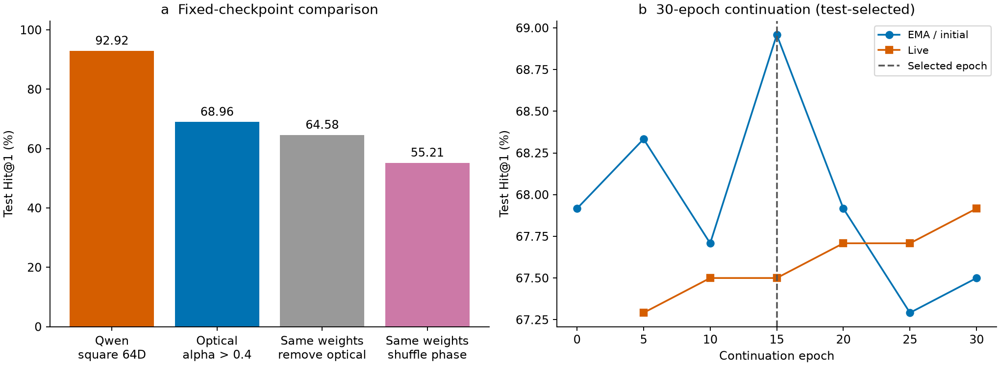
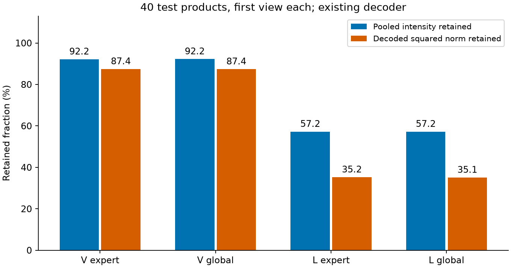
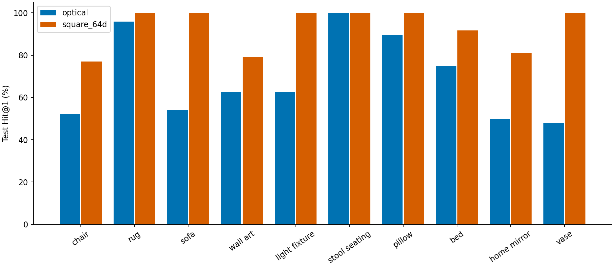
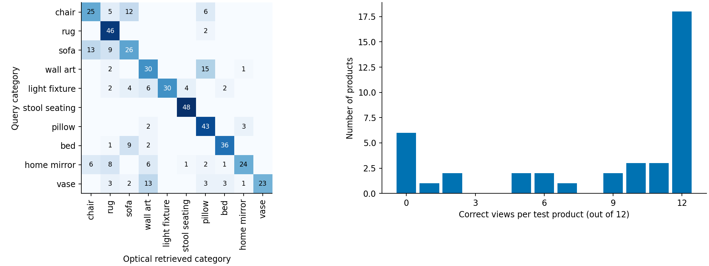

# ABO 图搜图：为什么当前性能偏低

审计日期：2026-09-10至09-11。分析与训练同时进行，报告已更新到本轮结束。所有数字来自本工程固定权重、manifest和逐样本特征，不引用其他任务成绩。

## 先给老师的结论

当前约束版（光 router Top2、alpha>0.4）从67.92%提高到 **68.96%**，没有达到75%。这不是“相位完全没训练”，更符合：**训练商品拟合充分，但迁移到新商品的语义泛化不足；输入裁切和CCD读出还存在信息瓶颈。** 数据也有需要复核的标注/划分问题，但不能用它们解释全部差距。

这是一组基于证据的定位，不是已经通过消融证明了每项因果。后续应分别控制输入保真、全场CCD读出、商品级预训练目标，而非继续只延长epoch或盲目增大alpha。

## 1. 最新结果：先分清对比口径

| 模型/处理 | Hit@1 | 含义 |
|---|---:|---|
| 冻结完整 Qwen，原生比例、2048维 | 95.2083% | 不微调，已有缓存复算 |
| 冻结完整 Qwen，原生比例、前64维 | 93.9583% | 截取嵌入前64维并L2，不训练投影 |
| 冻结完整 Qwen，中心方形224输入、2048维 | 93.7500% | 输入几何对齐学生 |
| 冻结完整 Qwen，中心方形224输入、前64维 | 92.9167% | 同输入几何、同输出维度的补充对照 |
| 前轮高alpha学生 | 67.9167% | high_alpha_aug，epoch55 EMA |
| 最新高alpha学生 | **68.9583%** | high_alpha_retrieval，epoch15 EMA |
| 最新学生，同权重去掉光 | **64.5833%** | 不重训，不是额外电模型baseline |
| 最新学生，打乱各相位空间排列 | 55.2083% | 单次seed42，保留每片相位直方图 |
| 最新学生，轻微CCD噪声 | 67.7083% | 单seed123，仅expert/global，不含eval直流或router噪声 |

最新权重选中的4个融合alpha分别为 V 0.43777/0.44037、L 0.43045/0.42982。实际去光下降 **4.375个百分点**，相对于正常错误率而言也不能直接换算“光贡献百分比”。alpha是局部同尺度融合系数，不是整网因果份额。

旧70.21%学生的alpha只有约0.09–0.10，不能作为本次alpha>0.4的达标结果。所有学生候选按周期test选best，本文明确标注 test-selected；不作为独立保留集的无偏结果。

图中比较的是相同测试/图库口径；Qwen square64仍使用完整冻结大模型，预训练预算和推理复杂度不是与学生完全匹配。曲线只画本次续训epoch0–30，不把旧转换诊断当作本轮训练起点。

## 2. 数据到底是什么任务

- 10类别×20商品×12视图=2400张，但独立商品只有200个。
- train：120商品/1440图；val：40商品/480图，当前没有用于选模；test：40商品/480图，每类只有4个测试商品。
- 测试query为480个测试视图；gallery是120个训练商品、各12视图的向量平均后归一化。
- 正样本是**同类别的其他商品**，每个query有12个相关候选；不是同SKU不同照片匹配。
- 当前表格中惯写的“R@1”实际是 Hit@1：第一名是否同类。严格的正样本集合Recall@1还需除以12，不能混用指标名。

### 数据审计发现

2400个文件SHA全不同，没有发现跨split完全相同文件；商品ID也隔离。48个test视图在训练集中存在dHash距离≤4的近邻，但这只是粗筛，可能来自同形产品/白背景，**不等于证实数据泄漏**。

十个类别都满足 `max(train_ID)<min(val_ID)<min(test_ID)`。这与按ID排序后分段的划分相符，但没有据此证明构建程序就是该算法；更不能把ASIN顺序当时间顺序。不能随意写“随机划分”。测试并非新品牌划分：测试品牌均在训练中出现。

发现具体待复核商品 **B075Z8THYY**，manifest为bed，标题为“Amazon Brand – Stone & Beam Bateman Casual Rustic Wood Bedroom Dresser, 55 Inch Wide, Brown”，图像也是斗柜。若标签语义是物体种类，存在明显冲突；若bed实际指卧室家具集合，则类别定义需重新说明。**未擅自修改或删除它。**

在最新68.96%固定权重上，该商品12张全错；即使诊断性排除，学生也仅为70.73%，而方形64维Qwen仍为93.59%。这不是官方新成绩，只说明一个标注问题不足以解释主要差距。

此图按“各类别最差商品、首个错误视图”确定性挑选，展示前六类，不是随机样本。右两列只是被检索商品的首个manifest视图，代表12视图中心，不意味着取它做了单图检索。照片没有增强或根据理论重绘。含数据集图像的面板仅在本地/内部ZIP提供，不提交Git。

## 3. 为何“Qwen前端保留了”仍然差很多

学生保留的是冻结patch、位置、merger和词嵌入，**不是大模型的上下文化视觉/语言语义计算**。完整冻结Qwen baseline保有其大规模预训练的Transformer计算；学生用两组小卷积电残差+光学传播替换它，只有约278万可训练参数，在120个目标训练商品上学习新商品语义。

数值上，完整Qwen即使换成与学生相同的方形输入和64维输出，仍有92.92%，高于最新学生约23.96个百分点。因此不能把差距简单归咎于“学生输出只有64维”。这不是证明输入裁切对学生无害：大模型对裁切可能更稳健，影响不能直接迁移。

最新高alpha模型，在训练数据上排除query自身商品、只检索同类其他训练商品仍有 **99.86%（1438/1440）**；测试为68.96%。该训练检索口径比普通训练分类准确率更接近测试，支持“新商品泛化存在大缺口”，而不只是分类损失与检索指标名称不同。它仍不是独立验证成绩。

冻结merger也有值得检查的分布问题：它原本接收经过完整视觉网络处理的特征，现在接收小型光电网络加原patch skip的输出。两种输入语义/分布是否匹配并未被证明；这是后续检查激活统计和有限adapter适配的假设，不是已经发现的确定bug。

### 大数据预训练是否已经试过

确实试过128类型、6144商品、12288图的原ABO预训练池，但那轮是**旧低alpha协议**。预训练后直接目标测试62.08%，目标适配新epoch最高67.50%，没有超过原70.21%；最后保留原权重，不能说“预训练达到70.21%”。来源为旧任务 `broad_transfer_20260910` 的pretrain/adapt报告。

这证明那一套预训练配方没产生正迁移，不证明更多商品永远无效。可能原因包括源类型标签与目标10类同类检索的语义对齐不够、优化遗忘原表征、输入/光场读出瓶颈没有解决。它们需要训练目标和样本域的控制实验，不应凭一次失败直接换数据集，也不能承诺再加数据必到75%。

## 4. 输入和光电读出有可定位的信息瓶颈

### 4.1 输入中心裁切

代码执行 `ImageOps.fit(...224×224...)`，会截掉细长灯、落地家具等上下部分，不是保持比例缩放加白边。按RGB最小通道<245粗略定义非白区域，全体图平均约 **24.8%** 非白像素位于被裁区域。该比例包含阴影/背景，不等于精确物体面积或必然准确率损失。

下一步合理控制：保持完整物体的等比缩放+固定背景填充，仍输出224×224、光ROI不变；从同一来源权重做适配，不能只在旧权重测试时换输入再认定优劣。

挑选规则为测试商品中非白裁切比例最高的四个不同商品，刻意展示压力样本而非平均效果。可以看到部分灯的灯罩、花瓶轮廓被截掉。右侧确实来自当前预处理代码，不是示意图。

### 4.2 语言CCD读出只保留前77行

当前先将整幅CCD压成224×224，再逐行处理并取 `row[:length]`。Vision length=196（87.5%行），Language length=77（34.375%行），其余行不传给后面的Linear。**这不是说恰好损失65.625%光能**，能量和信息可能非均匀分布；也不是已证明哪个专家失效。

建议单变量对照：保持光路、478ROI、输入排布不变，将整场电子读出改为保留全场信息的 L×224池化/线性汇聚，再适配训练；记录误差、专家利用率、全场/保留区强度与梯度。改变的是电子读出合同，应命名新profile，不能作为“代码整理”悄悄换进去。

已经补做只读数值审计：每个测试商品取manifest首视图，共40张。语言expert/global前77行分别保留约57.23%/57.24%的池化强度，及35.24%/35.09%的解码后平方范数；Vision相应约92.2%和87.4%。这些是对应离散张量的比例，不是硬件光子测量，更不是准确率损失比例。

### 4.3 CCD处理不是纯归一化

当前有除均值、截到12、log1p、逐行LayerNorm、ReLU。它可能压缩极亮点，也可能消除有用行间强度信息。是否有效必须同数据/同初始权重对照。目前只明确披露，没有为了贴近理论而偷偷美化或修改CCD。

## 5. 光确实在工作，但不能靠alpha断言贡献

去光下降4.38个百分点、相位打乱降到55.21%、实际相位参数有非零变化，共同反驳“相位完全没动”。这些操作仍不能把网络精度可加性分解成“电多少光多少”：两分支相互适配，干预会改变分布，打乱也同时影响router。

V输出还有直接原patch skip，且后面有冻结merger及可训练读出。局部alpha大并不保证整网主要依赖光；强行继续抬高alpha可能只是增大困难分支的扰动。应联合报告同权重去光、相位扰动、相位变化量和路由分布，而非只报alpha。

本轮光router训练选择频率接近均衡，不见明显单专家独占；这是训练采样统计，不是完整证明每个测试商品的路由都合理。

末轮训练选择频率：V=[49.49%,50.35%,49.22%,50.94%]，L=[54.22%,49.26%,46.29%,50.23%]。Top2每样本选两个，因此四项加起来约200%，不是应当加起来100%。这只是末轮，不冒充epoch15最佳权重的独立测试频率。

## 6. 明确区分“已证实”和“下一步假设”

| 优先级 | 控制实验 | 要回答的问题 | 防止误判 |
|---|---|---|---|
| P0 | 人工确认类别定义、固定商品split与清单 | 标注/任务究竟是什么 | 不删难样本换高分 |
| P1 | 完整物体输入 vs 中心裁切 | 信息在进网络前是否被截掉 | 相同ROI、源权重和训练预算 |
| P1 | 全场L行汇聚 vs 前L行截取 | 光场是否被读出丢掉 | 单改电子读出，不改光路 |
| P2 | 更多独立商品的预训练；商品级正负采样 | 能否提升新商品语义泛化 | 商品/近重复家族不跨split |
| P2 | 检索NLL+困难负例、分段相位/读出学习率 | 学习目标是否更贴合最终检索 | 不只看训练99%，看商品级错误 |
| P3 | 输入/读出问题澄清后再调整alpha与噪声 | 是否达到合理光电折中 | 固定alpha>0.4、不换低alpha权重 |

已经尝试的检索目标续训将67.92%提升至68.96%，仅多正确5个视图，尚不能称大幅突破。最新测试40商品中6个商品12视图全错、18个商品全对，说明很多错误以商品为单位相关。按类别内商品bootstrap的描述性95%区间约58.54%–79.17%，并非480个独立样本的置信区间；由于checkpoint本身按test选，这不是独立确认或显著性证明。

最新各类Hit@1：chair52.08%、rug95.83%、sofa54.17%、wall art62.50%、light fixture62.50%、stool seating100%、pillow89.58%、bed75%、home mirror50%、vase47.92%。每类仅4商品/48相关视图，不能把一个类别100%理解为泛化已经解决。

## 7. 组会两分钟说法

“我们目前高光学权重版本是68.96%，去光后64.58%，因此光学确实有作用，但还没有达到75%。完整Qwen同样压成64维、采用相同图像几何仍有92.92%，说明主要差距不是输出维度，而是完整预训练语义能力与小模型在新商品上的泛化。数据实际只有120个训练商品和40个测试商品，训练跨商品检索已经99%左右，而新商品测试明显低；同时发现具体标注待复核项、细长物体中心裁切以及语言CCD只取前77行的读出风险。下一步优先做保留完整物体和保留完整光场的单变量对照，再做商品级预训练，而不是只加epoch或抬alpha。我们没有删掉错误样本来报更高的结果。”

## 证据入口

- 训练：`LightGenV2/tasks/t07_abo_image_retrieval/runs/simulation/high_alpha_retrieval_20260910/artifacts/`，源码 e59fc45fbec17938e76f4bfd527e5540003bb255；final_report、history、phase_masks、逐样本特征。
- 前轮细粒度审计：`.../runs/simulation/meeting_audit_20260910/artifacts/`，源码706b57057adf659f186b598eac045c20a8a610cd；audit.json、per_category.csv、test_products.csv、image_audit.csv、example_selection.json。
- 本报告图/最新细粒度数据：`.../runs/simulation/meeting_audit_latest_20260911/artifacts/`，源码29e16bed0392dd87cd2aa9bec3ec2bb4cd89edfb。同目录保留逐样本与各类指标、图片SHA及选择规则，原图不改变。
- 独立整理版固定权重复评：`LightGenPublic/tasks/t07_abo_image_retrieval/runs/fixed_equivalence_20260911/`；训练/测试共1920×64个特征逐位一致，最大绝对误差0，正常/去光指标一致；详见VERIFICATION.md。
- 基线缓存：`.../runs/simulation/frozen_qwen_20260909/`，CPU从特征复算，不含本轮重新测速/测功耗。
- 数据manifest SHA256：`2949a4035150a9f8718f2a6cace164c17394613d24fb9d0234c553bee8d77c97`。

本轮best SHA256：`814893fb430a73ce529acd7a1a80e264d7ed0253a37658df936cc40e34d6265b`。内部审阅ZIP的 `reference/` 含关键JSON/CSV证据，完整数据仍留原目录。
