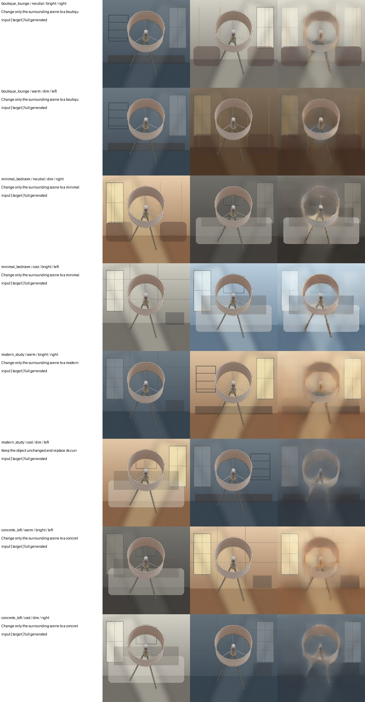
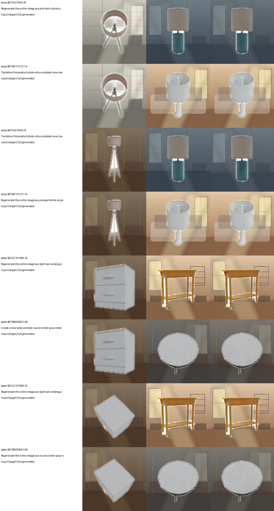

# T12: 2-layer Qwen, 282M full-frame optical/electronic editor

## Outcome

This run removes hard output compositing: every reported output is decoded from
the generated latent, with no source-object or source-background pixels pasted
back after inference.  It also excludes chairs from the new redesign task.

Two trained checkpoints are on the server:

- background replacement: `abo_scene_replace_2layer_progressive_282m_v1/best_model.pt`
- whole-image product redesign: `abo_global_redesign_2layer_282m_v1/best_model.pt`

## Architecture and counted parameters

The image path is `RGB -> frozen VAE encoder -> one narrow conditional UNet
call -> frozen VAE decoder -> RGB`.  The text path uses only the first two Qwen
language transformer blocks, followed by the existing 4.27M condition adapter.
At the decoder entrance, a parameter-free electronic identity residual and the
optical expert branch receive the same tensor in parallel and are RMS-fused.

| Component | Background model | Redesign model |
|---|---:|---:|
| Qwen transformer blocks 1-2 + final norm | 100,674,048 | 100,674,048 |
| VAE encoder | 34,163,664 | 34,163,664 |
| narrow UNet including optics | 93,803,689 | 93,803,689 |
| text adapter | 4,273,280 | 4,273,280 |
| task router | 26,635 | 12,292 |
| VAE decoder | 49,490,199 | 49,490,199 |
| **Counted end-to-end total** | **282,431,515** | **282,417,172** |

The 311,164,928 shared token-embedding parameters are listed separately and
excluded under the agreed project convention. The vision tower and language
model head are not used. The UNet widths were progressively pruned from
`[320, 640, 1280]` to `[192, 384, 768]`; the final UNet is 60% of the original
channel width and also removes 28,019,904 attention parameters.

The final learned optical fusion alpha is 0.5003 for background replacement and
0.5007 for redesign, satisfying the `alpha >= 0.4` constraint. Inference is one
UNet call, with no diffusion loop and no GAN.

## Progressive compression result

The model was not retrained from scratch. It was initialized from the existing
3-layer/494.85M checkpoint, narrowed in three stages, and locally distilled
against cached teacher predictions.

| Stage widths | Total parameters | Validation latent MSE |
|---|---:|---:|
| `[256, 512, 1024]` | 353,500,251 | 0.16652 |
| `[224, 448, 896]` | 315,472,443 | 0.12804 |
| `[192, 384, 768]` | 282,431,515 | **0.09886** |

Final held-out background test latent MSE is `0.09948`; exact text-attribute
combination accuracy is `1.0`.

## Full-frame product redesign

The supervised task uses ABO CleanRender CC BY 4.0 lamps and tables only. Each
held-out source product is paired with two same-category target archetypes:

- slim dark cylindrical lamp;
- compact white sculptural lamp;
- light-oak rectangular console table;
- round cinder-gray metal table.

The prompt jointly selects product form and a new room, tone, brightness, and
side-light direction. Masks are used only to construct training pairs; neither
masks nor hard composites are used at inference. Dataset sizes are 2,304 train,
256 validation, and 256 test pairs. Source identities are split-disjoint, while
the four controlled target archetypes are deliberately fixed. This is therefore
a small-vocabulary conditional generation benchmark, not open-world editing.

Final held-out test latent MSE is `0.02496`, target-catalogue accuracy is `1.0`,
and MSE improves by `96.94%` over copying the input. The Gaussian seed is real,
but noise scale is only `0.05`; it supplies small stochastic variation while
the prompt remains the dominant control.

The columns above are `input | supervised target | fully generated output`.

## Runtime state

Both training jobs completed successfully. GPU 0 was released after sampling;
the final observed state was 12 MiB allocated and 0% utilization.
