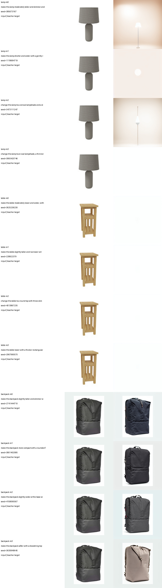
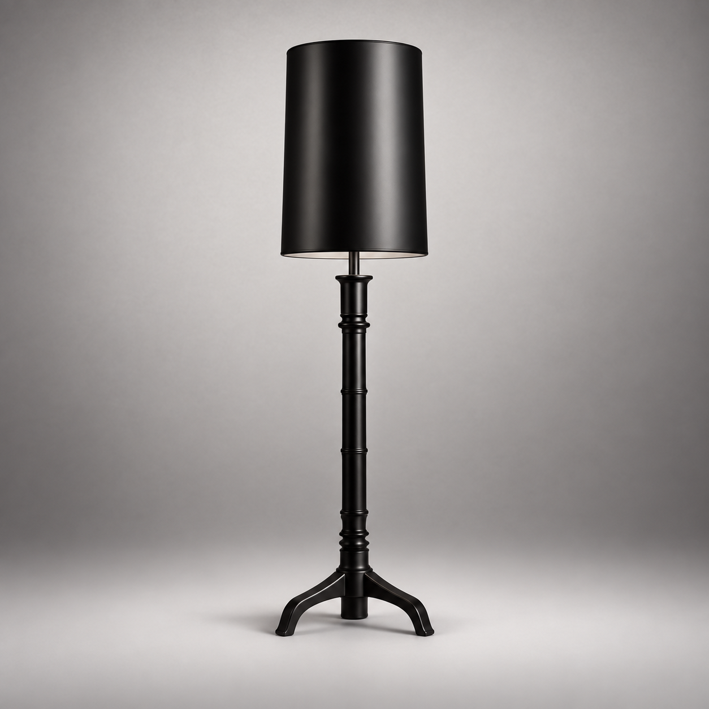
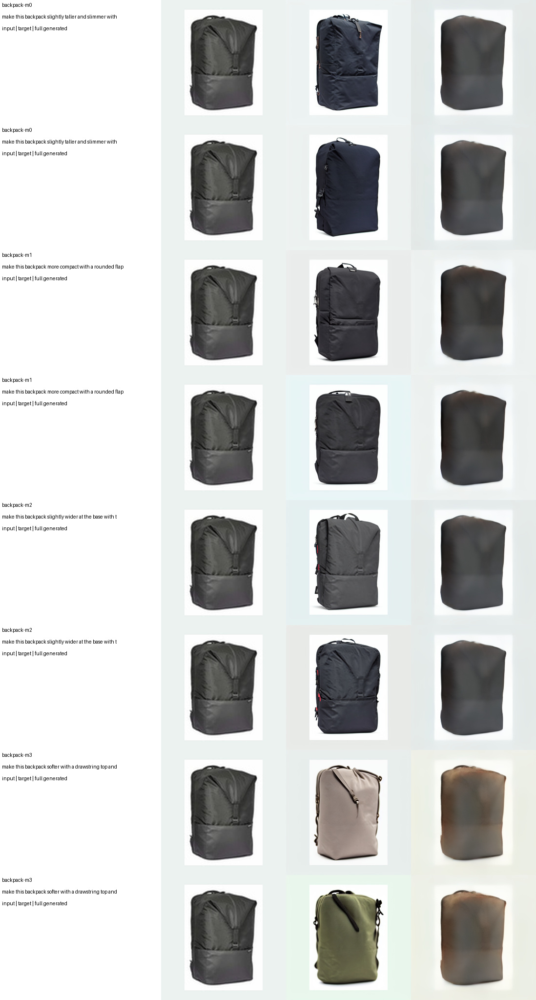

# T12 文本引导商品形态生成：首轮大模型结果

## 当前结论

这一版已经把任务改成真正的 `输入商品图 + 文本 + seed -> 完整新图`，推理阶段没有 mask、抠图、贴回原物体、固定背景模板或目标图库检索。教师目标和学生输出都是整张 RGB 图像重新解码。

数据质检后，v1 正式权重只使用通过质量门槛的 `backpack morphology`。ABO 的 lamp/table 原图中物体占比过小，当前 InstructPix2Pix 教师仍会偶发只生成灯罩、桌面或空白；这些失败目标没有进入 v1 学生训练。代码和原始清单保留了 lamp/table 的扩展位，但必须先更换更强的编辑教师。

## 数据

- 来源：ABO backpack，原图标记为 CC BY 4.0。
- source 划分：train/val/test = 12/3/3 个不同商品。
- 每个 source：4 条形态指令 × 2 个真实 seed。
- 训练对：96；验证对：24；测试对：24。
- 四类指令：更高更窄的 roll-top、紧凑圆角 flap-top、宽底双侧袋、柔软 drawstring。
- 每条记录保存 prompt、teacher seed、来源 URL 和许可字段。

教师数据的完整质检图：



图像生成技能给出的理想质量参照（不参与批量训练）：



## 模型结构

```text
输入 RGB ── frozen VAE encoder ── reference latent ─┐
                                                    ├─ concat ─ one-pass UNet ─ frozen VAE decoder ─ RGB
真实 seed ── Gaussian latent noise ─────────────────┘              │
                                                                  │
文本 ── Qwen3-VL embedding ── 2 个 Qwen language blocks ─ adapter ┘

UNet 第一/最深 decoder block：
        electronic residual(shared input) ─┐
                                           ├─ RMS 同尺度融合，alpha=0.5007
        optical FFT/MoE(shared input) ──────┘
```

形态任务解冻完整 UNet，但没有增加推理参数；Qwen 和 VAE 保持冻结。训练和推理均为一次 UNet 前向，没有扩散循环，也没有 GAN。

按项目约定不计共享 token embedding，block 到图像的参数为：

| 部分 | 参数量 |
|---|---:|
| Qwen 两层 transformer + norm | 100,674,048 |
| VAE encoder | 34,163,664 |
| UNet（含光学分支） | 93,803,689 |
| 文本 adapter | 4,273,280 |
| 辅助 router | 28,684 |
| VAE decoder | 49,490,199 |
| **总计** | **282,433,564** |

## 最好权重与结果

- 权重：`/DATA/DATA1/guest3/t12_assets/runs/abo_morphology_backpack_large_282m_v5_continue/best_model.pt`
- 最优 continuation epoch：4（此前 v4 已训练 20 epoch）。
- optical alpha：0.5007226。
- test latent MSE：0.19038。
- 相对直接复制输入的 latent MSE 改善：44.68%。
- 指令 router accuracy：100%。
- 推理整图生成：是；hard composite：否；GAN：否；UNet 调用：1 次。

列顺序为 `input | teacher target | fully generated`：



## 质量判断

这不是最终可投稿效果。当前学生已经学到完整包体轮廓、背景重绘和 drawstring 指令的颜色/材质趋势，但仍明显过平滑，四类几何结构分离不足，两个 seed 的变化也小于教师。它证明了数据流、真实 seed、两层 Qwen 和光电 decoder 可以端到端工作，但还没有达到“教师目标那样清晰且形态可控”的质量门槛。

因此暂不做 `<50M` 蒸馏；此时蒸馏只会固化模糊。下一步应先把大模型做清楚：扩大到全部 20 个 backpack source，加入训练期 perceptual/轻量 PatchGAN 判别损失（不增加推理参数），再根据验证图决定是否引入更强的开源编辑教师扩展 lamp/table。
