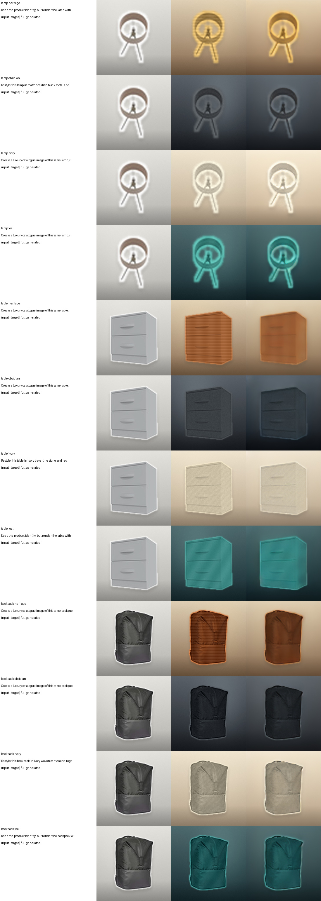
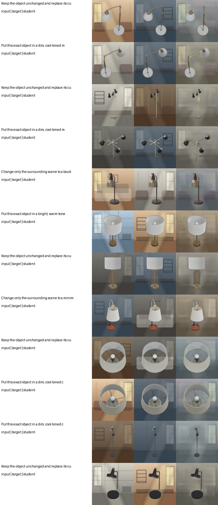
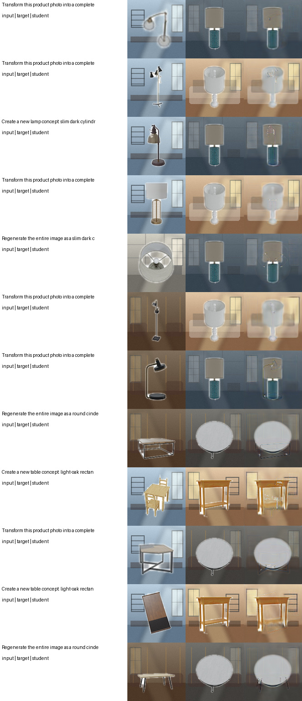
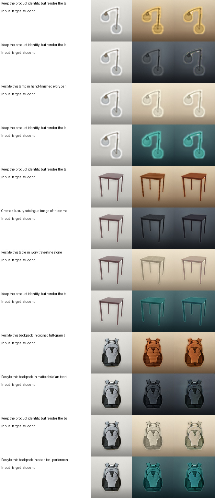

# T12 three-task large/small checkpoint bundle

Six independent checkpoints were completed before 06:00 CST: three 282M
latent editors and three 3.27M direct-RGB students. No checkpoint was
overwritten. All models use one generator call, have no diffusion loop or GAN,
and do not paste input pixels back after inference.

## Checkpoints

| Task | Large checkpoint | Counted parameters | Small checkpoint | Parameters |
|---|---|---:|---|---:|
| text-guided background replacement | `abo_scene_replace_2layer_progressive_282m_v1/best_model.pt` | 282,431,515 | `abo_background_small_rgb_3m_v1/best_model.pt` | 3,268,440 |
| text-guided product-form redesign | `abo_global_redesign_2layer_282m_v1/best_model.pt` | 282,417,172 | `abo_redesign_small_rgb_3m_v1/best_model.pt` | 3,268,440 |
| premium material/studio restyling | `abo_premium_material_2layer_282m_v1/best_model.pt` | 282,433,564 | `abo_premium_small_rgb_3m_v3/best_model.pt` | 3,278,680 |

Every path is relative to `/DATA/DATA1/guest3/t12_assets/runs/`.
The large-model convention excludes the shared 311.16M token embedding, as
agreed, and does not use the Qwen vision tower or language-model head.

## Large architecture

The large models use the following shared flow:

`RGB -> frozen VAE encoder -> narrow one-pass conditional UNet -> frozen VAE decoder -> RGB`

Text uses the first two Qwen language blocks and the existing condition
adapter. The UNet widths are `[192, 384, 768]`. At the decoder entrance, the
parameter-free electronic residual and optical expert/global branch consume
the same tensor in parallel and are RMS-fused. Learned optical alpha remains
about `0.50`, above the required `0.40` floor.

## New premium task

This task is separate from the four-fixed-product redesign checkpoint. It
preserves the source product identity and alters material plus the complete
editorial studio treatment. It uses only CC BY 4.0 ABO-derived images and no
chairs:

- 576 lamp and 576 table training views from ABO CleanRender;
- 20 backpack training identities from the cleaned ABO backpack subset;
- 4 category-appropriate controlled material families per product;
- 4,688 train, 524 validation, and 524 test pairs.

The materials are category-specific versions of heritage/brass-walnut-leather,
matte obsidian, ivory ceramic/travertine/canvas, and smoked teal
glass/lacquer/textile. Masks are used only when constructing paired targets;
the inference model receives RGB and text only and generates the complete RGB
frame.

Large premium held-out results: latent MSE `0.06713`, latent L1 `0.15208`,
material-target accuracy `1.0`, and `94.01%` improvement over copying the input.

Columns are `input | paired target | fully generated output`.

## Small architecture

The 128x128 small model removes Qwen and the VAE entirely:

`RGB + Gaussian seed + UTF-8 text -> direct RGB encoder/decoder`

It contains a 3.27M residual U-Net and a tokenizer-free byte-level GRU. At its
16x16 bottleneck, an electronic conditioned residual and compact Fourier
optical MoE operate in parallel, followed by scale-matched fusion. It predicts
every output pixel; there is no foreground/background compositing. The premium
student additionally uses a deterministic controlled-vocabulary parser for
category/material IDs. This parser is appropriate for the benchmark's twelve
declared controls and should not be described as open-vocabulary language
understanding.

| Small task | Best epoch | Test MSE | Test L1 | Improvement over copying | Optical alpha |
|---|---:|---:|---:|---:|---:|
| background | 18 | 0.07966 | 0.23511 | 55.79% | 0.4992 |
| redesign | 20 | 0.00426 | 0.03553 | 97.98% | 0.5005 |
| premium material | 8 | 0.00188 | 0.02938 | 99.62% | 0.4981 |

Large latent-space and small pixel-space MSE values are not numerically
comparable. The images below are the appropriate qualitative comparison.

## Runtime and resource hygiene

Large training used GPU 1; the two initial small students used GPUs 3 and 4 in
parallel; the final premium student reused GPU 1 after its teacher completed.
All task processes exited. GPUs 1 and 4 returned to idle; GPU 3 was also
released by this task and was subsequently occupied by a separate DeepSeek
feature-extraction process (PID 2783826), which was left untouched.
