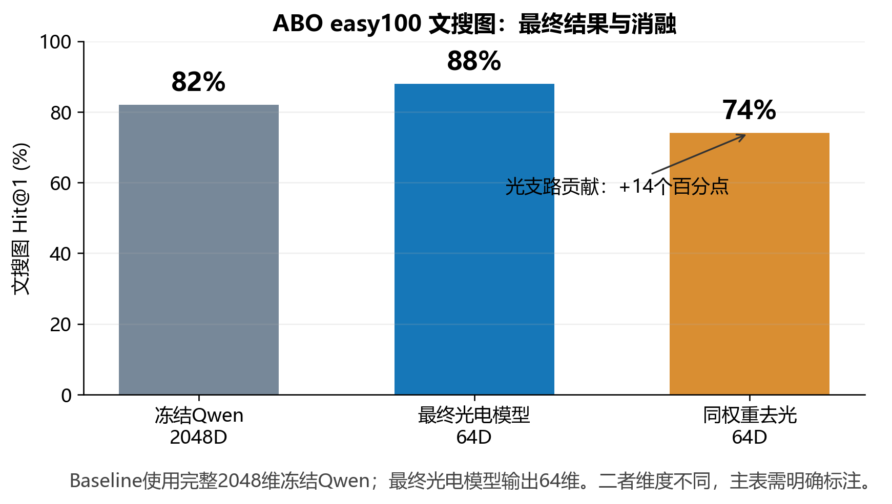
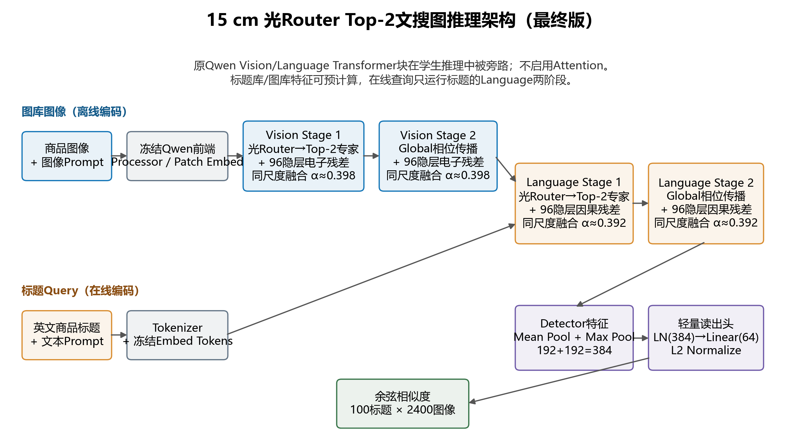
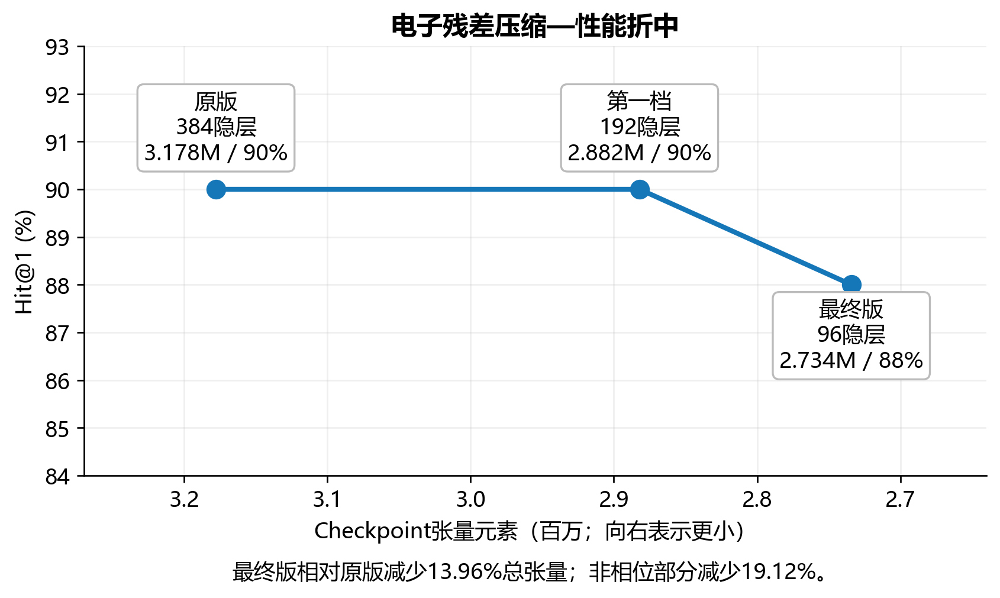
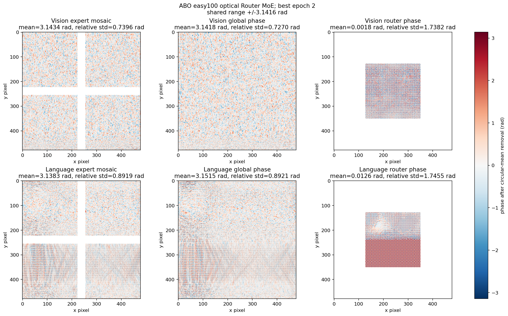

# ABO 文搜图最终方案（15 cm）

## 一句话结论

最终采用第二档紧凑电子残差：四个残差 MLP 均为 `192→96→192`，光学 Router
Top-2、相位尺寸、15 cm 传播和同尺度融合不变。ABO easy100 文搜图 Hit@1 为
**88%**；冻结 Qwen3-VL-Embedding-2B 2048D baseline 为 **82%**。同一最终权重
去掉全部光支路后为 **74%**，说明光学部分带来 14 个百分点。



## 数据与评价合同

| 项目 | 固定口径 |
|---|---|
| 数据集 | ABO easy100，同一批100个已登记商品 |
| 训练图库 | 4,800张，每商品48张 |
| 测试图库 | 2,400张未参与训练的新视角，每商品24张 |
| 文本Query | 100条官方英文商品标题 |
| 正例判断 | 完全相同的 `product_id` / SKU，不是宽泛类别 |
| 主指标 | 100条标题Query的Hit@1；每次变化1个百分点 |
| 选模 | 每2 epoch测试一次，按TEST Hit@1选EMA best；属于test-selected |

## 性能表

| 方法 | 输出维度 | Hit@1 | Hit@5 | Hit@10 | MRR | mAP |
|---|---:|---:|---:|---:|---:|---:|
| 冻结Qwen，动态长宽输入（正式baseline） | **2048D** | **82%** | 90% | 96% | 0.8560 | 0.7719 |
| 冻结Qwen，动态长宽输入（同维度补充） | 64D | 65% | 75% | 83% | 0.7051 | 0.5796 |
| 最终15 cm光Router Top-2光电模型 | **64D** | **88%** | **94%** | **98%** | **0.9119** | **0.7909** |
| 最终模型同权重去光 | 64D | 74% | 90% | 95% | 0.8086 | 0.6821 |

老师指定的主baseline是2048D冻结Qwen；最终模型是64D，所以这是“完整大模型强参照”，
不是同输出维度对照。64D冻结Qwen同时保留在表中，避免隐藏维度差异。

## 推理架构



- 学生推理保留Qwen的Tokenizer、Embed Tokens、图像Processor/Patch Embed等前端；
  原Qwen Vision/Language Transformer块被学生模块或Identity旁路替换，不启用Attention。
- 图像图库离线经过Vision两阶段，再进入Language两阶段；每个模态先由物理能量Router
  选择Top-2专家，再经过global相位传播。
- 每个光学输出都与对应的96隐层电子残差做RMS同尺度融合：Vision的α约0.398，
  Language的α约0.392。
- 最终Language detector特征做Mean Pool和Max Pool并拼接为384维，经过
  `LayerNorm(384)→Linear(64)→L2 Normalize`；标题与图像用余弦相似度检索。
- 图库特征和100个标题特征均可预计算。若在线输入新标题，只需要Language Router、
  expert、global共3次光学曝光；完整图像编码为Vision/Language共6次曝光。

## 电子规模消融

| 版本 | 四个残差MLP | Checkpoint张量元素 | 相对原版缩减 | Hit@1 | 去光Hit@1 |
|---|---:|---:|---:|---:|---:|
| 原版 | `192→384→192` | 3,177,750 | — | 90% | 60% |
| 第一档 | `192→192→192` | 2,882,070 | 9.30% | 90% | 63% |
| **最终第二档** | **`192→96→192`** | **2,734,230** | **13.96%** | **88%** | **74%** |

第二档若只计算非相位张量，相对原版减少19.12%。继续把96压到48只能额外减少
73,920个张量元素（约占当前总量2.70%），因此没有把这一小收益换成进一步性能风险。



## 相位Mask与专家使用



- Vision/Language专家均为四个 `224×224` 相位区，按2×2排在 `478×478` 有效场；
  global相位为 `478×478`，光Router相位的有效区为 `224×224`。
- Vision最佳epoch选择计数为 `[2427,2375,2400,2398]`，四专家约
  `25.28%/24.74%/25.00%/24.98%`，基本均衡。
- Language图像计数为 `[4800,1870,1509,1421]`，标题计数为
  `[1600,625,528,447]`：expert 0固定占一个Top-2槽位，另一个槽位在其余专家间轮换。
  这不是只使用两个专家的坍缩，但应如实披露其共享专家结构。

## 最终权重

服务器路径：

```text
/DATA/DATA1/guest3/2026OpticsMoE/LightGenV2/tasks/t08_abo_image_text_retrieval/runs/simulation/optical_text_to_image_64_15cm_compact_e0p5_seed42_20260921/best_checkpoint.pt
```

SHA256：

```text
ae92995b49eaf7d49165d7816f876e831d9ab070a482f94e849d2f16e9ebb50f
```

配置文件：
`configs/optical_text_to_image_64_15cm_compact_e0p5.yaml`。最佳epoch为2；正式run只保留
best与last权重、完整预测、训练曲线、架构合同、相位总览和数据SHA256。
