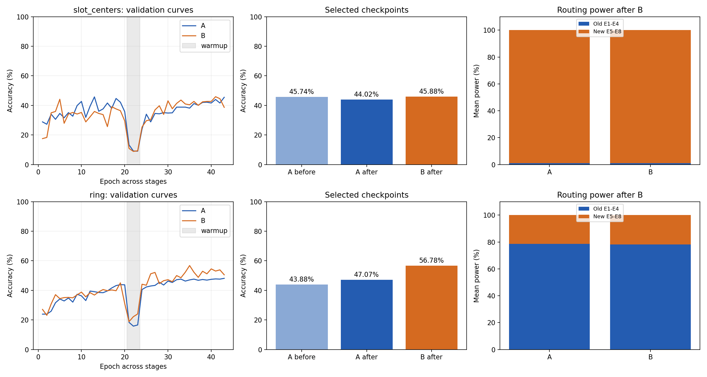

# 光学终身学习：初步结果与复现入口

初建：2026-09-19；跨数据集更新：2026-09-20。目的：供课题组初步讨论，不作为论文最终性能结论。

## 固定容量 D2NN 与扩展 MoE 的终生学习对照

本轮把离线联合学习、顺序学习和冻结迁移分开，避免用联合 D2NN 回答终生学习问题。所有结果均为 seed 17、验证集平衡准确率（BA），没有读取 test 图像或标签。顺序学习均按 A→B→C→D 到达；在 B/C/D 主训练前有 3 轮只看当前任务的适应阶段，随后进行 12 轮 replay 主训练。D2NN 的两个全孔径相位面在所有阶段都会更新；MoE 适应阶段只更新新增四专家，主阶段冻结旧专家并更新新增专家、router 和 global 相位面。

| 协议 | A | B | C | D | 最终四域平均 BA |
|---|---:|---:|---:|---:|---:|
| D2NN，少量 replay | 81.11% | 97.30% | 64.38% | 68.75% | **77.88%** |
| MoE，少量 replay | 78.33% | 97.00% | 64.38% | 70.00% | 77.43% |
| D2NN，全量 replay | 81.11% | 97.30% | 62.50% | 68.75% | 77.42% |
| MoE，全量 replay | 80.56% | 96.40% | 76.25% | 66.88% | **80.02%** |
| D2NN，离线联合训练 | 80.00% | 96.90% | 63.75% | 71.25% | 77.98% |
| MoE，离线联合训练 | 82.78% | 96.80% | 69.38% | 68.75% | **79.43%** |

少量 replay 使用每个旧任务每类 128 张固定记忆。B/C/D 每次更新分别为 `9 当前+3 A`、`8 当前+2 A+2 B`、`6 当前+2 A+2 B+2 C`。全量 replay 不设记忆子集，每个 batch 在所有已见任务间等分，并独立循环较小数据集；A/B/C/D 主阶段每轮分别为 67/334/500/667 次更新。两种架构使用相同 RGB 编码、986×986 有效孔径、传播参数、两个 CCD 窗口、学习率、数据子集、阶段长度和验证选模规则；均没有 MLP 或 OEO。

| 顺序协议 | A BWT | B BWT | C BWT |
|---|---:|---:|---:|
| D2NN，少量 replay | +1.11 pp | -0.10 pp | -6.25 pp |
| MoE，少量 replay | -7.78 pp | -0.20 pp | -13.75 pp |
| D2NN，全量 replay | +1.11 pp | +0.10 pp | -0.63 pp |
| MoE，全量 replay | -6.67 pp | -0.80 pp | +6.88 pp |

当前少量 replay 结果不支持“MoE 已经比固定 D2NN 更少遗忘”：D2NN 最终平均高 0.45 pp，而且 A/C 的 BWT 更好。全量 replay 下 MoE 最终平均比 D2NN 高 2.60 pp，优势主要来自 C；它证明了当前扩展架构在充分旧数据约束下可取得更高最终平均性能，但仍不能表述为所有旧任务都保存得更好。当前 MoE 只冻结旧专家相位；router 和 global 相位继续更新，且所有专家在末端发生相干叠加，所以旧任务的完整输入－输出映射并未固化。这是少量 replay 故事尚未成立的主要结构原因。

D2NN 少量 replay 的训练/验证四域均值为 81.89%/77.88%，差 4.01 pp；全量 replay 为 86.54%/77.42%，差 9.13 pp。更多旧数据和更新次数提高了训练拟合，却没有提高验证均值，说明当前全量 replay D2NN 已出现更明显的泛化差距，不能把训练集保持率当作终生学习性能。

四个单任务 D2NN 分别只按自己的验证集选模，随后冻结权重并在四个域上交叉评估。行表示训练域，列表示冻结后推理域：

| 训练域 → 推理域 | A | B | C | D |
|---|---:|---:|---:|---:|
| A | **80.00%** | 79.70% | 50.00% | 55.00% |
| B | 51.11% | **97.40%** | 48.75% | 56.88% |
| C | 70.56% | 42.70% | **73.75%** | 46.88% |
| D | 51.11% | 64.50% | 36.88% | **70.63%** |

冻结 A 后在 C/D 上接近随机水平，但在 B 上仍有 79.70%，因为 A/B 都是 H&E 肿瘤二分类并存在较强域间迁移。因此该矩阵只能说明固定权重的跨域适用性不稳定，不能声称固定 D2NN 对所有新任务均失效。终生学习的主要证据应使用上方同阶段 replay 对照，而不是只展示 A→C/D 的低迁移结果。

正式 run 为 `d2nn_small_s17_9c1a8f78`、`d2nn_full_s17_9c1a8f78` 和 `single_d2nn_transfer_s17_9c1a8f78`，训练 commit 为 `9c1a8f7893fa6cbeae078bf1f98e0b7eba966d2f`。两个顺序 D2NN 的 D 阶段最佳权重 SHA256 为 `b35f136bf7b975e012361d77edbec4a45df3be2373444a3366f41cb2ecc40be1`、`4a101416a5b1f8327c8494e63b459b0567989a5103f48d7349288016d0309b14`。四个单任务权重 SHA256 依次为 `29fae4a5fb340edb87fad4544026f14d1a035a50e17685fe81da53ba402c60f3`、`57efe8cf8e82f7fd03c79a5b07f67322cb7773e1beee19b3a2f2c4fae2b7f752`、`0cffe887e78641d2dbb18f327a4bbe6cb1ad36b79b7a2dba1e6acc6a5cb4a48d`、`9e1691280454e94c8491a14379af790c87ebcbcdd44b7628731b0a119b99a42e`。保存的逐样本预测已独立重算混淆矩阵和 BA。

## 本轮新增：联合 MoE 与全量 replay MoE

读出端没有 MLP、OEO 或其他电子分类头。两种 MoE 与联合 D2NN 均以末端光强在两个 32×32 CCD 窗口内的积分作为两类能量，再除以两窗口能量和得到分类概率。联合 D2NN 是标准全孔径两相位面网络，不复制输入、不含空间路由；联合 MoE 将同一幅 224×224 编码振幅按光学 router 的功率分配送入 16 个 224×224 专家槽位，再经共享 global 相位面和相同 CCD 读出。

| 协议（seed 17） | A | B | C | D | 四域验证 BA 均值 | 训练 BA 均值 | 训练－验证 |
|---|---:|---:|---:|---:|---:|---:|---:|
| 联合 D2NN | 80.00% | 96.90% | 63.75% | 71.25% | 77.98% | 82.35% | 4.38 pp |
| 联合 MoE | 82.78% | 96.80% | 69.38% | 68.75% | **79.43%** | 89.13% | 9.70 pp |
| A→B→C→D MoE，全量旧数据 replay | 80.56% | 96.40% | 76.25% | 66.88% | **80.02%** | 93.11% | 13.09 pp |

联合 MoE 和联合 D2NN 使用完全相同的数据子集、每步四域各 3 张、每轮 667 步、共 12 轮，并按四域验证 BA 均值选 checkpoint，因此这是本轮直接架构对照。联合 MoE 选中第 10 轮，比联合 D2NN 高 1.45 pp；但 C/D 的训练－验证差分别为 16.88/15.67 pp，已有明显泛化差距。其验证样本平均路由的熵等效专家数为 8.21–9.06，且各域均有两个专家的平均功率低于 0.1%，说明 16 个专家没有被充分利用。

全量 replay 版本按 A→B→C→D 学习。进入新域时先用新域数据等功率预热新增四专家 3 轮；主训练只冻结旧专家，相应的新四专家、router 和 global 可训练。B/C/D 主阶段的每个 batch 分别含每个已见域 6/4/3 张，并独立循环较小域，所以每轮覆盖当时最大的已见训练集，同时保留全部旧训练样本的访问权。最终 D 阶段按四域验证 BA 均值选中第 10 轮；第 12 轮训练在线准确率升至 93.08%，验证均值降至 77.87%，是后期过拟合，不能使用最后一轮。

全量 replay 的 80.02% 不能当作比联合 D2NN 更公平的架构优势：它累计 19,917 次优化更新，而两个联合模型各为 8,004 次，并且含阶段预热。它回答的是“给顺序 MoE 全部旧数据后能否减轻遗忘”，不是同预算离线架构比较。相较少量 replay MoE 的最终 77.43%，全量 replay 提升 2.59 pp；C 的保持明显改善，但最终 D 仍只有 66.88%。

正式 run 为 `joint_moe_s17_2f0900f8` 和 `full_replay_moe_s17_2f0900f8`，训练 commit 均为 `2f0900f8c8b7983516a52e7dab0844a2d9bf569e`。最佳权重 SHA256 分别为 `be13f42db38b1cda37d1c0e3bede33e8639f1ced3b654376b7e6596e4e32888a`、`a18cb6b762a731d3cdfef7a852853ca7b34fd010e19532930eb119794cdb5f40`。四域预测文件已独立重算混淆矩阵和 BA；test 图像与标签均未读取。本次正式 run 的 warmup 日志曾用正常 router 口径记录诊断值，未参与训练或 checkpoint 选择；后续代码已改为“旧域前缀专家”和“新域四专家等功率”两个明确口径。

## 四病理数据集离线联合 D2NN 基线

该基线从第一轮开始同时访问 Kather2016、LC25000 lung、Kather2018 VAL7K 和 HepatoBench，
共享 tumor / non-tumor 二分类输出。它没有任务顺序、专家扩展、replay 或遗忘评估。模型是
两层 986×986 全孔径相位 D2NN，不复制输入、不划分四个固定空间区域，也不接收数据集编号；
两层共 1,944,392 个可训练参数。对应 16 专家 MoE 的 expert/router/global 共 1,825,188 个
参数，D2NN 多 6.53%。

| 数据集 | 选定权重训练 BA | 验证 BA | 训练－验证 |
|---|---:|---:|---:|
| A：Kather2016 | 81.12% | 80.00% | +1.12 pp |
| B：LC25000 lung | 96.35% | 96.90% | -0.55 pp |
| C：Kather2018 VAL7K | 74.75% | 63.75% | +11.00 pp |
| D：HepatoBench | 77.17% | 71.25% | +5.92 pp |
| 四域宏平均 | 82.35% | **77.98%** | +4.38 pp |

第 10 轮的四域验证 BA 均值最高，为 77.975%；第 11、12 轮分别为 77.49% 和 76.78%，
因此报告第 10 轮，而不是最后一轮。C 的训练－验证差为 11.00 pp，说明该域存在明显的
泛化差距；整体没有出现训练性能继续大幅升高而验证性能持续崩塌，但当前单种子结果不足以
排除过拟合。验证混淆矩阵按 `[真实类别, 预测类别]` 为：A `[[90,0],[36,54]]`、
B `[[498,2],[29,471]]`、C `[[40,40],[18,62]]`、D `[[60,20],[26,54]]`，标签合同为
0=肿瘤、1=非肿瘤/正常。

RGB uint8 输入先按与 MoE 相同的固定 `[R,G;B,0]` 规则变为 224×224 单位功率振幅；D2NN
随后 bicubic 上采样至整个 986×986 有效孔径并再次做单位功率归一化。MoE 把 224×224
振幅加载至被路由的专家槽位。两者使用相同的 1026×1026 传播画布、17 µm 采样、532 nm
波长、两段 0.1 m 传播和两个 32×32 CCD 分类窗口，均无 OEO 和电子分类头。D2NN 每批固定
包含四域各 3 张图，667 步/轮、12 轮；较小数据集耗尽后独立重排循环。第一、第二相位层
Adam 学习率分别为 .01/.002。每轮只用四个验证集 BA 均值选模，test 图像和标签未读取。

正式 run：`runs/simulation/joint_d2nn_s17_9265d151`；训练 commit
`9265d15104b36b37bf1cfc3f02ef6d25ecf3809d`；最佳/最后权重 SHA256 分别为
`2d0c72fde9c29aa5ee806ed8422da4c59cc5cb740963a8394b90864199d7c682`、
`ea82c449f6af6af03d3aaa0091b7373492c76600245a119ee284836cf9c9907a`。预测文件独立重算得到
相同的混淆矩阵、NLL、accuracy 和 balanced accuracy。训练版 `metrics.json` 只把两个逐类
recall 的文字键写反；评估修正不改变上述数值、选模或权重，正确语义保存在
`verification.json`。服务器环境为 Python 3.11.15、PyTorch 2.6.0+cu124、单张 GPU。

```bash
CUDA_VISIBLE_DEVICES=6 /home/guest3/miniconda3/envs/xml/bin/python -u \
  -m LightGenV2.tasks.t11_lifelong_optics.joint_d2nn \
  --config LightGenV2/tasks/t11_lifelong_optics/configs/kather_lc25000_kather2018_hepato_joint_d2nn.json \
  --task-a <kather2016_binary.npz> --task-a-manifest <kather2016_binary_manifest.json> \
  --task-b <lc25000_lung_binary.npz> --task-b-manifest <lc25000_lung_binary_manifest.json> \
  --task-c <kather2018_val7k_binary.npz> --task-c-manifest <kather2018_val7k_binary_manifest.json> \
  --task-d <hepatobench_binary.npz> --task-d-manifest <hepatobench_binary_manifest.json> \
  --out LightGenV2/tasks/t11_lifelong_optics/runs/simulation/joint_d2nn_s17_9265d151

python -m LightGenV2.tasks.t11_lifelong_optics.verify_joint_d2nn \
  --run LightGenV2/tasks/t11_lifelong_optics/runs/simulation/joint_d2nn_s17_9265d151
```

四个来源都是 RGB H&E 病理图像，因此该结果严格支持“多来源/跨数据集联合分类”，不能单独
作为图文、音文或异构传感器意义上的多模态证据。它与下方顺序 MoE 最终四域均值 77.43%
也不是同一训练协议：本基线始终访问全部数据，下方 MoE 按 A→B→C→D 学习并只回放少量旧
样本，二者可用于回答不同问题，不能据 0.55 pp 的均值差宣称某个架构更优。

## 四数据集初步结果：固定 16 槽 A→B→C→D

Task D 新增 HepatoBench 肝脏 TUM/NOR。由于固定光学几何合同，四任务实验从 A 起按 16 槽
重新训练，不能接续 12 槽权重。每个主任务均更新当前四个专家、router 和 global；只有旧
专家冻结。每段 warmup 只更新新四专家，并冻结旧专家、router、global。

| 阶段最佳 checkpoint | A | B | C | D | 已见任务均值 |
|---|---:|---:|---:|---:|---:|
| A（epoch 9） | 86.11% | — | — | — | 86.11% |
| B（epoch 8） | 85.00% | 97.20% | — | — | 91.10% |
| C（epoch 12） | 75.00% | 94.40% | 78.13% | — | 82.51% |
| D（epoch 6） | 78.33% | 97.00% | 64.38% | 70.00% | 77.43% |

D 相对各任务刚学完时的 BWT：A -7.78 pp、B -0.20 pp、C -13.75 pp。D 阶段每次更新为
6 张 D + A/B/C 各 2 张 replay。B 保持良好，A 部分恢复，但最近任务 C 遗忘明显；当前结果
证明四任务固定几何和多旧任务 replay 可运行，尚不能声称已经解决长期遗忘。

warmup B/C/D 中所有旧任务指标逐轮完全不变。七个训练阶段的冻结参数逐元素检查均通过：
D 主训练中 E1–E12 不变，E13–E16、router、global 可训练；所有阶段几何不变。10 项合同
测试及四任务真实光学 pilot 通过。

正式 run：`runs/simulation/four_task_b0ce0836`；训练 commit `b0ce083641cd13bf6dd9d26150e978b591b54dbb`。
A/B/C/D best checkpoint SHA256：
`be1594d82f00e23f606836e20ea8fe1627c0f50cbd19f9fea8ef3a9758c8d462`、
`0c4666d9d0c4aa3cefe42ff5dee47f825dfb1dad56f7aedcb533d9ba00f48b6d`、
`ad189453f30f882dc342cc46f39b00359fe7bda86d96ac6de385472998e65210`、
`93b26ae6f0688c96a88dac1c2af69a0031e114a3ad206aa17899a95dccc16dcf`。

HepatoBench 来源：[数据集页面](https://huggingface.co/datasets/xtxx/HepatoBench)，CC BY 4.0，
DOI 10.57967/hf/8231。TUM/NOR 原 ZIP SHA256 为
`0f627cb4afff9344bd1559ef1e3b36056ac0e931073c0789c18faed442fa826e`、
`202d97446aa12e0cfa4f5c60903ba1f6487c86da179ce2df68c9847f6392b33d`；准备后 NPZ 为
`d53e4c99b4a4802775ee7230f49c0e5878d8fed822c22e3d9540cca316bda2ff`。当前为单种子、验证集
选模结果；D 数据仅作图像级划分，不能声称患者独立。

## 三数据集初步结果：Kather2016 → LC25000 lung → Kather2018 VAL7K

已按“旧专家固化、共享层与新专家学习、旧任务 small replay”的顺序完成真实相干光学
MoE 的 4→8→12 训练。Task A 为 Kather2016 结直肠二分类，Task B 为 LC25000 肺二分类，
Task C 为 Kather2018 CRC-VAL-HE-7K 二分类；三者均使用 tumor / non-tumor 语义。表中是
每类等量验证子集的平衡准确率，所有 checkpoint 均由当时已见任务验证平衡准确率的平均值
选择，三个数据集的 test 均未读取。

| 阶段最佳 checkpoint | A | B | C | 已见任务均值 |
|---|---:|---:|---:|---:|
| A（epoch 12） | 87.22% | — | — | 87.22% |
| B（epoch 9） | 83.33% | 97.10% | — | 90.22% |
| C（epoch 8） | 80.00% | 96.30% | 75.63% | 83.98% |

最终 A 相对 A 学完时 BWT 为 -7.22 pp；最终 B 相对 B 学完时 BWT 为 -0.80 pp。C warmup
只使用 C 数据，E1–E8、router、global 全部冻结；三轮中 A=83.33%、B=97.10% 均保持不变。
这直接核验了 warmup 不会凭空改变旧任务。C 主训练每次更新使用 8 张 C、2 张 A replay、
2 张 B replay；可更新 E9–E12、router 和 global，E1–E8 逐元素不变。A 仍有累计遗忘，说明
当前 replay 能明显保留旧记忆但尚未解决全部遗忘。

固定权重复评与原 run 的 all 指标、混淆矩阵完全一致。最终专家掩码诊断如下：

| 数据集 | 全部 E1–E12 | 自己的四专家 | 学到该任务时的前缀 | 不含当前组的旧前缀 |
|---|---:|---:|---:|---:|
| A | 80.00% | 66.11% | 66.11% | — |
| B | 96.30% | 50.00% | 81.40%（E1–E8） | 56.70%（E1–E4） |
| C | 75.63% | 58.13% | 75.63%（E1–E12） | 48.75%（E1–E8） |

屏蔽专家会重新归一化路由功率并改变全场相干干涉，因此“自己的四专家”低不能解释为该组
没有学到知识；正式任务性能采用全部当前已激活专家。它同时显示 C 需要 E9–E12 与旧专家
共同工作，符合 soft routing 的混合专家设计。

正式 run 为 `runs/simulation/three_task_feef2710`，训练 commit
`feef271094e465545689e364e63a8d75b2144045`；评估修正 commit
`aaf6f8b1`。A/B/C best checkpoint SHA256 分别为
`9ad1d3158b86baca2fc828da3d24bda49a9b42970f6a75173377b37b549d8d9d`、
`f7c941238c98d93e3e564796da8b9dc668a509ef7e4d47a381cbab57316826e2`、
`40c63e401e6ac83f23fcf08d3d06c3ea850e5e1f2d1182b8da494cba52b6f241`。
服务器环境为 Python 3.11.15、PyTorch 2.6.0+cu124、单张 A100；9 项合同测试通过，五个
训练阶段的冻结参数和固定几何审计全部通过。

训练/验证抽样分别为：A 每类 400/90，B 每类 1000/500，C 每类 600/80。replay memory
为每个旧任务每类 128 张训练图。缓存 SHA256：A
`ba8b6a30f99798c244377d2585c1fc3fe8bc234c2847afcd373a0932d40882b5`，B
`c923e22dd6bb85de24393a5de020f9beedb13040f5d4472b3ac2df53d071126a`，C
`2008579aa6c9d4a74c04d5555dff70dd887f7e9ddd351754ca6b675a14c28782`。C 的 train/validation
Arrow SHA256 分别为 `6e9b14bc6aef755b7312f0405a7ece8ddce8ab33ad6725054da1c5758ffddbdf`、
`a440392afefbdbe01385e62e1def311fc24f55e7362ca0556ababde5ad9c06f4`。

数据来源：[Kather2016](https://zenodo.org/records/53169)、
[LC25000 lung](https://zenodo.org/records/14998042)、
[Kather2018 VAL7K](https://zenodo.org/records/1214456)；使用的 Kather2018 重发布入口为
[nirschl-lab/kather_et_al_2018_val7k](https://huggingface.co/datasets/nirschl-lab/kather_et_al_2018_val7k)。
三者的本地 manifest 均声明并由加载器强制校验 CC BY 4.0。LC25000 含增强衍生图且缺少
患者/增强家族 ID；本实验不能声称跨数据集患者独立。当前结果是单种子、验证集选模的工程
可行性证据，尚未做独立测试、多种子或第三任务 no-replay 对照。

完整三任务训练命令见 run 的 `metadata.json`；固定权重复评使用：

```bash
CUDA_VISIBLE_DEVICES=6 /home/guest3/miniconda3/envs/xml/bin/python -u \
  -m LightGenV2.tasks.t11_lifelong_optics.evaluate_three_dataset \
  --run LightGenV2/tasks/t11_lifelong_optics/runs/simulation/three_task_feef2710 \
  --task-a <kather2016_binary.npz> --task-a-manifest <kather2016_binary_manifest.json> \
  --task-b <lc25000_lung_binary.npz> --task-b-manifest <lc25000_lung_binary_manifest.json> \
  --task-c <kather2018_val7k_binary.npz> --task-c-manifest <kather2018_val7k_binary_manifest.json>
```

## 跨数据集初步结果：Kather2016 → LC25000 lung

已完成不同数据集、相同二分类语义的真实光学 MoE 顺序学习。Task A 为 Kather2016
结直肠组织（tumor / non-tumor），Task B 为 LC25000 肺组织（lung cancer / benign）。
两者都是 H&E RGB 组织病理图，但器官和数据来源不同。表中均为每类等量验证样本上的
平衡准确率；没有读取两个数据集的 test 图像。

| B 阶段设置 | A 学完时 | B 学完后 A（E1–E8） | B 学完后 B（E1–E8） | BWT |
|---|---:|---:|---:|---:|
| 256 张 A replay | 86.67% | 83.33% | 96.60% | -3.33 pp |
| 无 replay | 86.67% | 56.11% | 96.70% | -30.56 pp |

两组 B 每轮都使用 9 张当前任务样本组成一次更新；replay 组另加入 3 张 A 样本。因此
small replay 将 A 保持率提高 27.22 个百分点，而 B 只相差 -0.10 个百分点。warmup 全程
只使用 B 训练数据；在固定 `A_old_only` 评估条件下，A 始终保持 86.67%，确认此前
“4 专家与 8 专家口径混用导致 A 虚假提高”的问题已经修复。

replay 组最终 `A_old_only=82.22%`、`A_new_only=69.44%`；`B_old_only=96.60%`、
`B_new_only=91.80%`。这说明旧专家对相近病理域有很强迁移能力，也意味着当前 B 并未证明
“必须扩展新专家”才能获得高精度。专家屏蔽会改变相干干涉，只作为系统诊断，不能将差值
解释为可加的专家知识。

数据配置：A 训练每类 400、验证每类 90；B 从发布方 train 中每类抽取 1000，从发布方
validation 中每类抽取 500。Kather 来源为 [Zenodo 53169](https://zenodo.org/records/53169)；
LC25000 来源为 [Zenodo 14998042](https://zenodo.org/records/14998042)，两者均按 CC BY 4.0
清单校验。LC25000 归档 MD5 为 `1b1325f690bc51fd76bb8c4958c03b06`。该 LC25000 归档只含
肺组织子集，而且数据包含由较小原始集合生成的增强图；没有患者或增强家族 ID，因此不能
声称患者独立，96.6% 只作为工程可行性结果。

证据 run：

- replay：`runs/simulation/kather_lc25000_8b0b69f2`，commit `8b0b69f2`，B 最佳 epoch 9；
  A/B best checkpoint SHA256 为 `66c308b493a5586693a2fad233abd3d406265cb4d837fcdcd321a22db345ebe6`、
  `c228207550f5989fd40687792ea1ae1a61a56b035aa9a4ac319a945cf4d43ce9`。
- no replay：`runs/simulation/kather_lc25000_no_replay_a846e1d6`，commit `a846e1d6`，
  B 最佳 epoch 8；A/B best checkpoint SHA256 为
  `56bdb48d9bca31ec932f0e87ef2129ef15d76df4f770e1f3b1532ae9f5c7efe3`、
  `dc446b536cd59b22b40d4c4ebebb32f58f2c84bf7a70a3a20023fe34ae6a0965`。

两组的冻结参数逐元素不变，光学几何 state shape 不变；8 项合同测试通过。运行环境为
Python 3.11.15、PyTorch 2.6.0+cu124、单张 A100（CUDA_VISIBLE_DEVICES=6）。
准备后缓存 SHA256：Kather `ba8b6a30f99798c244377d2585c1fc3fe8bc234c2847afcd373a0932d40882b5`；
LC25000 `c923e22dd6bb85de24393a5de020f9beedb13040f5d4472b3ac2df53d071126a`。
两组均用 A/B 验证平衡准确率均值选择 B checkpoint，尚未进行独立测试或多种子复验。

在对应 commit 的服务器仓库根目录执行；no-replay 仅将 config 换成
`kather_lc25000_no_replay.json` 并使用新的输出目录：

```bash
CUDA_VISIBLE_DEVICES=6 /home/guest3/miniconda3/envs/xml/bin/python -u \
  -m LightGenV2.tasks.t11_lifelong_optics.cross_dataset \
  --config LightGenV2/tasks/t11_lifelong_optics/configs/kather_lc25000.json \
  --task-a /DATA/DATA1/guest3/demo_reproduction_data/kather_lc25000_c3729eeb/kather2016_binary.npz \
  --task-a-manifest /DATA/DATA1/guest3/demo_reproduction_data/kather_lc25000_c3729eeb/kather2016_binary_manifest.json \
  --task-b /DATA/DATA1/guest3/demo_reproduction_data/kather_lc25000_c3729eeb/lc25000_lung_binary.npz \
  --task-b-manifest /DATA/DATA1/guest3/demo_reproduction_data/kather_lc25000_c3729eeb/lc25000_lung_binary_manifest.json \
  --out LightGenV2/tasks/t11_lifelong_optics/runs/simulation/kather_lc25000_8b0b69f2
```

## 可以向老师汇报的结果

已经完成真实相干光学 MoE 的固定几何 4→8 顺序学习。等半径 router 探测区版本在单种子验证集上观察到 A 的正向后向迁移：43.88% → 47.07%（+3.19 个百分点），新域 B 为 56.78%。冻结审计和重载 checkpoint 复评通过。尚不能说明多种子/独立测试集上稳定成立。

| Router 布局 | A 学完时 | B 学完后 A | B 学完后 B | BWT |
|---|---:|---:|---:|---:|
| 槽位中心探测区 | 45.74% | 44.02% | 45.88% | -1.73 pp |
| 等半径探测区 | 43.88% | 47.07% | 56.78% | +3.19 pp |



## 专家屏蔽：等半径版本

| 验证域 | 全部 E1–E8 | 仅旧 E1–E4 | 仅新 E5–E8 |
|---|---:|---:|---:|
| A | 47.07% | 37.37% | 12.63% |
| B | 56.78% | 37.23% | 14.49% |

A 屏蔽新专家后下降 9.71 个百分点。最终旧专家功率占比：A 78.55%、B 78.05%；新专家分别为 21.45%、21.95%。旧专家相位在 B 阶段没有改变。

解释边界：屏蔽时重新归一化输入功率，改变了全场相干干涉；router/global 也在 adaptation 中更新。因此这是一项系统级消融，不能单独证明可加的“知识贡献”，更不能把 9.71 pp 当成 BWT。BWT 是 3.19 pp。第一版新专家占约 99% 功率；第二版只改 router 检测几何，支持继续检查几何偏置。两种子相同不是多种子验证。

## 实际架构及训练合同

- 固定 12 槽，224×224 独立专家相位；固定 772×1026 画布和 732×986 global 相位。
- RGB uint8 三通道平铺 → 单位功率振幅 → optical router → CCD 能量归一化 → sqrt(q) 专家输入 → 专家相位/相干传播 → global 相位/相干传播 → 八类 CCD。
- 没有线性替代模型、电子分类头或中间 OEO。使用数值角谱传播，不是实验台测量。
- A 20 轮；仅新专家等功率 warm-up 3 轮；B + replay 20 轮。expert/router/global 学习率 .01/.002/.002。
- replay 256 张 A 训练图，每类 32；B 批次 16 新域 + 4 replay，最后短批次有取整偏差。
- A 按 A 验证准确率选 checkpoint；B 按 A/B 平均验证准确率选 checkpoint；warm-up 使用最后一轮。没有使用测试准确率选模。

## 数据与限制

服务器 Kather2016：3496 train、752 validation、752 test，八类。逐类将训练集分为 A 1744 张（每类218）、B 1752 张（每类219），原图身份互不重叠。A 为原始域，B 为预先固定的 RGB 增益/偏移合成域；两个验证域使用同一组独立 752 张图、每类94张，便于配对比较。新训练/复评不读取测试图像或标签。

来源：[原始数据](https://zenodo.org/records/53169)，[作者 Data usage statement 明确 CC BY 4.0](https://www.nature.com/articles/srep27988#Sec4)。服务器缓存来自镜像重打包，未核验与原始 ZIP 逐像素等价；图像级划分未证实患者独立。数据 SHA256：`b6d887d8dfc890f5829639b47dd63e7fe22d1fee100119617a36756e32631ce7`。

这是验证集选模后的初步结果，不能当作独立测试性能。当前未做多种子、无 replay、固定容量或 frozen-global 对照，不能把提升全部归因于专家扩展。相较其他已有 Kather 高分，本实验的几何、光学层数/OEO设置和每阶段训练量可能不同，尚未建立可比基线。

## 运行身份与证据

服务器工作目录：`/DATA/DATA1/guest3/t11_optical_20260919`。Python 3.11.15，PyTorch 2.6.0+cu124，NumPy 1.26.4；单张 A100（CUDA_VISIBLE_DEVICES=6）。训练与复评进程已结束，显存已释放。

### kather_s17_f7c6fbba

训练 commit：`f7c6fbba91aa2041c1f41b0b5ccbf28fb65badfb`。

- A 最佳轮次：13；权重 SHA256：`a4678e32b64803796c31755e78ab382b7423eeeac2cba867e492e3584da8870a`。
- B 最佳轮次：18；权重 SHA256：`9524eae3f79ba81c20d089717822b704abe9d1e2e3c245b8505f9c4163a3e473`。

所有指标对应 `runs/simulation/kather_s17_f7c6fbba` 下的 metrics.json、history.json、audit.json、split.json、metadata.json、reevaluation.json；逐样本概率与路由为同目录 NPZ。A/B 最佳权重已下载到本地同名 run，并校验 SHA256；服务器保留各阶段 best/last。
### kather_ring_s17_7c1a07e9

训练 commit：`7c1a07e90f20b7e02d1836d2e90d03cae78eddf3`。

- A 最佳轮次：19；权重 SHA256：`be94f08a1a66407092125aaa7796273d9cad4fa10c4aedf57a080038d2b49495`。
- B 最佳轮次：12；权重 SHA256：`6d2558de79a17c3f0a4e3936fd7a6213d30779df48a1ea1b83d409fc4f86d90c`。

所有指标对应 `runs/simulation/kather_ring_s17_7c1a07e9` 下的 metrics.json、history.json、audit.json、split.json、metadata.json、reevaluation.json；逐样本概率与路由为同目录 NPZ。A/B 最佳权重已下载到本地同名 run，并校验 SHA256；服务器保留各阶段 best/last。

## 完整复现命令

在服务器仓库根目录执行，先 checkout 相应的训练 commit。输出名必须新建，不能覆盖已有 run。

```bash
CUDA_VISIBLE_DEVICES=6 /home/guest3/miniconda3/envs/xml/bin/python -m unittest discover -s LightGenV2/tasks/t11_lifelong_optics/tests -v

CUDA_VISIBLE_DEVICES=6 /home/guest3/miniconda3/envs/xml/bin/python -m LightGenV2.tasks.t11_lifelong_optics --config LightGenV2/tasks/t11_lifelong_optics/configs/kather_ring.json --data /DATA/DATA1/guest3/demo_reproduction_data/kather2016/kather2016_fixed_split.npz --manifest /DATA/DATA1/guest3/demo_reproduction_data/kather2016/data_manifest.json --out LightGenV2/tasks/t11_lifelong_optics/runs/simulation/kather_ring_reproduction

CUDA_VISIBLE_DEVICES=6 /home/guest3/miniconda3/envs/xml/bin/python -m LightGenV2.tasks.t11_lifelong_optics.evaluate --run LightGenV2/tasks/t11_lifelong_optics/runs/simulation/kather_ring_s17_7c1a07e9 --data /DATA/DATA1/guest3/demo_reproduction_data/kather2016/kather2016_fixed_split.npz --manifest /DATA/DATA1/guest3/demo_reproduction_data/kather2016/data_manifest.json
```

第一版使用 configs/kather.json，其余命令相同。第一版训练 commit 尚无 evaluate.py，可用 ba76afb2 的复评入口（核心计算图未变）复评。本轮六项合同测试通过；两组 A/B checkpoint 的七项验证准确率和混淆矩阵重算全部一致。

## 下一步优先级

1. 同协议多种子复验，确认 +3.19 pp 是否稳定。
2. 固定 global 对照，区分共享层适应与专家扩展的影响；补无 replay / 固定容量对照。
3. 对齐既有高准确率 Kather 的架构与训练预算后再优化性能，最终锁定配置后评价独立测试集。

旧线性 smoke 和错误切分的 100%、62.5%、25%、0% 结果均作废，不参与以上比较。
