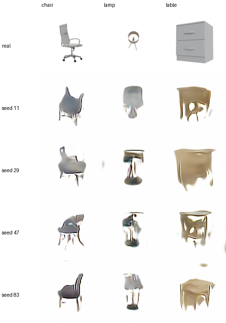
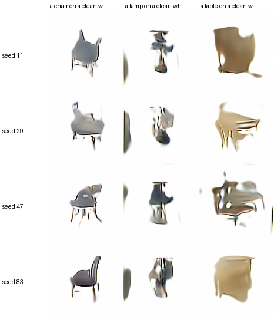

# ABO CleanRender direct electronic baseline

## Outcome

This is the first trained T12 row whose **entire trainable electronic system is below 10M parameters**.  It removes both SD-Turbo UNet and the frozen SD VAE.  At inference it takes text and a Gaussian seed, then emits a 128x128 RGB image in one direct decoder call.

The result is a functional research pilot rather than a publication-quality image generator.  Chairs, lamps, and tables are usually separable and seeds change pose/shape, but thin structures can break and some table samples remain chair-like.  Epoch 120 is the selected checkpoint; epoch 160 reduced paired reconstruction error further but introduced more vertical/edge artifacts.

## Dataset

The earlier 800-image catalog crop was not reused.  `abo_cleanrender_v1` is range-fetched from the official 223 GB ABO CVPR 2022 **No-BG Blender render** ZIP and retains only the selected images locally.

| split | images | distinct products | views/product |
|---|---:|---:|---:|
| train | 1,728 | 144 | 12 |
| validation | 192 | 24 | 8 |
| test | 192 | 24 | 8 |
| total | 2,112 | 192 | - |

The three balanced conditions are `chair`, `lamp`, and `table`.  Product identity is disjoint across all splits.  Images are alpha-composited on white and resized to 128x128.  The source license file is copied into the prepared dataset and pinned by SHA-256 `419896aea50c15d6e40c5b4baf4bd346f78223b9a354c7357ad00262afdc08ec`.


## Architecture and parameter accounting

```text
caption
  -> frozen Qwen3-VL-2B masked-mean feature (2048-D; cached during training)
  -> trainable text projection + category context
Gaussian z (128-D, initialized by the integer seed)
  -> trainable noise mapping + 4x4 spatial seed
  -> five FiLM residual upsample blocks
  -> RGB tanh head (128x128)
```

| component | trainable parameters | used at inference |
|---|---:|---|
| Direct RGB generator, including text adapter | 4,193,542 | yes |
| Conditional discriminator | 1,875,364 | no |
| Total during training | **6,068,906** | - |

Frozen Qwen is reported separately and is not counted as trainable.  There is no UNet, no VAE, no image encoder, no iterative denoising, and no input image at inference.

## Training logic

Each training render is assigned a deterministic `N(0,I)` code derived from `SHA256(seed, sample_id)`.  Foreground-weighted 32x32 reconstruction teaches coarse shape/color, while hinge adversarial, category, feature-statistics, white-border, and seed-diversity losses sharpen the direct decoder and prevent mode collapse.  At inference an arbitrary integer initializes a fresh Gaussian code; no training image is retrieved or copied.

The first unpaired run collapsed to nearly identical blobs for different seeds.  The released run adds paired low-frequency silhouette supervision and explicit seed diversity without adding parameters.

## Selected result

Epoch 120 is selected by visual inspection of the held-out identity grid, not by the low-resolution polynomial MMD alone.  That proxy reached its numerical minimum at epoch 20 while the images were still blob-like, so it is retained only as a diagnostic.

| metric at epoch 120 | value |
|---|---:|
| validation discriminator category accuracy | 1.0000 |
| validation mean seed pixel difference | 0.13399 |
| low-resolution polynomial MMD diagnostic | 0.07872 |
| train foreground-weighted low-frequency reconstruction | 0.08502 |

Checkpoint: `/DATA/DATA1/guest3/t12_assets/runs/cleanrender_direct_gan_v1/checkpoint_epoch_0120.pt`

SHA-256: `2638ea12e7bf88059aed7b60f4bc445859e6136cab27809e4dee18357423860a`

The first row below is an unseen held-out product; the next four rows are generated from four independent seeds.



The following grid runs the full live path (fresh text -> Qwen -> generator) with the simple in-domain prompts “a chair/lamp/table on a clean white studio background”.  The same Gaussian vector is shared across columns within a row to isolate the effect of the text condition.



The model is less reliable for prompt phrasing outside the small training caption distribution; this is visible in `novel_prompt_diagnostic.png` and is the main next electronic issue, ahead of optical replacement.

## Reproduction

```bash
python -m LightGenV2.tasks.t12_text_to_image.prepare_abo_cleanrender \
  --abo-root /path/to/abo-metadata \
  --output-dir /path/to/abo_cleanrender_v1 \
  --categories CHAIR,LAMP,TABLE \
  --train-instances 48 --val-instances 8 --test-instances 8 \
  --train-views 12 --eval-views 8 --image-size 128 --download-workers 16

python -m LightGenV2.tasks.t12_text_to_image.cleanrender_run \
  --data-dir /path/to/abo_cleanrender_v1 \
  --run-dir /path/to/run \
  --qwen-checkpoint /path/to/Qwen3-VL-2B-Instruct \
  --device cuda
```

All 36 T12 tests pass on the server.  The training/inference GPU was verified at 12 MiB and 0% utilization after completion.

## License note

The current official ABO bucket exposes `LICENSE-CC-BY-4.0.txt`, which is the file pinned above.  Some older ABO paper/AWS-registry descriptions still state CC BY-NC 4.0.  Keep the source license and attribution in every release, and have the institution re-check this discrepancy before redistributing a paper dataset bundle.
