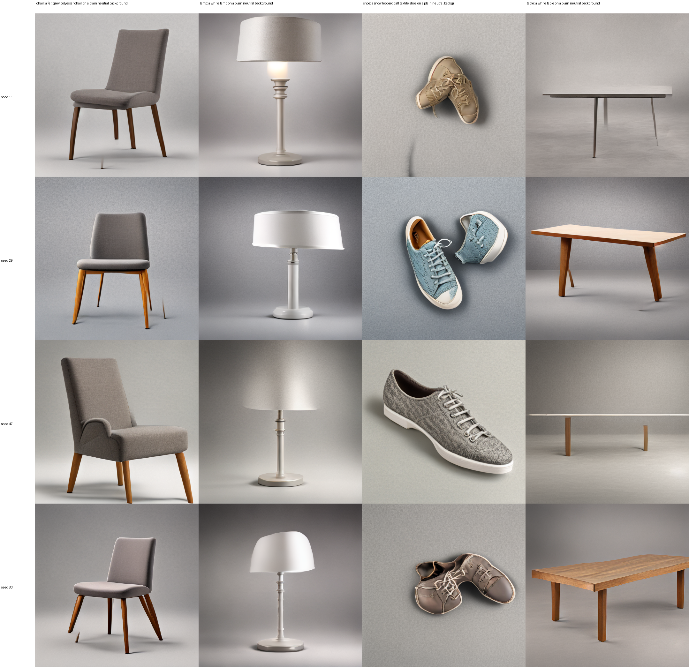
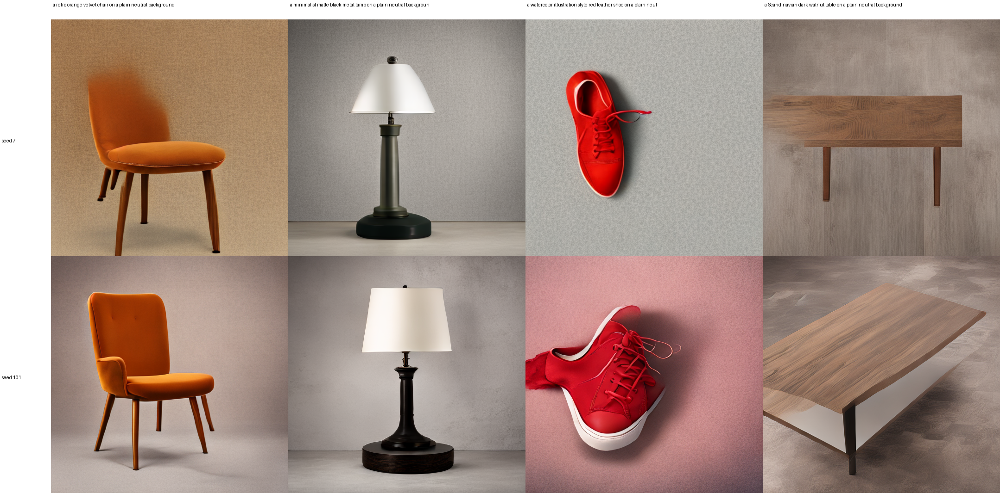

# T12 纯电子文生图 baseline（2026-09-21）

## 结论

本轮最终采用 `Qwen3-VL-2B -> 4.27M 条件适配器 -> 冻结 SD-Turbo UNet -> 冻结 VAE`。它不是扩散循环：每张图只调用一次 UNet、一次 VAE decode。训练和推理都不读取输入图片。

从零训练的两个小 GAN 版本只学到了类别轮廓和随机性，但长期保留条纹、融化形状和 VAE 流形外伪影，因此明确否决，不作为后续换光的电子基线。冻结的预训练单步 decoder 提供视觉先验，只训练 Qwen 条件适配器，是当前可用方案。

## 数据与训练流

- 图像：ABO CC BY 4.0 单物体子集，train/val/test = 800/100/100，chair/lamp/shoe/table 各类别平衡。
- 冻结文本前端：`Qwen/Qwen3-VL-2B-Instruct`，masked-mean hidden state，2048 维。
- 文本增强：768 条 `类别 × 颜色 × 材料 × 风格` 组合，只增加文本，不增加图片；用于蒸馏冻结 decoder 已有的文本知识。
- 适配器：2048 维 Qwen 表征经过 3 个 residual MLP，预测 128 维 PCA 系数，再还原为 `77 × 1024` 条件 token。
- 训练参数：4,273,280；Qwen、SD-Turbo UNet、VAE 全部冻结。
- 最佳 checkpoint：epoch 200，validation teacher cosine = 0.97338，normalized MSE = 0.05379。

```text
文本
  -> 冻结 Qwen（语义表示）
  -> 电子 residual MLP 适配器（唯一训练部分）
  -> 77×1024 条件 token

真实整数 seed -> N(0,I) latent
条件 token + latent
  -> 冻结 SD-Turbo UNet（一次）
  -> 冻结 VAE decoder（一次）
  -> 512×512 RGB
```

训练阶段用冻结 CLIP 条件作为教师信号，但推理阶段不会调用 CLIP：真正输入生成器的是 Qwen 经适配器产生的 token。

## 固定测试提示与 seed

下图的列是四条未参与训练的固定 test caption，行是 seed 11/29/47/83。没有“输入图片”或重建参考图。不同 seed 对应不同的高斯 latent，因而会改变物体造型、视角和局部细节。



人工审计：四类总体稳定；鞋、灯为 4/4 可识别，椅和桌各有少量单步失败或结构简化。该结果足以作为后续逐步替换为光学主干的电子质量基线，但不是开放域 SOTA。

## 新提示词和属性控制

以下四句不在固定测试网格中，分别测试复古橙色天鹅绒椅、极简黑色金属灯、红色皮鞋和斯堪的纳维亚深胡桃木桌；两行是 seed 7/101。



颜色、材料、类别和部分设计风格已能明显跟随。`watercolor illustration style` 仍主要表现为色彩/柔化变化，没有稳定变成水彩媒介，因此这里只称为“文本属性与初步风格控制”。真正的参考图风格迁移需要额外图像条件分支，不属于当前纯文生图 baseline。

## 速度与产物

- A100 上 512×512、batch=4 的热启动生成时间约 0.18 秒/批（不含首次模型载入）。
- 冻结 decoder 单独峰值显存约 4.92 GiB；训练及采样过程中观察到的进程显存约 8 GiB。
- 服务器 checkpoint：`/DATA/DATA1/guest3/t12_assets/runs/677deac6/qwen_sd_turbo_one_step_text_aug_seed42/best_adapter.pt`
- 训练摘要：[training_summary.json](training_summary.json)
- 新提示推理合同：[novel_prompt_inference.json](novel_prompt_inference.json)
- SD-Turbo 权重未提交到 Git；服务器 run 保留其 `LICENSE.md`。该模型使用 Stability AI Community License，研究用途需遵守随模型提供的许可证。

## 复现

```bash
python -m LightGenV2.tasks.t12_text_to_image.electronic_turbo_run \
  --data-dir /path/to/abo_single_object_v1 \
  --run-dir /path/to/run \
  --qwen-checkpoint /path/to/Qwen3-VL-2B-Instruct \
  --turbo-checkpoint /path/to/sd-turbo-fp16 \
  --device cuda

python -m LightGenV2.tasks.t12_text_to_image.electronic_turbo_infer \
  --adapter-checkpoint /path/to/run/best_adapter.pt \
  --qwen-checkpoint /path/to/Qwen3-VL-2B-Instruct \
  --turbo-checkpoint /path/to/sd-turbo-fp16 \
  --output-dir /path/to/output \
  --prompt "a retro orange velvet chair on a plain neutral background" \
  --seed 7 --seed 101 \
  --device cuda
```

服务器结构测试为 23 passed。正式训练和两次端到端推理结束后，专用 A100 显存均回落到 14 MiB，无残留本任务进程。
