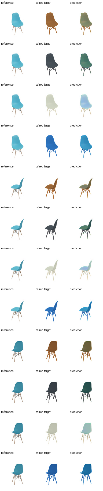

# Chair style transfer: electronic and parallel-optical v1

## Result

This experiment changes the task from unconstrained chair generation to
geometry-preserving, text-conditioned chair style transfer.  The input render
is carried to the output through an explicit pixel skip.  A compact
encoder/decoder predicts only a bounded foreground RGB residual, so chair
legs, armrests, holes, and the white background are not regenerated from
scratch.

The four frozen-Qwen conditions are product-style prompts for warm walnut,
matte charcoal, ivory white, and cobalt blue.  Paired supervision is generated
from the source render by changing foreground colour/material appearance while
preserving its luminance and silhouette.  This is deliberately a controlled
style-transfer benchmark, not a claim of arbitrary artistic-style transfer.

## Architecture

Both variants are one-pass 128x128 models with one decoder call and no
diffusion/UNet loop.

```text
reference RGB -> compact encoder -> 16x16 bottleneck -> compact decoder -> bounded RGB residual
       |                                                                  |
       +---------------- pixel identity skip + foreground mask -----------+

electronic bottleneck:  x -> electronic conditioned residual
hybrid bottleneck:      x -> {electronic conditioned residual || optical FFT block}
                              -> detached-RMS fusion
```

For the hybrid comparison, the selected electronic model initializes the
encoder, electronic residual, and decoder.  Those weights are frozen; only the
parallel optical branch and RMS-fusion scalar are optimized.  The compact FFT
backend is a differentiable optical simulation, not a hardware measurement.

| Variant | Inference generator | Training-only discriminator | Total training | Newly optimized for optical run |
|---|---:|---:|---:|---:|
| Electronic | 911,284 | 956,705 | 1,867,989 | n/a |
| Parallel optical | 948,152 | 956,705 | 1,904,857 | 36,868 |

The optical path itself has 36,865 parameters.  Its selected fusion weight is
0.13485.

## Data and selection

- Curated ABO standard-chair split: 540 train images / 27 identities, 40
  validation images / 5 identities, and 32 test images / 4 identities.
- Each image is paired with all four style conditions.
- Electronic training: 60 epochs; selected epoch 58.
- Optical-only adaptation: 35 epochs; selected epoch 35.
- Selection score is validation L1 plus 0.25 times edge drift.

| Variant | Best validation selection score |
|---|---:|
| Electronic | 0.024327959 |
| Parallel optical | 0.024326497 |

The optical change is only 0.000001462 (about 0.006%).  It should be described
as quality preservation / compatibility, not a meaningful quality gain.  The
visual comparison likewise shows no obvious structural degradation.

## Unseen-test visual grids

Each row is `reference | paired target | prediction`.  The grid contains three
held-out chair views, each rendered under all four text conditions.

### Electronic


### Parallel optical simulation



## Preserved releases

The server artifacts are immutable (`chmod a-w`) and include checkpoints,
configs, architecture summaries, test grids, and SHA256 manifests.

- Existing different-seed chair generation:
  `/DATA/DATA1/guest3/t12_assets/releases/standard_chair_seedgen_v1`
  - checkpoint SHA256:
    `35e2145a3ff7474ae8ade11cdd846627662918f10599540afc2cbe38cef2b154`
- Style-transfer electronic/optical pair:
  `/DATA/DATA1/guest3/t12_assets/releases/chair_style_transfer_v1`
  - electronic checkpoint SHA256:
    `216e74fd0d80f5dd901a1f96c8d322862fa48fdc7d4c40ba1d1595cb30d4e6f6`
  - optical checkpoint SHA256:
    `102618f0ad0a677ea0dc53603a4cb9b2914f9403a1631f5158560cfeb59b7c58`

All 41 T12 tests passed after the run.  The two training PIDs no longer own a
GPU allocation; unrelated T11/T13 jobs on the shared server were left intact.
