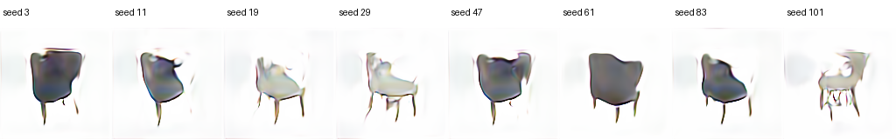
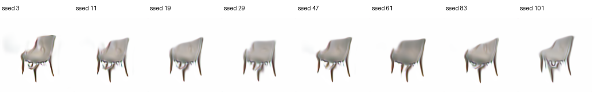

# Standard-chair conditional VAE-GAN

## Outcome

The selected model is epoch 100 from `cleanrender_standard_chair_vae_gan_v1`.
It performs one direct RGB decoder call with no UNet and no iterative sampler.

- Training parameters: 7,677,494
- Pure text-to-image inference parameters: 4,189,060
- Reference-variation inference parameters: 5,802,644
- Frozen Qwen parameters are excluded from those trainable counts
- Training uses a text-conditioned projection discriminator with hinge GAN loss

## Data correction

The original ABO `chair` category contained sofas, recliners, cushions, ottomans,
benches, office chairs, and detached soft parts. The reproducible standard-chair
selection keeps conventional single-seat chairs with a visible back and legs:

- train: 540 images / 27 product identities
- validation: 40 images / 5 product identities
- test: 32 images / 4 product identities
- product identities remain disjoint across splits
- all images retain the source CC BY 4.0 metadata and attribution

The exact product allow-list is in
`configs/abo_standard_chair_sequences.json` and the dataset builder is
`curate_standard_chairs.py`.

## Seed semantics

Pure generation uses a real seeded `N(0,I)` tensor:

`caption -> frozen Qwen feature -> seeded Gaussian latent -> one RGB decoder call`

Reference variation uses an interpretable latent interpolation:

`z = lerp(encoder(reference).mean, seeded_N(0,I), strength)`

- `strength=0`: deterministic VAE reconstruction
- `strength=0.5`: default visible reference variation
- `strength=1`: independent pure generation endpoint

The same checkpoint, prompt, seed, and strength are deterministic. A seed does
not select or copy a training image.

## Visual audit

`final_pure_prompt.png` uses the prompt
`a gray chair on a clean white studio background` with eight held-out seeds.
All eight are recognizable as single chairs. Thin legs and high-frequency edges
are still the main failure mode at 128x128.

`final_reference_variations.png` uses one unseen validation chair and the same
prompt at `strength=0.5`. The seed changes seat/back curvature and leg geometry
while keeping the reference pose family.

## Verification

- 120 training epochs completed
- selected checkpoint: epoch 100
- best validation proxy: 0.16963801085948943
- T12 tests: 38 passed
- final generation and reference inference both completed
- target A100 returned to 14 MiB / 0% utilization after inference

## Honest limitations

This is a compact research baseline rather than a photorealistic generator.
It removes the earlier cross-shape failures, but outputs remain smooth and can
show color fringes, fused thin legs, or simplified geometry. The chair-only
captions also contain limited linguistic variety, so Qwen conditioning is real
but the current dataset does not yet support rich compositional prompt tests.
