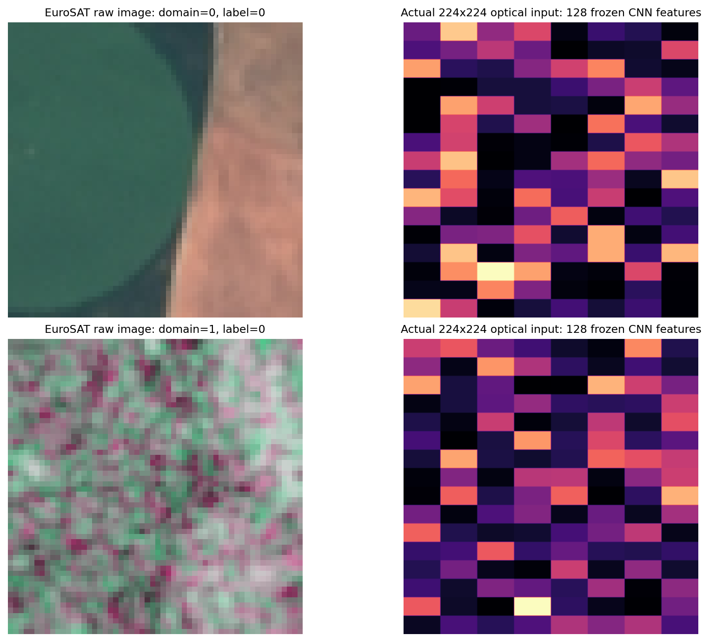
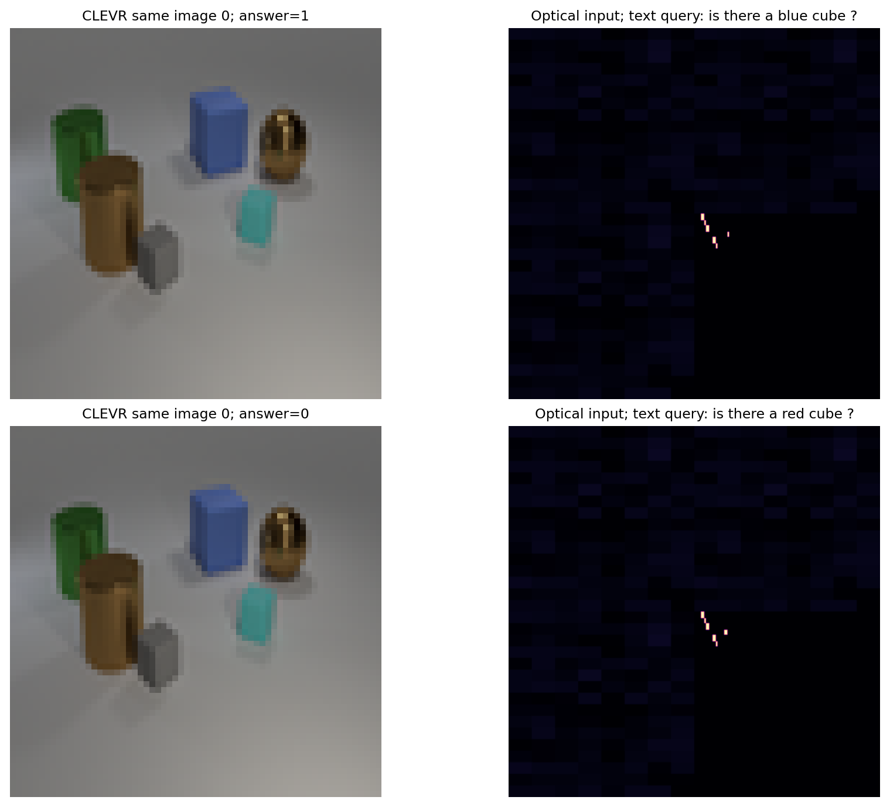
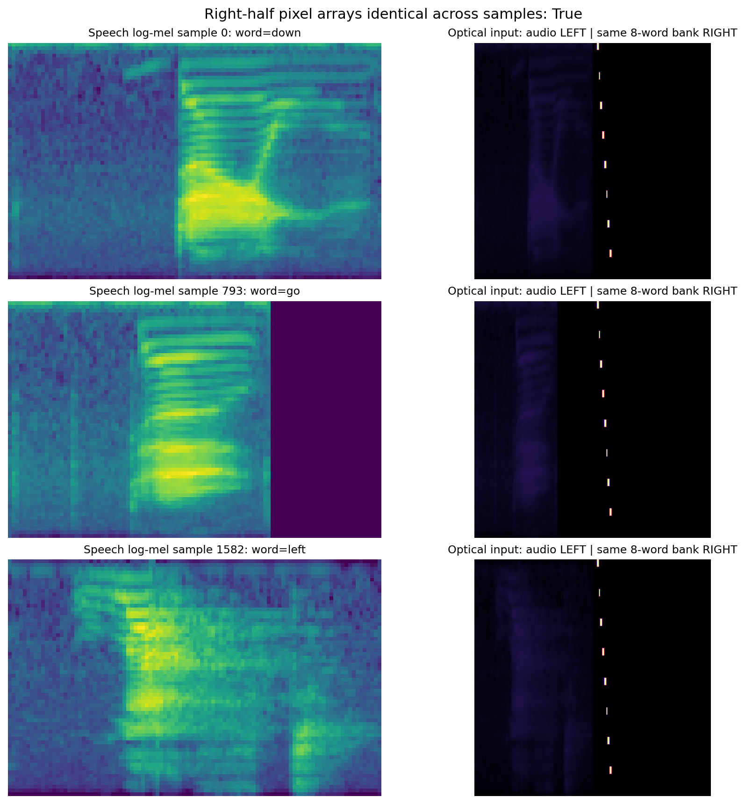
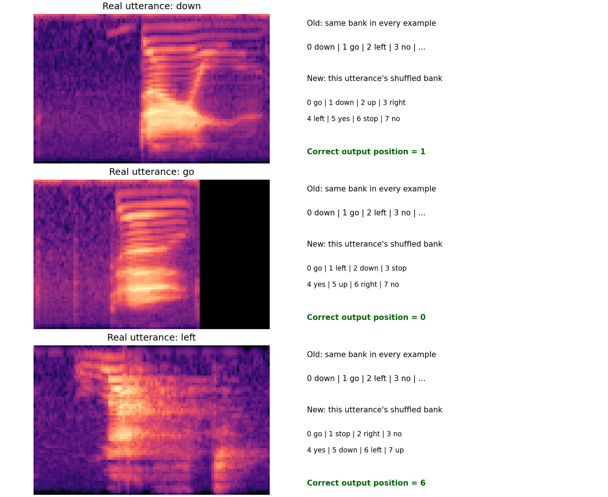
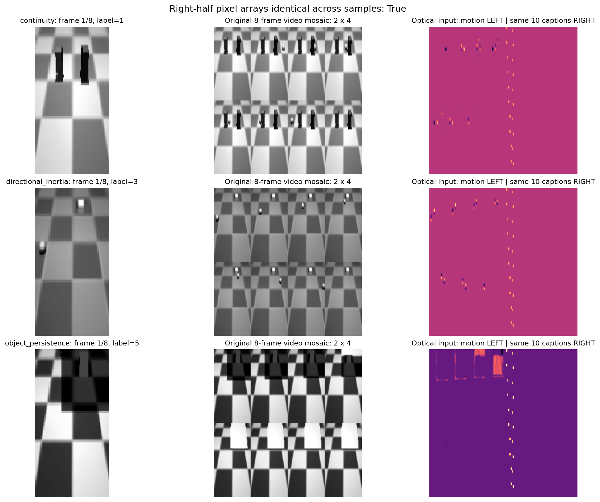
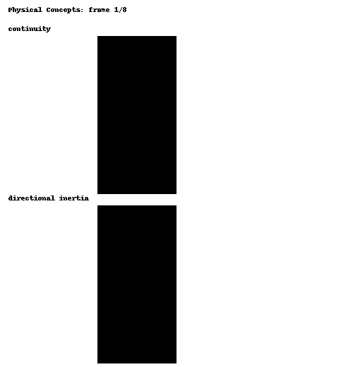
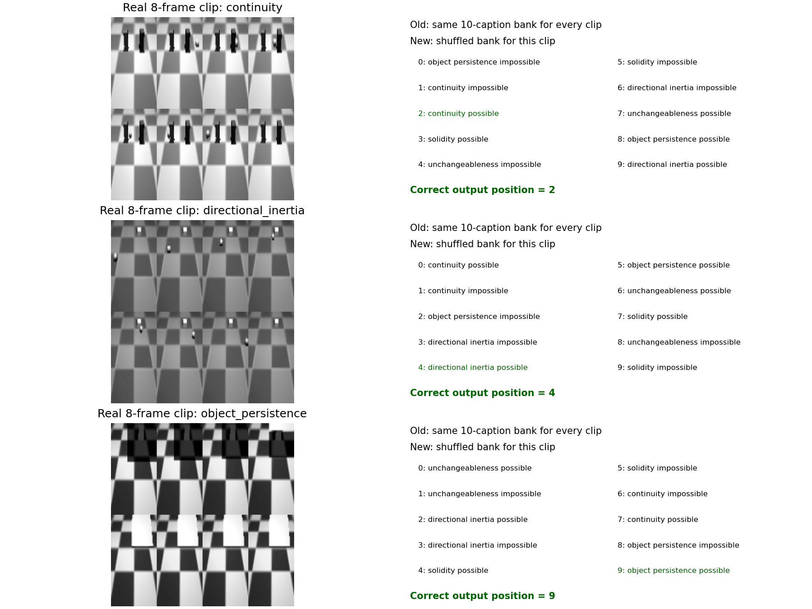

# 四任务固定共享读出：逐任务重新验收

这是与 `t13_four_modal_lifelong` 隔离的新协议。旧三张矩阵不改写、也不拿旧成绩冒充新协议成绩。目标是减少可学习电子部分，逐任务确认任务定义与可学性，再启动新的终身学习链。

## 用户确认的模型合同

- 两架构使用**逐元素完全相同**的、从一开始冻结的 `Linear(784,10,bias=False)` 权重。参考候选的十行由固定随机种子生成的零均值正交向量构成；其固定尺度可在**验证集**上选择。另有十个预设空间区域的固定行权重作为光学读出可学性候选。选定一套后 MoE/D2NN 全部重跑并共用它；电子头在任何任务和任何阶段都不训练、不替换、不重拟合。不同候选的单任务试跑不能拼入同一正式矩阵。
- 所有任务输入都预测十个输出位置：EuroSAT 和 Physical 标签 `0..9`，Speech 标签 `0..7`，CLEVR 标签 `0..1`。多余输出位置仍参与 softmax/交叉熵，并不依据任务身份屏蔽。任务名称不进入前向：没有任务专属头，也没有根据任务限制 MoE 专家；只由目前已激活的专家数决定容量。
- 保留原有角谱传播、相位层和 OEO；MoE router CCD 强度仍用于 soft routing。这是光电混合系统，**可训练的适配参数仅在光学相位**；不能把 OEO/路由的固定电子计算写成全光学硬件。
- EuroSAT 与 CLEVR 不再使用任何按目标标签训练的冻结 CNN，也不使用训练期电子 teacher。初始任务先用原始 RGB/SAR 的固定通道编码验证。旧 `t13` 的高分不能直接迁移为新协议成绩。
- 最终 16 槽几何与两个相位层保持不变，MoE 光学参数 1,825,188、D2NN 为 1,944,392。两边共享读出权重，但其光学参数分别训练。

共享十输出避免把 10+2+8+10 类硬拆成 30 个互斥槽，防止独立 D2NN 对从未学过的槽位天然得零分。代价是同一个输出编号在不同数据集代表不同含义；成绩须逐任务报告，不能把模型称为统一 30 类语义分类器。推理不传任务名，但外部评测知道各数据集标签含义。

两条具体前向路径：

|环节|16 槽 MoE|等口径 D2NN|
|---|---|---|
|输入至第一相位|固定规则产生 224² 振幅；router 224² 相位经一次 FFT 传播和 CCD 强度得到软权重，振幅乘权重平方根后送入当前激活的专家槽相位。|同一任务的**同一份** 224² 振幅确定性插值至 986²，经过整孔径第一相位。|
|后续|角谱传播 → CCD 强度电子归一化及 softsign → 重新注入（OEO）→ 986² 全局相位 → 角谱传播 → 同样 OEO。|同一传播、OEO、全局相位与输出处理。|
|电子读出|CCD 强度固定池化成 28×28，按本样本均值归一化并 `log1p`，**同一组**冻结 `Linear(784,10)` 输出十个 logit。|逐元素相同的冻结 Linear；无目标任务头切换。|

这里“只靠光适配”严格指**可学习的**任务参数只在相位上；输入的固定数字编码、router 的 CCD 强度计算、OEO 和读出前固定数学运算仍是电子计算。必须在论文里称光电混合模型，不能称全光学。

新旧协议的样本数量和输出含义如下。CLEVR 新计数已用服务器原始 70,000/7,500/7,500 张图逐图核验；其余保留原数据划分，但 Speech/Physical 的新候选位置标签仍须在真实全量数据上验收。

|任务|新训练 / 验证 / 测试样本|输入|新目标及输出位置|
|---|---:|---|---|
|EuroSAT|31,996 / 10,930 / 10,858|每次一张 RGB **或** SAR 图，非两图同时输入|10 种地物，位置 0–9|
|CLEVR|140,000 / 15,000 / 15,000 条问答；原图 70,000 / 7,500 / 7,500 张|图像与一条颜色/形状问题|是/否，位置 0–1|
|Speech Commands|6,263 / 843 / 867 条|一条语音的 log-mel 图加八个逐样本重排的词|正确词在本次候选表中的位置 0–7|
|Physical Concepts|70,400 / 14,652 / 14,948 条|八帧视频的相邻帧差分加十个逐样本重排的描述|正确概念及可行性描述的位置 0–9|

原始任务协议将 EuroSAT 素材标为 MIT，而 CLEVR、Speech、Physical 标为 CC BY 4.0；因此当前四任务不能整体宣称满足“所有数据均 CC BY 4.0”。正式发布前需依据上游素材逐项核对许可，或更换 EuroSAT 任务。

## 真实样本：当前任务究竟是什么

下面都是实验室数据包中的真实样本。图中右侧是**旧 `t13` 模型实际收到的 224×224 光场**，不是普通的原图缩放。因而也能直接看出为什么要改输入协议。

### EuroSAT：一张 RGB 或 SAR 图 → 十类地物

上、下两张分别是 RGB 与 SAR 域的样本，二者标签恰巧都是 `0`。旧光场右图把各自原图先经过**按地物标签训练过的 CNN**，再把 128 维特征排成方格。新协议直接把原图的 R/G/B 通道确定性铺成光场；SAR 采用数据包提供的三通道表示，避免先让电子网络学会地物分类。

### CLEVR：同一张图 + 每样本不同的问题 → 是／否

图像完全相同。问题 `is there a blue cube?` 的标签是 `1`；`is there a red cube?` 的标签是 `0`。这才是真正需要同时读图和文字的例子。旧协议先用学过颜色×形状属性的电子 CNN 变成特征，每图生成三正三负六问，共 420,000 条训练样本。新协议保留全部 70,000 张训练原图，**每图只取一正一负两个确定性问题**，变成 140,000 条；验证、测试各从 45,000 降到 15,000，三种架构结果必须在新协议上一起重跑、不能与旧矩阵混写。

### Speech Commands：声谱图 + 固定八词表 → 哪个词

左边三条音频分别说 `down`、`go`、`left`，标签分别是 `0`、`1`、`2`。右边旧光场的左半幅随音频改变；**右半幅包含按同一顺序排列的八个词，在这些样本间逐像素相等**（已由数组相等检验确认）。所以旧任务仅凭声音即可选出固定编号。新协议每条音频都确定性打乱八词的空间顺序，标签变为正确词在本次排列中的位置。这样同一句 `down` 的正确输出位置可随候选排列改变，模型必须利用文字侧信息；还须验证遮掉文字后接近八选一机会水平。

### Physical Concepts：八帧视频 + 固定十描述 → 概念及可行性

每行中间是同一视频的八帧（2×4 排列），右边旧光场左半幅是相邻帧差分，右半幅是十个候选描述。三个不同概念样本的右半幅也逐像素相同。旧任务可仅从视频分类成“哪个概念＋可能／不可能”。新协议对每条视频打乱十描述的位置，标签为正确描述在该条样本候选表中的位置；遮掉文字后应接近十选一机会水平。视频分组、概念来源、正负标签都需做防捷径检查。

## 接下来逐任务的验收顺序

1. **EuroSAT**：`model.py` 和原图单任务入口已实现；使用完整 31,996/10,930/10,858 划分及验证早停。冻结头 MoE 最好完整验证为 49.02%，**未通过约 70% 验收线**，故新四阶段链尚未启动。运行设置、同头公平比较、完整验证曲线及测试集访问记录见 [EuroSAT 验收报告](reports/EUROSAT_ADMISSION_20260924.md)。下一步须先决定是否允许任务 A 一次性公共读出校准，不能悄悄恢复标签训练 CNN 或任务专属电子头。
2. **CLEVR**：实现原图＋逐样本问题输入与每图两问协议，先检查同图一正一负能否被区分，再跑完整 70k 张训练图；分别遮掉图像和问题，检查是否存在仅靠一侧也能高分的生成偏差。预设上限 8 轮和验证早停；每轮样本降为原来的三分之一。
3. **Speech**：实现候选顺序按样本变化，验证标签随排列同步变化，先跑单任务并做文字遮挡检查。若仅保留音频，正确位置条件分布应是八选一机会水平，故遮挡后的异常高分意味着泄漏或协议错误。初始上限 12 轮，不因为旧协议第 17 轮才最佳就机械照搬。
4. **Physical**：按同一原则做十描述重排和视频分组检查，再跑单任务；遮掉描述后应接近十选一机会水平。初始上限 12 轮。

只有某任务的**完整验证集** MoE balanced accuracy 达到约 70%，且输入消融符合任务描述，才把它纳入新的四阶段终身学习链。70% 是进入下一阶段的目标，不是允许看测试集调参或保证一定达到的承诺。D2NN 单任务正常训练并报告，顺序 D2NN 不回放；不做 D2NN replay 训练。

终身 MoE 继续回放，但预算从旧的每任务 512 提升到**最多每个旧任务 16,384 个不同样本**，少于该数时全取（Speech 6,263 条即全取）；按类别、EuroSAT 传感器域平衡，按旧任务分别报告唯一数和每轮重复次数。每个旧任务初始 replay batch 为 32，随后只用验证集调整。此为大记忆回放，**不称旧数据全量回放**。新增专家预热改为初始 1 轮：只训练新四个专家相位，路由对这四个专家均分，router、global、旧专家、共享电子头不动；之后再启用所有当前专家的输入相关路由，训练新专家＋router＋global，并用旧任务 replay 防遗忘。验证不足时才有依据地增加预热轮数。

旧 `t13` 三张矩阵仍是历史可复现结果；新协议的矩阵必须重新产生，不能在两种数据定义和读出合同之间拼接单元。
