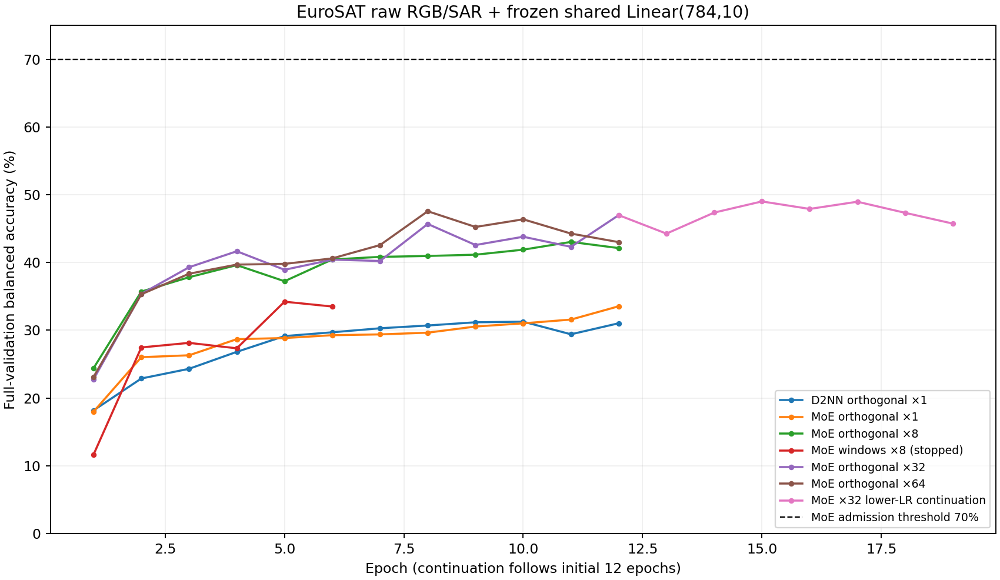

# EuroSAT 原图＋冻结共享读出单任务验收（2026-09-24）

本报告只覆盖新 `t14_shared_readout_lifelong` 协议的第一个任务。训练使用完整 31,996 张 RGB/SAR 图，按完整 10,930 张验证图的 balanced accuracy 选 checkpoint；测试集 10,858 张。MoE 与 D2NN 都是实际 FFT 传播/OEO 光学前向，可学习参数仅为相位，最终电子读出只有一个 `Linear(784,10,bias=False)`；不使用按地物标签训练过的 CNN 或训练期电子 teacher。所有固定头候选从头冻结，输出位置不按任务屏蔽。

|候选|完整验证 balanced accuracy|测试 balanced accuracy|说明|
|---|---:|---:|---|
|D2NN、正交固定头×1|31.27%|32.45%|12 轮，验证第 10 轮最好|
|MoE、**同一正交固定头×1**|33.54%|35.04%|12 轮，验证第 12 轮最好|
|MoE、正交固定头×8|43.04%|46.51%|12 轮，验证第 11 轮最好；与 D2NN ×1 不能当成公平架构差值|
|MoE、固定空间区域头×8|34.22%|未测|第 6 轮时因低于正交×8 而提前停止；没有打开测试集|
|MoE、正交固定头×32|46.99%|不测|12 轮，验证第 12 轮最好；仅验证集选型|
|MoE、正交固定头×64|47.57%|不测|12 轮，验证第 8 轮最好；仅验证集选型|
|MoE、正交固定头×32，低学习率续训|49.02%|不测|从 ×32 验证最佳相位继续训练，新增第 3 轮最好，新增第 7 轮早停；初始 checkpoint 作为零轮候选保留|

前三个完成运行的 `metadata.json` 显示读出头在整个训练中 SHA-256 未变化。MoE ×1 与 D2NN ×1 的读出权重 SHA-256 逐字符相同（`026b0ff1e45ea110b934008c1d4f8581ef452c00868c864d3a5c47a98b7deb7f`），所以仅这两行具有同头直接比较资格，其测试差 2.59 个百分点。增益是冻结 Linear 权重的共同正尺度，相当于改变交叉熵训练温度；同一模型 checkpoint 的 argmax 不因正尺度改变，但训练梯度会变，必须在相同增益下分别训练两架构才能比较。空间区域候选也是**同一层 Linear** 的预设权重，并未新增电子层。

**验收结论未通过：**最佳 MoE 完整验证为 49.02%，距约 70% 验收线还有 20.98 个百分点。旧 `t13` 的 EuroSAT 80.11% MoE / 79.92% D2NN 包含冻结的标签监督 CNN、任务头及 MoE 训练期 teacher，不能与本次原图＋从头冻结共享读出相减归因。此次性能下降说明严格约束下当前系统不够好，却不能凭一次同时改变数项设计的试验精确分离每项贡献。因此不把此 checkpoint 冒充四任务新矩阵的第一行，也不开始 CLEVR/终身链。

服务器 CPU 测试覆盖共享头不更新、旧专家冻结与光学梯度，以及真实 CLEVR/Speech/Physical 数据的输入及标签位置检查；12 项通过。`reports/` 保留每个运行的 `metadata.json`、逐轮 `history.json`、可得的 `results.json` 和退出码。空间区域候选被人为早停，退出码非零是预期行为。早期脚本已经对 ×1 和 ×8 完成测试评估；这些测试分数只作该 checkpoint 的描述，**未用于**挑选固定读出或训练轮数，后续 ×32/×64/续训候选已改成仅验证集运行。因此本轮是方法筛选报告，尚不是最终预注册的单次测试估计。

下一步应先决定是否允许**一次性公共读出校准**：在任务 A 开始时训练一组对 MoE、D2NN 逐元素相同的 Linear 权重，随后四任务完全冻结，B/C/D 的适配仍只更新相位。这比恢复任务专属头/标签监督 CNN 更接近“光学承担跨任务适配”，但不再是“电子头从一开始随机冻结”，必须作为另一个清晰标注的协议。若坚持从头冻结，则需接受当前达不到 70% 的证据，或设计等参数量、更深的光学层后重新验收；不能悄悄把旧的电子特征接回来。
