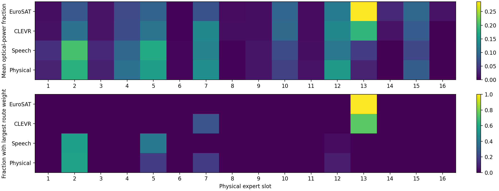
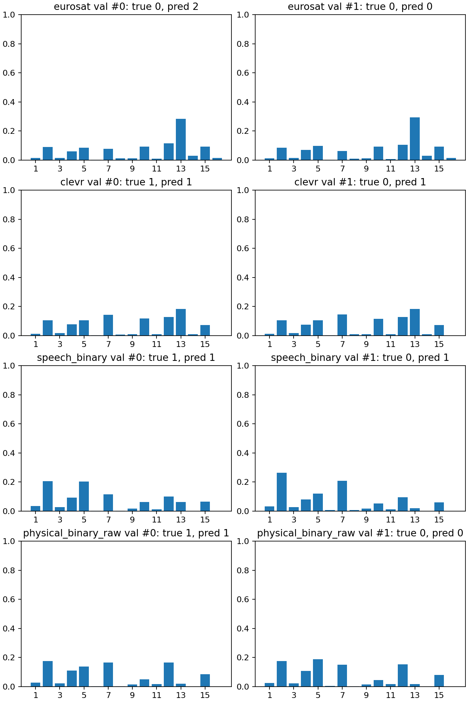

# 最终展示：三张矩阵与专家使用分布（MoE均值78.62%）

采用 `stage4_moe_physical_pairwise2_sharedvision_s17_e19a` 第4轮作为MoE最后一行，A/B/C仍是该链原有获选检查点。最后一行是后验探索性优化，原正式D行不覆盖。所有矩阵数值为完整测试集宏平均召回率（%），不是普通样本准确率。顺序矩阵行＝刚学完的阶段，列＝测试任务；—表示尚未学到。

## 1. MoE 全量replay终身学习

| 阶段／测试任务 | A EuroSAT | B CLEVR | C Speech | D Physical |
|---|---:|---:|---:|---:|
| A | 77.85 | — | — | — |
| B | 73.65 | 79.77 | — | — |
| C | 76.72 | 80.34 | 78.84 | — |
| D（探索性优化） | 77.35 | 81.12 | 81.14 | 74.88 |

最终四任务均值 **78.62%**。D从同一个C checkpoint接续，保持全量replay与旧专家冻结，仅加入Physical正负配对排序损失；没有更换输入、光路或读出架构。原D结果77.20/80.90/81.95/73.46%保留在原协议报告，不放入这张展示表。

## 2. 独立D2NN固定模型跨任务推理4×4

| 独立训练源模型／测试任务 | A EuroSAT | B CLEVR | C Speech | D Physical |
|---|---:|---:|---:|---:|
| A EuroSAT | 71.77 | 0.00 | 0.00 | 0.00 |
| B CLEVR | 10.00 | 76.50 | 50.00 | 50.00 |
| C Speech | 10.13 | 50.25 | 67.19 | 50.00 |
| D Physical | 10.00 | 50.00 | 51.90 | 75.35 |

每行用独立训练所得的相位和该模型自己的Linear，跨列直接推理，绝不适配目标任务头。这是跨任务得分矩阵，不是逐类混淆矩阵。10%／50%通常为单类预测的宏平均机会水平；0%包含十输出头预测到二分类合法位置之外。不能把这些格单独解释为纯光学表示失效。

## 3. D2NN无replay顺序学习

| 阶段／测试任务 | A EuroSAT | B CLEVR | C Speech | D Physical |
|---|---:|---:|---:|---:|
| A | 71.77 | — | — | — |
| B | 10.00 | 76.41 | — | — |
| C | 10.00 | 50.00 | 60.67 | — |
| D | 9.98 | 57.96 | 51.96 | 75.16 |

同一份光学权重和Linear沿A→B→C→D持续更新，只训练当前任务，没有旧任务训练数据；最终均值48.77%。D2NN全量replay与每旧任务300条replay另见[全部对照总览](FINAL_RESULTS_AND_TRAINING_20260926.md)，不混入这张无replay表。

## 获选MoE阶段D：每个任务的专家使用分布

以下来自78.62%方案的**完整验证集**，不是测试集，也不是早期阶段或第二轮均衡候选。专家编号1–16为固定物理槽。平均功率是各样本软路由权重的平均；最大权重频率只用于分析，推理仍是所有16专家的dense soft routing，没有Top-1硬选择。功率占比不等于因果贡献。

### 平均路由功率（%）：槽1–8

| 任务 | 1 | 2 | 3 | 4 | 5 | 6 | 7 | 8 |
|---|---:|---:|---:|---:|---:|---:|---:|---:|
| EuroSAT | 1.01 | 7.77 | 1.46 | 6.35 | 9.11 | 0.22 | 7.22 | 0.89 |
| CLEVR | 1.29 | 10.66 | 1.54 | 6.70 | 11.07 | 0.25 | 13.39 | 1.05 |
| Speech | 3.84 | 20.30 | 3.35 | 9.51 | 17.56 | 0.42 | 12.76 | 0.29 |
| Physical | 2.76 | 18.16 | 2.57 | 10.48 | 15.90 | 0.37 | 14.33 | 0.30 |

### 平均路由功率（%）：槽9–16

| 任务 | 9 | 10 | 11 | 12 | 13 | 14 | 15 | 16 |
|---|---:|---:|---:|---:|---:|---:|---:|---:|
| EuroSAT | 1.21 | 9.40 | 0.89 | 11.72 | 28.66 | 3.14 | 9.57 | 1.39 |
| CLEVR | 1.12 | 9.91 | 0.87 | 13.28 | 18.90 | 1.45 | 8.39 | 0.12 |
| Speech | 1.66 | 6.55 | 1.17 | 11.36 | 4.97 | 0.14 | 6.09 | 0.01 |
| Physical | 1.59 | 5.45 | 1.40 | 15.41 | 2.76 | 0.07 | 8.45 | 0.01 |

### 样本级最大权重频率与新专家使用

| 任务 | 验证样本数 | 各最大权重槽及频率 | 最后新四槽合计功率 |
|---|---:|---|---:|
| EuroSAT | 5,465 | 13: 100.00% | 3.51% |
| CLEVR | 15,000 | 7: 25.53%, 13: 74.47% | 2.53% |
| Speech | 1,686 | 2: 56.47%, 5: 40.27%, 12: 3.20%, 15: 0.06% | 5.44% |
| Physical | 29,304 | 2: 57.52%, 5: 17.57%, 7: 17.29%, 12: 7.62% | 4.55% |

EuroSAT最大权重仍集中在槽13；其它任务有一定样本间变化，但新四槽总体功率较少，不能声称充分发挥了16专家。平均功率表因四舍五入可能不严格加到100%。

## 证据入口

- [原阶段矩阵与D2NN协议](shared_frozen_vision_protocol_20260925.md)
- [78.62% MoE优化过程与测试边界](moe_physical_optimization_20260926.md)
- [专家统计JSON](expert_distribution_20260926/pairwise_validation_summary.json)、[固定样本JSON](expert_distribution_20260926/pairwise_expert_examples_validation.json)

两方共用输入与冻结视觉CNN、光学传播尺度和单层Linear结构，但训练策略及训练后的权重不同。此展示比较的是完整光电系统与训练方案；MoE全量replay与D2NN无replay同时存在回放差异。原D测试在设计MoE优化前已查看，因此最后一行须在论文或幻灯片中注明探索性结果。本页只重新整理已完成结果，没有新训练或重测。
