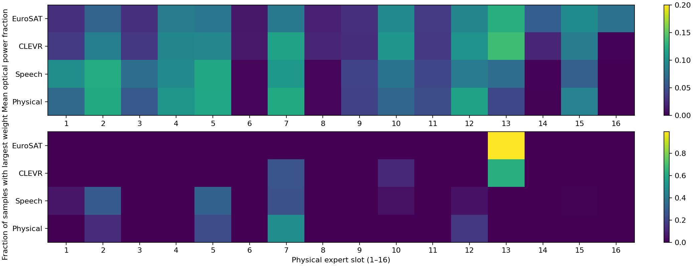
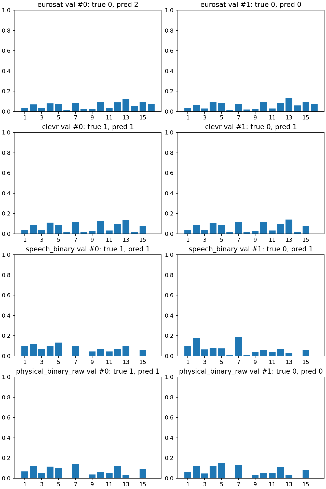

# 阶段D第二轮：路由分散与精度权衡

三条候选均从正式C `stage3_moe_balanced_sharedvision_s17_e696/best_checkpoint.pt` 重训D，保持相同输入、冻结视觉前端、光路、旧专家冻结、全量balanced_cycle回放和单层Linear。源码commit `421f6cea0`；种子17、batch32、头学习率比例0.1、CLEVR配对权重4；6轮预算、最少4轮、耐心3。完整命令与配置保存在服务器各run的command.txt/config.json，目录为任务runs/simulation/。

| 候选run后缀（前缀stage4_moe_refine_） | 学习率 | 均衡权重 | Physical配对权重 | 最佳轮 | 四任务验证均值 |
|---|---:|---:|---:|---:|---:|
| lr5e4_r03_p2_s17_20260926 | 0.0005 | 0.3 | 2 | 6 | 77.84% |
| lr1e3_r3_p2_s17_20260926 | 0.001 | 3 | 2 | 4 | 78.09% |
| lr5e4_r1_p4_s17_20260926 | 0.0005 | 1 | 4 | 6 | 77.65% |

按完整验证比较选第二条：各任务≥70%，均值与上轮78.10%近似持平，路由更分散。另两条未测试。获选模型四任务验证73.50/80.98/82.44/75.45%；仅测试一次，探索性测试如下。

| 阶段D方案 | EuroSAT | CLEVR | Speech | Physical | 四任务均值 |
|---|---:|---:|---:|---:|---:|
| 上轮配对排序优化 | 77.35% | 81.12% | 81.14% | 74.88% | 78.62% |
| 本轮加强均衡 | 76.44% | 81.02% | 80.97% | 74.93% | 78.34% |

未达到80%目标，不能称各项精度提升。Physical仅高约0.05个百分点，四任务均值下降约0.28点，保留上轮作为最佳测试精度方案。Physical本轮测试负/正召回64.46%/85.41%，仍有偏向。原测试在设计候选前已查看，本轮也是后验探索性结果，不能作为盲测确认性增益。

## 完整验证路由

| 任务 | 最大专家平均功率：上轮→本轮 | 最常胜出专家样本比例：上轮→本轮 |
|---|---:|---:|
| EuroSAT | 28.66%→12.60% | 100%→99.25% |
| CLEVR | 18.90%→13.79% | 74.47%→62.69% |
| Speech | 20.30%→12.38% | 56.47%→30.90% |
| Physical | 18.16%→12.17% | 57.52%→48.49% |

Physical最后新四槽功率4.55%→12.02%。功率分配变散不等于所有任务均形成样本级分工，EuroSAT最大权重仍几乎总落在槽13，部分槽仍很弱。功率不是专家因果贡献。

source.json保存源checkpoint、训练源码commit、验证样本数与选中轮次；result.json保存完整验证与旧专家逐元素未变核验；selected_test.json保存唯一测试、checkpoint SHA256和评估commit；expert_examples_validation.json保存固定索引预测和路由功率。获选权重唯一读出为shared_head.weight (10,784)，无额外头；服务器29项测试通过，本轮训练与推理进程均已结束并释放GPU。
