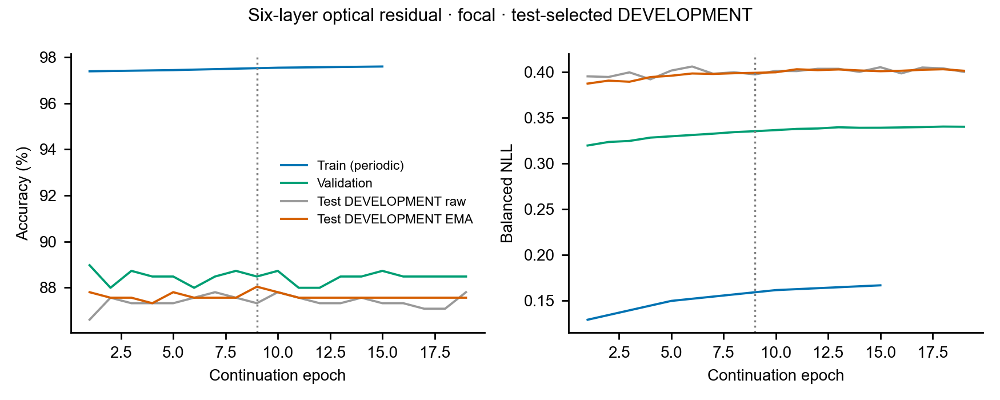

# 六层30%相干振幅残差：focal开发续训结果

run：`mango_rho03_L6_focal_testdev_spare_20261010`，训练源码main `5ca083bc0`。
本次为用户授权的 **test-selected DEVELOPMENT**，每轮test选PT和早停，
训练梯度只来自train；不是独立泛化，也不是与固定无残差组同预算的公平消融。

从原smooth第8轮EMA（开发87.80%）接续；六层九专家MoE、专家/global的rho0.3、
router无残差、原OEO/CCD、输入及数据划分均不变，推理不含电子教师/CNN/Linear。
Focal gamma1、lr0.00015余弦至0.000015、EMA0.99、label smoothing0.02，
capture loss0.2、phase smooth0.05，原增强，epoch偏移200；优化器和EMA重启。
最多30轮／至少10／patience10；完成19轮后早停，按test accuracy最高、同分
balanced NLL最低选择第9轮EMA，best和last均保留。

| 状态 | train准确率 | val准确率 | test开发准确率 | test正确数 | test balanced NLL |
|---|---:|---:|---:|---:|---:|
| 原父smooth EMA | 97.39% | 88.73% | 87.80% | 367/418 | 0.386227 |
| 获选第9轮EMA | 97.50% | 88.48% | **88.04%** | **368/418** | 0.398909 |
| 末轮raw | — | — | 87.80% | 367/418 | 0.399930 |
| 末轮EMA | — | — | 87.56% | 366/418 | 0.401186 |

所选模型train／val balanced NLL为0.159254／0.335054，train−val准确率差9.02pp。
开发准确率只多正确1条，NLL反而变差；不能据此宣称有稳定显著收益或已达到上限。
训练准确率高，但train与val NLL随本轮训练都趋于变差，故不能仅凭差距将问题全归为
过拟合。Focal优化目标与记录的NLL不同，可能伴随置信校准变化；未额外修改模型验证此因果。
相位梯度记录非零，收光率由父验证0.6011升到所选0.6443，也未换来明显分类收益。

目标至少375/418=89.71%，目前368/418，仍差7条正确预测。未达到目标，
未继续追加无界训练，未改rho、类别、光路或固定无残差/2/4层结果。
并行电子教师88.28%未通过90%门槛，无蒸馏学生；不能把教师成绩作为光模型成绩。

## 证据与资源核验

CPU核对19轮raw/EMA历史最优、418条唯一ID预测、完整8类支持与混淆矩阵，
选中epoch9 EMA及PT源码与metadata一致。PT SHA256：
`06165fe337897a28558e3769396e9dba08ca7744baddcff8e5b2ea1fd27a3eb1`。
所有分析仅读保存结果，不重复GPU推理test；完整记录包括config、数据SHA、
父PT/训练来源SHA、样本顺序/增强哈希、梯度和GPU策略。

按用户不等待指令，在指定GPU1剩余显存执行；UUID
`GPU-e8837b85-d55b-8e81-aaa5-ec1ac326932d`，Torch分配上限3GiB，
监控时进程实际占1690MiB。microbatch2按样本权重累积到有效batch16，
宏batch后裁剪/AdamW/EMA一次，OEO逐样本归一化；浮点累计顺序可有微小差异。
其它项目进程未被终止。训练记录2332秒约38.9分钟，含周期评估，非纯光学推理耗时。
进程于北京时间2026-10-10 17:43结束，PID3988180已退出，GPU释放。

train仅连接保存的周期评估点；虚线为选中轮次。第9轮最终加载获选权重的train
评估值记录于result，未插补逐轮train数据。
[完整记录](focal_spare_testdev_20261010.json)、
[曲线CSV](focal_spare_testdev_figures_20261010/source_data.csv)、
[SVG](focal_spare_testdev_figures_20261010/curves.svg)、
[PDF](focal_spare_testdev_figures_20261010/curves.pdf)。
