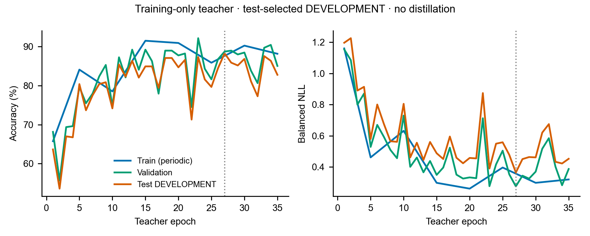

# 训练期电子教师：未通过蒸馏门槛

本结果属于用户授权的 **test-selected DEVELOPMENT**。test每轮参与选模和早停，
不作为独立泛化估计。教师没有加入光学推理，且本次没有启动蒸馏学生。

run：`mango_rho03_L6_teacher_testdev_spare_20261010/teacher`，源码main `5ca083bc0`。
110,024参数教师接收同一1×100×100固定振幅输入；Conv通道32/64/128，
每层BN/ReLU，固定4×4均值池化，Dropout0.1与Linear2048→8。
AdamW lr0.001、weight_decay0.01、label smoothing0.02、有效batch64，
最多80轮、至少10轮、耐心8。GPU4剩余显存执行，Torch分配上限3GiB；
其它项目保持运行，教师退出后不再占GPU。

| 模型 | 完成轮数 | 选中轮数 | train准确率 | val准确率 | test开发准确率 | test正确数 |
|---|---:|---:|---:|---:|---:|---:|
| 电子教师bn32 | 35 | 27 | 92.54% | 88.73% | 88.28% | 369/418 |

所选模型train／val／test balanced NLL为0.210432／0.275565／0.364442。
按每轮test accuracy最高、同分balanced NLL最低选第27轮；完整history核对通过。
418条唯一sample ID的保存预测与混淆矩阵、正确数一致；所选PT SHA256为
`5fe99752b05ac1dfae4b824bc83ab598f159826ffcc721101c64eb2f33aa2fa6`。

未达到事先规定的教师test开发90%门槛，suite停止，没有学生结果。
教师后期验证／开发曲线仍明显波动，不能只归因于单纯过拟合；本次没有据此改光路、
数据或门槛。教师成绩不能当作六层光模型突破；光模型历史开发最高仍87.80%。

train曲线只连接保存的周期评估点，未插补不存在的逐轮train结果；所选第27轮的
train为最终加载best后评估，记录在result中。虚线为所选轮数。
[完整结果与审计](teacher_bn32_testdev_20261010.json)、
[曲线数据](teacher_bn32_testdev_figures_20261010/source_data.csv)、
[SVG](teacher_bn32_testdev_figures_20261010/curves.svg)、
[PDF](teacher_bn32_testdev_figures_20261010/curves.pdf)均来自保存记录，未重复推理test。

GPU1直接光学focal候选另在`mango_rho03_L6_focal_testdev_spare_20261010`运行，
微批量2累积有效batch16，最多30轮；不与本教师结果混用。
