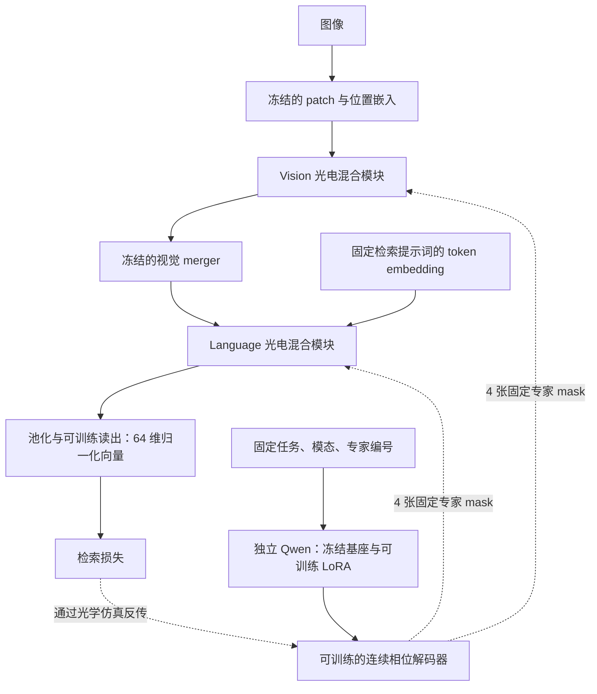

# Caltech101：固定专家库生成

用户已批准首轮固定专家库实验。实现与结果只在本任务维护，不写回 LightGenV2 的正式对照表。

## 首轮协议

- 光路直接复用 LightGenV2 T01 main_dc20；vision/language 各四专家 Top-2，Router/global 正常直接优化。
- A direct；B small_hyper；C qwen_frozen；D qwen_lora。生成器只接收固定任务/模态/expert 条件。
- D 使用独立 Qwen3-VL-2B-Instruct 的语言 Transformer，所有 q_proj/v_proj 挂 rank=8、alpha=16 LoRA。
  Qwen 基座冻结，LoRA 与 float32 patch 解码器训练；不改变原任务前端。
- 使用 `anchor + decoder(context) - initial_reference` 生成 raw phase。anchor 是同 seed 的固定随机相位，
  initial_reference 是训练前生成值，二者均为不可训练 buffer。因此四组初始光学相位完全一致；
  后续没有独立可训练的 expert 像素参数（A 除外）。这替代草案中的 B/C 初始化拟合。
- 经 torch parametrization 将生成 tensor 接入原 PhaseLayer，不改变 FFT、相位转换、DC 正则和噪声实现。
- 复用原 2,625 train / 30 gallery / 200 test 划分，再仅从 train 固定抽每类 30 张，合计 300 张。
  PK=10×3；5 epoch，默认每 epoch 10 optimizer steps。此轮是 pilot，不能和全量正式结果混表。
- 任务 loss 与 backend 一致：supervised contrastive + episodic prototype，附原路由/CCD/DC 正则。
- 只在最后一轮评估 EMA，不按 test 选择 checkpoint；`best_checkpoint.pt` 明确表示最终 EMA。
  `last_checkpoint.pt` 为 live 可恢复状态；保留 `expert_bank.pt` 独立部署相位。
- 记录 task loss 到 expert / LoRA 的非零梯度、显存、训练日志，以及移除生成器后的预测一致性。

## 运行

从仓库根目录，在已有 xml 环境运行；GPU 由外部环境选择。

```bash
python -m unittest discover -s TransferFromElectricity/tasks/t01_object_retrieval/tests -v
CUDA_VISIBLE_DEVICES=3 python -m TransferFromElectricity.tasks.t01_object_retrieval.run \
  --method qwen_lora \
  --run-dir TransferFromElectricity/tasks/t01_object_retrieval/runs/simulation/YYYYMMDD_static_qwen_lora_pilot_s42
```

相同命令替换 method 为 direct / small_hyper / qwen_frozen，使用独立 run-dir。
`--generator-source` 可指定本机缓存 snapshot；默认通过已有模型缓存解析。
`--epochs 1 --steps-per-epoch 2` 是实际光路短检查，用独立 runs/smoke 目录。
中断后同配置加 `--resume`，只读取 last；恢复要求相同代码 commit。

## 证据与限制

每 run 保存完整 backend config、pilot 配置、样本清单、Git SHA、初始化 checkpoint SHA、
环境、原始命令、实际参数组、LoRA 模块名、loss/梯度、最终指标与导出误差。
固定 anchor 与初始生成值仅用于相同起点，不是从已训练 baseline 蒸馏。
小生成器与 Qwen 的总参数/训练成本不相同；本轮仅按相同样本与 optimizer steps 比较。
CUDA 仿真耗时不是物理光路延时；生成器仅在训练和导出使用。
真实 SLM/CCD 闭环不属于本轮。

## 2026-09-07 首轮结果

四组均已完成：300 train、30 gallery、200 test，seed=42，5 epoch / 50 updates，最终 EMA。
训练 commit：`56d7e6b66b9d820b64ad476ceccb5bff56f55947`；运行在服务器 GPU 3（RTX 4090）。
源码、数据划分和预算一致；本地轻量文件从服务器经 SFTP 同步并逐文件校验 SHA256。

| 方法 | Top-1 | Top-3 | MRR | 峰值显存 GiB |
|---|---:|---:|---:|---:|
| direct | 82.0% | 93.0% | 0.8860 | 7.43 |
| small_hyper | 82.0% | 93.0% | 0.8868 | 7.44 |
| qwen_frozen | 81.5% | 93.0% | 0.8843 | 10.64 |
| qwen_lora | 81.5% | 93.0% | 0.8835 | 11.25 |

机制验证通过：D 的任务 loss→expert 梯度范数 0.05483，任务 loss→LoRA B 梯度范数
0.0008387；最终 EMA expert 相位相对起点的 RMS 变化 0.01331 rad。
四组固化 expert 后输出误差均为 0，样本逆序误差为 0；单样本与 batch 推理最大 embedding
绝对差为 0.00223–0.00298（BF16 路径，低于预设 0.005 容差），不能表述为逐位一致。

结论仅为链路可训练、可导出；本轮没有观察到大模型生成优于直接优化。
D 与 A 的 Top-1 差距仅 1/200 个查询，单 seed 短训练不能据此判断方法优劣。
Language Router 四组均只使用前两个专家（训练选择次数 1500/1500/0/0），尚未解决路由集中。
相位变化较小且四组 loss 曲线非常接近，不能将 loss 下降全部归因于生成器。
小生成器首 batch task loss 与 A 相差约 0.00154，虽初始无梯度相位校验误差为 0，
该端到端微小差异尚未逐算子定位；B 保留为辅助对照。

完整数值、run ID 和证据哈希见 [summary.json](reports/pilot_20260907/summary.json)、
[evidence_manifest.json](reports/pilot_20260907/evidence_manifest.json)；
[对照图](reports/pilot_20260907/pilot_comparison.png) 给出每 epoch 平均 task loss 与最终 Top-1。
原始日志、配置和 sample manifest 在任务 runs 下；checkpoint 留在服务器同名 run。
后续优先诊断 Language Router 集中及生成相位的实际贡献，再考虑延长训练和多 seed。

## 当前实际计算图

本任务复用的是光电混合 student。原任务 Qwen3-VL-Embedding 的图像 patch/位置嵌入、
视觉 merger、文本 token embedding 等冻结组件保留；原 Vision/Language Transformer 主干
在 student 模式被替换或旁路。不能将其描述为完整冻结大模型先提取语义特征、后接纯光学网络。
生成 mask 的 Qwen3-VL-2B-Instruct 是另一套独立模型，仅使用其语言 Transformer。



Vision 和 Language 顺序连接；每个模块内部有两个阶段，且都有可训练电子通路：

1. 第一阶段：电子 block 与“幅度编码→光学 Router→Top-2/4 expert→传播与 CCD→读出”并行，再融合。
2. 第二阶段：上一步融合特征进入电子 block；同时按已有路由重新编码到 global 光路，经过
   global phase、传播与 CCD、读出，再融合。因此 expert→global 之间存在探测和电子重载。

两阶段均先匹配光电特征尺度，再按约 `(1-alpha)*E + alpha*O` 融合并归一化，外围还有适配器和残差。
当前四个 alpha 从 0.055 起步，50 步后仍在 0.054957–0.055038 左右；这是特征融合系数，
不能解释为光学分支贡献了 5.5% 的准确率或物理能量。
Vision 的电子 block 使用二维局部混合，Language 使用因果一维局部混合；内部宽度 192。

| 参数 | direct | qwen_lora |
|---|---|---|
| 每模态 4 张 224×224 expert raw phase | 直接梯度下降 | 由生成器产生，任务梯度回传解码器与 LoRA |
| 光学 Router、global phase | 直接梯度下降 | 直接梯度下降 |
| 电子 block、适配器、融合门、检索读出 | 直接梯度下降 | 直接梯度下降 |
| 任务前端的预训练嵌入/merger | 冻结 | 冻结 |
| 独立生成器的 Qwen 基座 | 不使用 | 冻结；训练 q_proj/v_proj 的 LoRA |

固定专家库指所有样本共用同一套参数；训练时随优化更新，导出后固定，推理时无需生成器。
生成器输入没有当前图片、样本标签或 batch。连续解码器将条件向量映射为 14×14 个 16×16 patch，
形成每张 224×224 raw phase，再由原 PhaseLayer 转成 `2*pi*sigmoid(raw)`。
这实现了可微的专家参数生成；是否利用了大模型预训练知识带来收益，需要后续对照，不能由链路通畅推出。

## 2026-09-07 checkpoint 诊断

仅重新评估上述四个 run 的最终 live/EMA checkpoint，没有继续训练或按 test 重新选择权重。
诊断源码 commit：`f44979cede66f252e3bfa29d6826709b862482fc`；
诊断 run：`runs/smoke/20260907_checkpoint_diagnosis`。
原四组 EMA Top-1 全部复现；原 checkpoint 的 SHA256 已记录。

| 方法 | 最终 live Top-1 | 原报告 EMA Top-1 | live 相位变化 RMS / rad | EMA 相位变化 RMS / rad |
|---|---:|---:|---:|---:|
| direct | 85.5% | 82.0% | 0.046407 | 0.008393 |
| small_hyper | 85.0% | 82.0% | 0.044263 | 0.007774 |
| qwen_frozen | 85.5% | 81.5% | 0.071835 | 0.014128 |
| qwen_lora | 85.5% | 81.5% | 0.059505 | 0.013309 |

相位变化相对共同初始 expert bank，使用圆周差统计全部八张相位。D 与 A 的 live 相位
RMS 差为 0.075171 rad；去除各 mask 的常数相位偏移后仍为 0.075170 rad，说明不是仅有整体相移。
两者 query embedding RMS 差为 0.0031523，200 个 query 中有 2 个 Top-1 类别预测不同，
但总准确率相同。相同准确率不能表述为相同 mask 或相同输出。

EMA 衰减率 0.995，50 步后初始参数权重仍有 `0.995**50 = 0.778313`。
这是参数平均的权重，不能按此线性分解生成器输出相位或准确率。
初始 warmstart 模型、随机专家、重置 Router/融合门在本次重评估中已有 81.0% Top-1。
因此首轮仅展示 EMA 隐藏了短训练 live 权重的变化；两种权重都应报告，不能按 test 挑较好者。

### 保持其他训练后参数不变的干预

以下均针对 D 的最终 live checkpoint，gallery 与 query 都在对应干预下重新编码：

| 干预 | Top-1 | 相对正常模型改变的 Top-1 类别预测数 / 200 |
|---|---:|---:|
| 正常训练后模型 | 85.5% | 0 |
| 仅将 expert 换回初始随机相位 | 86.0% | 1 |
| 仅将 expert 换为统一 pi 相位 | 85.5% | 0 |
| 仅将 LoRA B 置零，保留训练后的相位解码器 | 85.5% | 0 |
| 关闭所有光学特征贡献 | 84.5% | 11 |

关闭所有光学分支是推理干预，不等于另行训练的纯电子 baseline。
A 的 live 模型换回初始 expert 也维持 85.5%，关闭光学为 84.0%。
当前证据表明光学分支能影响结果，但这 50 步的 expert 学习尚未显示必要的检索收益。
这不证明继续训练无效，也不证明整个光学分支无用。

LoRA B 从零更新到范数 0.192866，结合先前任务梯度记录，排除了完全未更新。
在保持 D 的训练后解码器不变时，关闭 LoRA 只引起 0.000483 rad 的相位 RMS 差，
远小于其相对初始的总相位变化 0.059505 rad；LoRA 在最终生成函数中的直接影响较弱。
这一干预不能隔离 LoRA 训练过程对解码器轨迹的间接影响，也不能将 RMS 比值视作严格贡献比例。
当前 D 的 expert mask DC 指标 `abs(mean(exp(i*phase)))**2` 为 0.99527–0.99558，
相位仍接近常数屏；该指标不是整个光路的实测零级能量占比。

完整证据见 [diagnosis.json](reports/diagnosis_20260907/diagnosis.json)、
[传输校验](reports/diagnosis_20260907/transfer_manifest.json)。
[live/EMA 相位变化图](reports/diagnosis_20260907/phase_changes.png) 使用共同色标，显示每模态 expert 0；
[D 的全部八张相位变化图](reports/diagnosis_20260907/qwen_all_expert_changes.png) 同样按共同色标展示。

### 下一阶段建议（尚未执行）

先验证“只靠 expert 更新，能否学到任务”，再扩大方法比较。保持固定专家库与本任务数据身份：

1. 从 train 单独固定诊断训练/验证子集，统一起点，先做 direct 与 qwen_lora 两组。
   暂时冻结电子 block、适配器、读出、Router、global 和融合门，仅更新 expert 或其生成器。
   记录任务 loss 本身、梯度、物理相位变化、路由覆盖以及换回初始 expert 的损失变化。
   先证明训练小集能被 expert 学习，不能仅凭总 loss 中正则项下降验收。
2. 若冻结后的 0.055 融合系数限制学习，再用单独 profile 做双方一致的固定 alpha 对照；
   同时检查近常数相位初始化、DC 约束与 Language Router 仅选两专家的问题。
   每次改变一个因素，不在四种生成器上同时大规模扫参。
3. 机制通过后恢复 Router/global 的正常优化，再逐步恢复电子部分的联合训练，
   保留冻结专家对照；分别报告 live 与 EMA，然后扩展训练步数和 seed。

上述冻结 Router/global 是定位问题的临时干预，不改变主方案让它们直接梯度下降的设计。
本轮 test 已用于机制诊断，后续调参只使用固定验证集，正式泛化评估另行预先约定，
不把本次干预中较高的 test 数字作为新方法成绩。
