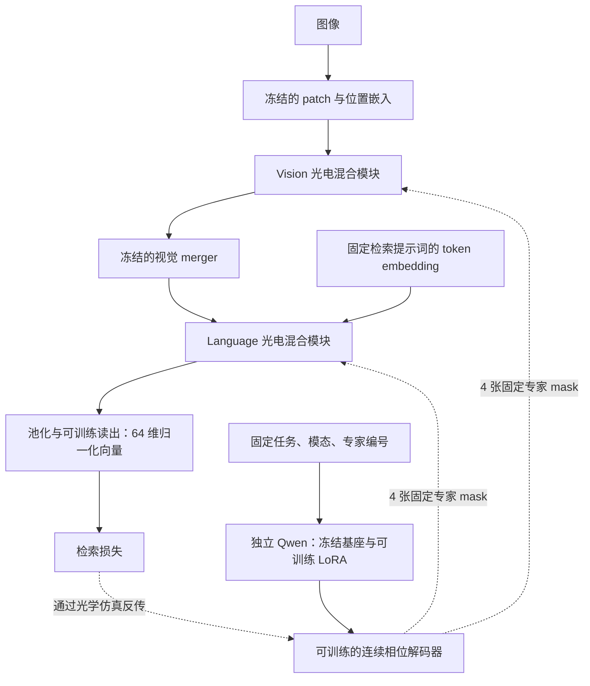

# 固定专家库生成：三数据集检索

第四轮已完成：六组确定性开发实验、三数据集共 14 个正式 run，全部使用 RTX 4090，未使用 A100，训练进程已退出。
四路光学融合系数始终为 0.6。所有导出一致性误差与冻结参数变化均为零；204 个回传文件通过 SHA256 校验。
正式训练源码固定 `dee34f07`；报告更新不改变服务器上的复现实验 worktree。

下表每格为 **Top-1 / Top-3**，属于十类图像到类别原型的检索；每组一个优化 seed。Qwen/CLIP 列均训练 LoRA 和相位解码器。

| 数据集 | 专家不训练 | 直接相位优化 | Qwen | CLIP |
|---|---:|---:|---:|---:|
| Caltech 十类 | 79.50% / 91.50% | 81.50% / 94.50% | 81.00% / 94.00% | 81.00% / 94.50% |
| CIFAR-100 固定十类 | 50.00% / 81.10% | 50.30% / 83.10% | 50.10% / 80.60% | 52.30% / 81.70% |
| Imagenette 十类 | 39.97% / 68.43% | 37.68% / 66.39% | 40.97% / 67.44% | 37.83% / 66.65% |

生成固定 mask 的可微链路成立，光学功能依赖明确；局部对照有小幅收益，尚未证明预训练大模型更新具有稳定优势。
CIFAR 上冻结 Qwen/CLIP、只训练 decoder 的 Top-1 为 48.6%/50.8%，加入 LoRA 均提高 1.5 pp；
但专家完全不训练的基线也较强，Language 路由在所选训练轮只使用两个专家。不能只凭相位变化或某个单次高分判断迁移成功。
Top-3 达到约 66%–95%，CIFAR/Imagenette 的 Top-1 仍未达到 60%。

结构、训练步骤、各组含义和结论见 [训练与结构说明](reports/control_v3_20260907/训练与结构说明.md)；
[14 组完整结果](reports/control_v3_20260907/完整结果.md)、[总指标 CSV](reports/control_v3_20260907/metrics.csv)、
[逐类指标 CSV](reports/control_v3_20260907/per_class_metrics.csv)、[对照图](reports/control_v3_20260907/retrieval_and_branch_contribution.png)
及开发选择、设备与同步审计均归档于同一报告目录。
下述指标及 0.5 起点描述属于第三轮历史；第四轮详细协议和开发选择保留在文末。

## 第三轮历史摘要

新增计时检查使用 `configs/control_v3/timing_cifar.yaml`：direct、Qwen LoRA、CLIP LoRA 在同一空闲 RTX 4090 上顺序运行，每阶段两轮、每轮 120 batch，保留相同 PK batch=30、初值、精度与损失。只使用验证集，不能并入正式成绩表。CUDA 同步后分别记录阶段设置、训练循环、验证/审计、checkpoint/主日志耗时；计时文件自身写入、模型加载、初始验证和训练后的干预不计入 epoch。每阶段第二轮用于稳态比较，六轮原值全部保留。旧日志的记录间隔与这次精确计时分开报告。

当前主线恢复 Caltech 十类；三十类保留为规模诊断。新增 CIFAR-100 与预先固定的十类子集，
沿用类别原型检索，不能直接当作带 100 类分类头的标准 CIFAR 分类榜单成绩。

用户已批准首轮固定专家库实验。实现与结果只在本任务维护，不写回 LightGenV2 的正式对照表。

独立专家输出头的新一轮共 14 个正式 run，均已完成，全部使用 RTX。
结论：生成 mask 的可微链路成立，专家确实更新并影响检索；尚未证明 Qwen 生成优于直接优化的稳定优势。

| 新一轮任务 | 直接优化 Top-1 | Qwen LoRA＋解码器 Top-1 | 统计口径 |
|---|---:|---:|---|
| Caltech 十类 | 81.17% ± 4.48% | 82.00% ± 2.29% | 三个优化 seed，均值 ± 样本标准差 |
| CIFAR-100 固定十类 | 42.6% | 41.3% | seed=42，1,000 test query |
| CIFAR-100 全百类 | 7.44% | 7.46% | seed=42，10,000 test query，有限预算筛查 |

三行是各自任务内的对照，不能合并平均。Caltech 的测试查询复用和历史 warmstart 限制仍然存在；
百类仅约 0.76 次训练集大小的等量抽样，不能作为收敛上限或标准分类榜单成绩。
最新 [Caltech 四组](reports/caltech10_heads_20260907/summary.json)、
[Caltech 三种子](reports/caltech10_heads_seeds_20260907/paired_seeds.png)、
[CIFAR 十类](reports/cifar100ten_heads_20260907/summary.json)、
[CIFAR 百类](reports/cifar100_heads_20260907/summary.json) 的完整协议、干预与限制见文末。
前面的首轮 pilot、强扰动诊断、共享头三种子与三十类扩展均保留为历史实验，不混入这次结果。

## 当前架构与四组含义

所有样本共用 Vision 四张、Language 四张 224×224 expert mask；训练中更新，导出后固定。
每一侧都是 optical Router（Top-2/4）+ experts + global phase，与电子模块融合。
四处光学融合系数均从 0.5 开始，并限制在 [0.4, 0.95]。该系数不等于准确率贡献比例。

| 当前方法 | 专家 mask 如何得到 | 生成器哪些部分更新 |
|---|---|---|
| fixed | 固定的初始随机专家库 | 没有生成器；expert 完全冻结 |
| direct | 把相位像素作为参数直接优化 | 没有生成器 |
| qwen_frozen | 固定提示词 → 冻结 Qwen → 可训练连续相位解码器 | 只更新解码器 |
| qwen_lora | 固定提示词 → Qwen（含 LoRA）→ 连续相位解码器 | 同时更新 Qwen 内的 LoRA 和解码器 |

fixed 仍有光学专家，只是不训练它们；Router/global 和后期电子部分与其他组按相同阶段训练。
qwen_frozen 的 mask 仍会改变，因为解码器在更新。qwen_lora 则把任务梯度继续传进 Qwen 的 LoRA，
不是全量更新 2B 基座参数。推理时导出八张 mask 即可移除生成器。
生成器不接收当前图片、标签或 batch，也不通过离散文本采样生成 mask。

Caltech 训练为 4 轮只训练 expert/生成器，8 轮加入 Router/global，8 轮低学习率联合电子部分；
CIFAR 改为 2/2/16 轮，具体预算见文末协议。
先前强扰动训练出现退化；当前扩大类别与种子复验使用单独的 ideal 配置，关闭采样光学扰动，
仍通过完整可微光学传播训练。它验证学习机制，尚未证明硬件扰动鲁棒性。

## 首轮协议

- 光路直接复用 LightGenV2 T01 main_dc20；vision/language 各四专家 Top-2，Router/global 正常直接优化。
- A direct；B small_hyper；C qwen_frozen；D qwen_lora。生成器只接收固定任务/模态/expert 条件。
- D 使用独立 Qwen3-VL-2B-Instruct 的语言 Transformer，所有 q_proj/v_proj 挂 rank=8、alpha=16 LoRA。
  Qwen 基座冻结，LoRA 与 float32 patch 解码器训练；不改变原任务前端。
- 使用 `anchor + decoder(context) - initial_reference` 生成 raw phase。anchor 是同 seed 的固定随机相位，
  initial_reference 是训练前生成值，二者均为不可训练 buffer。因此四组初始光学相位完全一致；
  后续没有独立可训练的 expert 像素参数（A 除外）。这替代草案中的 B/C 初始化拟合。
- 经 torch parametrization 将生成 tensor 接入原 PhaseLayer，不改变 FFT、相位转换、DC 正则和噪声实现。
- 复用原 2,625 train / 30 gallery / 200 test 划分，再仅从 train 固定抽每类 30 张，合计 300 张。
  PK=10×3；5 epoch，默认每 epoch 10 optimizer steps。此轮是 pilot，不能和全量正式结果混表。
- 任务 loss 与 backend 一致：supervised contrastive + episodic prototype，附原路由/CCD/DC 正则。
- 只在最后一轮评估 EMA，不按 test 选择 checkpoint；`best_checkpoint.pt` 明确表示最终 EMA。
  `last_checkpoint.pt` 为 live 可恢复状态；保留 `expert_bank.pt` 独立部署相位。
- 记录 task loss 到 expert / LoRA 的非零梯度、显存、训练日志，以及移除生成器后的预测一致性。

## 运行

从仓库根目录，在已有 xml 环境运行；GPU 由外部环境选择。

```bash
python -m unittest discover -s TransferFromElectricity/tasks/t01_object_retrieval/tests -v
CUDA_VISIBLE_DEVICES=GPU-<verified-RTX-UUID> python -m TransferFromElectricity.tasks.t01_object_retrieval.run \
  --method qwen_lora \
  --run-dir TransferFromElectricity/tasks/t01_object_retrieval/runs/simulation/YYYYMMDD_static_qwen_lora_pilot_s42
```

相同命令替换 method 为 direct / small_hyper / qwen_frozen，使用独立 run-dir。
`--generator-source` 可指定本机缓存 snapshot；默认通过已有模型缓存解析。
`--epochs 1 --steps-per-epoch 2` 是实际光路短检查，用独立 runs/smoke 目录。
中断后同配置加 `--resume`，只读取 last；恢复要求相同代码 commit。

## 证据与限制

每 run 保存完整 backend config、pilot 配置、样本清单、Git SHA、初始化 checkpoint SHA、
环境、原始命令、实际参数组、LoRA 模块名、loss/梯度、最终指标与导出误差。
固定 anchor 与初始生成值仅用于相同起点，不是从已训练 baseline 蒸馏。
小生成器与 Qwen 的总参数/训练成本不相同；本轮仅按相同样本与 optimizer steps 比较。
CUDA 仿真耗时不是物理光路延时；生成器仅在训练和导出使用。
真实 SLM/CCD 闭环不属于本轮。

## 2026-09-07 首轮结果

四组均已完成：300 train、30 gallery、200 test，seed=42，5 epoch / 50 updates，最终 EMA。
训练 commit：`56d7e6b66b9d820b64ad476ceccb5bff56f55947`；运行在服务器 GPU 3（RTX 4090）。
源码、数据划分和预算一致；本地轻量文件从服务器经 SFTP 同步并逐文件校验 SHA256。

| 方法 | Top-1 | Top-3 | MRR | 峰值显存 GiB |
|---|---:|---:|---:|---:|
| direct | 82.0% | 93.0% | 0.8860 | 7.43 |
| small_hyper | 82.0% | 93.0% | 0.8868 | 7.44 |
| qwen_frozen | 81.5% | 93.0% | 0.8843 | 10.64 |
| qwen_lora | 81.5% | 93.0% | 0.8835 | 11.25 |

机制验证通过：D 的任务 loss→expert 梯度范数 0.05483，任务 loss→LoRA B 梯度范数
0.0008387；最终 EMA expert 相位相对起点的 RMS 变化 0.01331 rad。
四组固化 expert 后输出误差均为 0，样本逆序误差为 0；单样本与 batch 推理最大 embedding
绝对差为 0.00223–0.00298（BF16 路径，低于预设 0.005 容差），不能表述为逐位一致。

结论仅为链路可训练、可导出；本轮没有观察到大模型生成优于直接优化。
D 与 A 的 Top-1 差距仅 1/200 个查询，单 seed 短训练不能据此判断方法优劣。
Language Router 四组均只使用前两个专家（训练选择次数 1500/1500/0/0），尚未解决路由集中。
相位变化较小且四组 loss 曲线非常接近，不能将 loss 下降全部归因于生成器。
小生成器首 batch task loss 与 A 相差约 0.00154，虽初始无梯度相位校验误差为 0，
该端到端微小差异尚未逐算子定位；B 保留为辅助对照。

完整数值、run ID 和证据哈希见 [summary.json](reports/pilot_20260907/summary.json)、
[evidence_manifest.json](reports/pilot_20260907/evidence_manifest.json)；
[对照图](reports/pilot_20260907/pilot_comparison.png) 给出每 epoch 平均 task loss 与最终 Top-1。
原始日志、配置和 sample manifest 在任务 runs 下；checkpoint 留在服务器同名 run。
后续优先诊断 Language Router 集中及生成相位的实际贡献，再考虑延长训练和多 seed。

## 当前实际计算图

本任务复用的是光电混合 student。原任务 Qwen3-VL-Embedding 的图像 patch/位置嵌入、
视觉 merger、文本 token embedding 等冻结组件保留；原 Vision/Language Transformer 主干
在 student 模式被替换或旁路。不能将其描述为完整冻结大模型先提取语义特征、后接纯光学网络。
生成 mask 的 Qwen3-VL-2B-Instruct 是另一套独立模型，仅使用其语言 Transformer。



Vision 和 Language 顺序连接；每个模块内部有两个阶段，且都有可训练电子通路：

1. 第一阶段：电子 block 与“幅度编码→光学 Router→Top-2/4 expert→传播与 CCD→读出”并行，再融合。
2. 第二阶段：上一步融合特征进入电子 block；同时按已有路由重新编码到 global 光路，经过
   global phase、传播与 CCD、读出，再融合。因此 expert→global 之间存在探测和电子重载。

两阶段均先匹配光电特征尺度，再按约 `(1-alpha)*E + alpha*O` 融合并归一化，外围还有适配器和残差。
历史 50-step pilot 的四个 alpha 从 0.055 起步，50 步后仍在 0.054957–0.055038 左右；这是特征融合系数，
不能解释为光学分支贡献了 5.5% 的准确率或物理能量。
Vision 的电子 block 使用二维局部混合，Language 使用因果一维局部混合；内部宽度 192。

| 参数 | direct | qwen_lora |
|---|---|---|
| 每模态 4 张 224×224 expert raw phase | 直接梯度下降 | 由生成器产生，任务梯度回传解码器与 LoRA |
| 光学 Router、global phase | 直接梯度下降 | 直接梯度下降 |
| 电子 block、适配器、融合门、检索读出 | 直接梯度下降 | 直接梯度下降 |
| 任务前端的预训练嵌入/merger | 冻结 | 冻结 |
| 独立生成器的 Qwen 基座 | 不使用 | 冻结；训练 q_proj/v_proj 的 LoRA |

固定专家库指所有样本共用同一套参数；训练时随优化更新，导出后固定，推理时无需生成器。
生成器输入没有当前图片、样本标签或 batch。连续解码器将条件向量映射为 14×14 个 16×16 patch，
形成每张 224×224 raw phase，再由原 PhaseLayer 转成 `2*pi*sigmoid(raw)`。
这实现了可微的专家参数生成；是否利用了大模型预训练知识带来收益，需要后续对照，不能由链路通畅推出。

## 2026-09-07 checkpoint 诊断

仅重新评估上述四个 run 的最终 live/EMA checkpoint，没有继续训练或按 test 重新选择权重。
诊断源码 commit：`f44979cede66f252e3bfa29d6826709b862482fc`；
诊断 run：`runs/smoke/20260907_checkpoint_diagnosis`。
原四组 EMA Top-1 全部复现；原 checkpoint 的 SHA256 已记录。

| 方法 | 最终 live Top-1 | 原报告 EMA Top-1 | live 相位变化 RMS / rad | EMA 相位变化 RMS / rad |
|---|---:|---:|---:|---:|
| direct | 85.5% | 82.0% | 0.046407 | 0.008393 |
| small_hyper | 85.0% | 82.0% | 0.044263 | 0.007774 |
| qwen_frozen | 85.5% | 81.5% | 0.071835 | 0.014128 |
| qwen_lora | 85.5% | 81.5% | 0.059505 | 0.013309 |

相位变化相对共同初始 expert bank，使用圆周差统计全部八张相位。D 与 A 的 live 相位
RMS 差为 0.075171 rad；去除各 mask 的常数相位偏移后仍为 0.075170 rad，说明不是仅有整体相移。
两者 query embedding RMS 差为 0.0031523，200 个 query 中有 2 个 Top-1 类别预测不同，
但总准确率相同。相同准确率不能表述为相同 mask 或相同输出。

EMA 衰减率 0.995，50 步后初始参数权重仍有 `0.995**50 = 0.778313`。
这是参数平均的权重，不能按此线性分解生成器输出相位或准确率。
初始 warmstart 模型、随机专家、重置 Router/融合门在本次重评估中已有 81.0% Top-1。
因此首轮仅展示 EMA 隐藏了短训练 live 权重的变化；两种权重都应报告，不能按 test 挑较好者。

### 保持其他训练后参数不变的干预

以下均针对 D 的最终 live checkpoint，gallery 与 query 都在对应干预下重新编码：

| 干预 | Top-1 | 相对正常模型改变的 Top-1 类别预测数 / 200 |
|---|---:|---:|
| 正常训练后模型 | 85.5% | 0 |
| 仅将 expert 换回初始随机相位 | 86.0% | 1 |
| 仅将 expert 换为统一 pi 相位 | 85.5% | 0 |
| 仅将 LoRA B 置零，保留训练后的相位解码器 | 85.5% | 0 |
| 关闭所有光学特征贡献 | 84.5% | 11 |

关闭所有光学分支是推理干预，不等于另行训练的纯电子 baseline。
A 的 live 模型换回初始 expert 也维持 85.5%，关闭光学为 84.0%。
当前证据表明光学分支能影响结果，但这 50 步的 expert 学习尚未显示必要的检索收益。
这不证明继续训练无效，也不证明整个光学分支无用。

LoRA B 从零更新到范数 0.192866，结合先前任务梯度记录，排除了完全未更新。
在保持 D 的训练后解码器不变时，关闭 LoRA 只引起 0.000483 rad 的相位 RMS 差，
远小于其相对初始的总相位变化 0.059505 rad；LoRA 在最终生成函数中的直接影响较弱。
这一干预不能隔离 LoRA 训练过程对解码器轨迹的间接影响，也不能将 RMS 比值视作严格贡献比例。
当前 D 的 expert mask DC 指标 `abs(mean(exp(i*phase)))**2` 为 0.99527–0.99558，
相位仍接近常数屏；该指标不是整个光路的实测零级能量占比。

完整证据见 [diagnosis.json](reports/diagnosis_20260907/diagnosis.json)、
[传输校验](reports/diagnosis_20260907/transfer_manifest.json)。
[live/EMA 相位变化图](reports/diagnosis_20260907/phase_changes.png) 使用共同色标，显示每模态 expert 0；
[D 的全部八张相位变化图](reports/diagnosis_20260907/qwen_all_expert_changes.png) 同样按共同色标展示。

### 下一阶段建议（尚未执行）

先验证“只靠 expert 更新，能否学到任务”，再扩大方法比较。保持固定专家库与本任务数据身份：

1. 从 train 单独固定诊断训练/验证子集，统一起点，先做 direct 与 qwen_lora 两组。
   暂时冻结电子 block、适配器、读出、Router、global 和融合门，仅更新 expert 或其生成器。
   记录任务 loss 本身、梯度、物理相位变化、路由覆盖以及换回初始 expert 的损失变化。
   先证明训练小集能被 expert 学习，不能仅凭总 loss 中正则项下降验收。
2. 若冻结后的 0.055 融合系数限制学习，再用单独 profile 做双方一致的固定 alpha 对照；
   同时检查近常数相位初始化、DC 约束与 Language Router 仅选两专家的问题。
   每次改变一个因素，不在四种生成器上同时大规模扫参。
3. 机制通过后恢复 Router/global 的正常优化，再逐步恢复电子部分的联合训练，
   保留冻结专家对照；分别报告 live 与 EMA，然后扩展训练步数和 seed。

上述冻结 Router/global 是定位问题的临时干预，不改变主方案让它们直接梯度下降的设计。
本轮 test 已用于机制诊断，后续调参只使用固定验证集，正式泛化评估另行预先约定，
不把本次干预中较高的 test 数字作为新方法成绩。

## 第二轮：光学系数至少 0.4 的分阶段对照

用户已批准执行。配置为 [staged_alpha40.yaml](configs/staged_alpha40.yaml)，
入口为 `python -m TransferFromElectricity.tasks.t01_object_retrieval.train_staged`。
这是独立的新协议，不能将其与 50-step pilot 的差异单独归因于某一个改动。

| 命令 method | 含义 | expert 相关的可训练参数 | 对照目的 |
|---|---|---|---|
| fixed | 专家存在，但始终保持共同初始相位 | 无 | 其他部件能否在不学习 expert 时完成任务 |
| direct | 直接优化每个 expert 像素 | expert raw phase | 传统方法主基线 |
| qwen_frozen | Qwen 输出固定特征，经解码器产生 expert | 相位解码器 | 只训练生成器末端能达到什么效果 |
| qwen_lora | 微调 Qwen 内部 LoRA，并训练解码器 | LoRA 与相位解码器 | 用户提出的大模型参与学习方案 |

第 3/4 组使用同一 Qwen3-VL-2B-Instruct 语言模型、相同固定描述和完全配对的解码器初始化。
Qwen 原始权重均冻结；第 4 组的 q_proj/v_proj LoRA rank=8，训练参数改为 FP32，
冻结基座仍是 BF16。解码器末层初始化标准差由 0.002 改为 0.02，增强上下文到相位的初始梯度；
固定 reference 抵消初始生成值，因此不改变四组相同的初始专家库。
不再将上一轮 small_hyper 纳入这次主表。

师姐的 `d2nn_pack` 使用离线 CLIP 特征（提取脚本默认 RN50），后接从头初始化的四层
Transformer/MLP；优化器只更新后面的生成器，不微调 CLIP。其 mask 在 batch 内求均值，
与本任务输入样本无关的固定专家库合同不同。此说明基于实际代码，不依据注释中的 sigmoid 描述。

### 共同设置与阶段

- Vision/Language 的 expert/global 四个融合位置全部采用 alpha 下限 0.4、初值 0.5、上限 0.95。
  前两阶段冻结门值 0.5；最后阶段允许在该区间内学习，逐轮断言不低于 0.4。
- 每类从原 train 留出 10 张用于本轮适配验证，其余全部参与训练；保持原 gallery/test。
  原 warmstart 曾使用原 train，所以该验证集仅对本轮更新留出，不是整个训练历史的未见样本。
  原 test 也曾用于上一轮诊断；这轮仍是机制对照，正式泛化结论需要新的类别/数据评估。
- 专家物理相位从 `pi + Uniform(-a,a)` 初始化，其中 `(sin(a)/a)^2=0.25`，再逆 sigmoid
  映射回 raw。四组共用 seed 对应的同一张随机库，远离 sigmoid 饱和与常数屏。
  0.25 是初始化的 mask DC 统计目标，不是将光路中 20–30% 零级噪声参数改成相位初始化。
- 光学几何、传播、Top-2/4、CCD、任务损失继续复用原 backend。阶段 1 用确定性光学；
  阶段 2/3 恢复 backend 的训练扰动。每组都保存具体 resolved config。

| 阶段 | 轮数 | 更新的部件 | 冻结的部件 |
|---|---:|---|---|
| experts | 4 | expert 或其生成器；fixed 组不更新 | Router、global、电子模块、适配器、读出、融合门 |
| optics | 8 | 上述部件加 Router/global | 电子模块、适配器、读出、融合门 |
| joint | 8 | 上述部件加低学习率电子部分和融合门 | 原预训练任务嵌入/merger、生成器 Qwen 基座 |

PK=10×3；原 train 2,625 张中留出 100 张，训练 2,525 张，每轮 85 batch，20 轮共 1,700 batch。
fixed 组前 340 batch 无可训练部件，实际 optimizer update 为 1,360；其余三组为 1,700。
同一 seed 的四组共享样本顺序、划分、相位与任务模型起点，固定专家组保留为干预对照。
各方法的参数量、显存和训练成本仍不相等，不声称算力预算严格匹配。
样本身份/顺序和增强配置一致，但生成器初始化会消耗及重设 RNG，因此各方法的数据增强随机抽样不是逐位配对。
当前按同分布增强与多种子复验比较，不能宣称每一步输入像素完全相同。

学习率：expert 0.02、Router 0.01、global 0.006、LoRA 0.0005、解码器 0.001；
电子部分 0.00001、读出 0.00002、融合门 0.0001。每阶段单独 warmup 20 step，再 cosine
下降至该阶段峰值的 20%；按参数组分别 clip norm=1，避免所有部件共享一次梯度裁剪。
EMA decay=0.95；每轮报告 live/EMA 验证指标，主 checkpoint 固定按 live validation Top-1、
再按 MRR 选择。最终统一评估 validation-selected live 和 final EMA，不用 test 挑权重。

逐轮记录任务 loss、相位 RMS/DC/饱和比例、task→expert/LoRA 梯度、路由使用次数、融合系数，
并验证冻结参数没有变化。每阶段结束，在验证集换回初始 expert 检查专家学习贡献。
最终对所选模型做初始 expert、均匀相位、关闭 LoRA 的干预，并校验固化 mask 后输出一致。
只保存 best/last checkpoint 和独立部署 expert_bank；不生成周期权重文件。

```bash
python -m unittest discover -s TransferFromElectricity/tasks/t01_object_retrieval/tests -v
python -m TransferFromElectricity.tasks.t01_object_retrieval.launch_rtx --gpu-uuid GPU-<verified-RTX-UUID> \
  --method direct --run-dir TransferFromElectricity/tasks/t01_object_retrieval/runs/simulation/YYYYMMDD_alpha40_direct_s42
```

先用独立 `runs/smoke` 加 `--smoke` 检查全部阶段，再运行上面的完整协议。
`--resume` 要求相同 config 与代码 SHA，恢复 last 的优化器、EMA、阶段、日志和 RNG。
扩展顺序：先完成共同协议下的四组，再复查主比较的随机种子和新类别；类别扩大与新任务
必须使用独立配置及数据 manifest，不混入本表。新增类别是否被 warmstart 见过要明确记录。

### 类别规模与随机种子扩展

用户进一步授权扩大任务检查偶然性。新增 [staged_alpha40_caltech30.yaml](configs/staged_alpha40_caltech30.yaml)
继承相同阶段/光路配置，只将检索类别扩大到 30，并将生成器的固定任务描述改为 thirty-category。
完整数据有 101 类、8,677 张前景图像；原十类之外，按名称排序后从至少 60 张图像的类别中，
用 random.Random(42) 抽取二十类。排除 BACKGROUND_Google 和 Faces_easy，避免引入 Faces 的明显重复版本。
类别由数据数量和固定随机规则选择，没有参考模型成绩。

二十个新增类共 1,602 张图像，与原十类合计 4,457 张；每类 gallery=3、test=20、
本轮 validation=10，预计 train=3,467、validation=300、gallery=90、test=600。
每轮仍按 PK=10×3，从三十类中抽取十类，116 batch/epoch，20 轮共 2,320 batch。
除改任务描述外，生成器容量、专家数量、光学系数与训练学习率保持不变。
在三十类共同 gallery 上分别统计原十类查询和新增二十类查询；新增类在本轮有训练样本，
因此属于监督适配，不是零样本识别。

主比较 direct / qwen_lora 计划增加 seed=43、44，与 seed=42 一起报告。
`--seed` 改优化初始化、训练采样与扰动，validation 划分使用固定 data_seed=42，原 gallery/test
仍使用 backend 固定划分；不能将每个种子的测试样本换一批再混算。
报告工具同时支持四组完整表和 direct/qwen_lora 配对表。

这些属于当前工作的扩展安排；具体已完成和运行状态以每个 run 的 status.json 为准。

### 高光学系数下的扰动诊断

第一批 alpha40 在第 5 轮恢复完整训练扰动后，验证表现明显下降，训练 task loss 接近随机检索水平。
这与相位更新小是不同问题。新增 `staged_alpha40_ideal.yaml` 和
`staged_alpha40_caltech30_ideal.yaml`，仅将光学分支设为 eval 模式以关闭训练时采样的
位移、零级光、CCD 噪声等扰动；梯度依旧回传，Router/global 和生成器按原阶段正常学习。
光学几何、可微传播、探测、相位参数化、融合系数区间不变，训练图像增强仍按阶段保留。
这些 run 必须在 ID 中包含 `ideal`，不能宣称获得了原强扰动的鲁棒性。
先以 direct/qwen_lora 的每轮 20 batch、20 轮诊断核对效果；确认后再用共同 ideal 协议做完整规模对比。
历史带扰动 run 全部保留，不能覆盖或合并其成绩。硬件扰动训练策略需另行验证。

### alpha40 强扰动分阶段对照结果

四组均完成 20 轮。run ID：`20260907_alpha40_{fixed,direct,qwen_frozen,qwen_lora}_s42`，
训练源码 `76db29f0`；设备更正：前三组实际为 RTX 4090，qwen_lora 误用了 A100。
CUDA 数字枚举与 nvidia-smi 索引不同；原始 environment.json 保留真实型号，不能宣称全程未使用 A100。
选择按本轮 validation；表内 test 仅作这轮机制对照。光学系数四处均保持约 0.5，满足 >=0.4。

| 方法 | 所选 epoch | 所选 live test Top-1 | 最终 EMA test Top-1 | 所选专家相位 RMS 变化 / rad | 换回初始 expert 的 test Top-1 |
|---|---:|---:|---:|---:|---:|
| fixed | 20 | 60.0% | 60.5% | 0 | 60.0% |
| direct | 3 | 81.0% | 66.0% | 0.64469 | 51.0% |
| qwen_frozen | 2 | 71.0% | 63.0% | 0.97564 | 51.0% |
| qwen_lora | 3 | 72.0% | 65.5% | 1.15048 | 51.5% |

三种可学习专家组的最佳模型均在强扰动阶段前；选择过程没有用 test，不能把 final EMA 与
所选 live 的差距只归因于 EMA，因为两者还来自不同 epoch。
前四轮仅更新 expert/生成器，恢复初始 expert 会使验证指标从 direct 83% 回到 42%、
qwen_frozen 63% 回到 42%、qwen_lora 68% 回到 41%。专家学习的作用已能被干预观察到。

在 D 所选模型内，仅关闭 LoRA、保持解码器不变，test 从 72% 降到 61%，相位 RMS 差
为 0.58062 rad。这证明大模型内部更新已参与结果；不等同于“LoRA 比单独训练的冻结 Qwen 组
高 11 个百分点”（后者为 71%）。当前单 seed 尚未证明大模型生成优于直接优化。
相位去除每张整体常数偏移后的 RMS 仍约 direct 0.64469、C 0.97560、D 1.15025 rad，
因此差异不只是无空间结构的整体相移。

Vision Router 在后期覆盖四专家；Language Router 仍固定选择前两个，未解决。
完整数值、逐阶段干预与原文件哈希见 [summary.json](reports/alpha40_20260907/summary.json)、
[evidence_manifest.json](reports/alpha40_20260907/evidence_manifest.json)。
图见 [训练过程](reports/alpha40_20260907/training_comparison.png) 和
[所选相位变化](reports/alpha40_20260907/selected_phase_changes.png)。
下载脚本 `collect_results.py` 只读取已完成 run 的轻量产物/部署相位，逐文件对照服务器 SHA256，
不传源码与 best/last checkpoint；凭证仅交互输入、不落盘。

### 当前扩展运行合同

确定性光学 400-step 诊断：`runs/smoke/20260907_ideal400_{direct,qwen_lora}_s42`。
相同 20 轮、每轮 20 batch；三十类接口检查用
`runs/smoke/20260907_caltech30_{direct,qwen_lora}_check`，已验证 30 类划分与导出一致性。

完整三十类四组：`runs/simulation/20260907_caltech30_ideal_{fixed,direct,qwen_frozen,qwen_lora}_s42`，
20 轮 / 2,320 batch，按共同 ideal profile。前三组为 RTX 4090；LoRA 原 run 误用 A100，
发现后终止并保留。替代 run 为 `20260907_caltech30_ideal_qwen_lora_rtx_s42`，以完整 UUID 绑定 RTX 4090 从头训练。
随机种子复验：`runs/simulation/20260907_ideal400_repeat_{direct,qwen_lora}_s{42,43,44}`，
原 direct 队列实际为 RTX 4090，原 LoRA 队列为 RTX 3090，不能宣称设备匹配。
补跑 `20260907_ideal400_repeat_direct_rtx3090_s{42,43,44}`，与 LoRA 三组共同构成 RTX 3090 对照。
每组 400 次更新；此前 RTX 4090 结果保留，不混入三种子主表。
数据划分固定，三个种子重复使用相同 200 个 test query，不能当作 600 个独立测试样本。
训练基准源码为 GitHub `8c354986`。共享 checkout 被其他 LGVQ 工作切换后，原 direct seed44 记录为
`791299dc`、LoRA seed43 为 `8fc78530`；301 个相关 Python/config 文件的 Git blob 完全一致。
报告记录各 run 实际 SHA，并校验源码指纹。后续训练移至独立 detached worktree
`/DATA/DATA1/guest3/worktrees/2026OpticsMoE_static_experts_8c354986`，只用符号链接共享数据、历史初始化和本任务 runs。
`report_suite.py` 分别汇总三种子稳定性与三十类结果，不把 400-step 和 2,320-batch 预算混为同一实验。

不同任务的后续候选是 LightGenV2 T08 ABO easy100 图搜文：图像查询面对 100 个固定标题，
文本候选也经过 Language 光学支路，能补充当前 Caltech 类别原型检索对真实文本处理的覆盖。
该任务尚未在 TransferFromElectricity 启动；迁移时需重新约定验证划分，不能照搬其历史按 test 选模的口径。

### GPU 绑定纠正

2026-09-07 逐进程 UUID 审计发现 CUDA 序号 4 实际对应 nvidia-smi 6 的 A100。
误用涉及 alpha40 LoRA smoke、alpha40 LoRA 正式 run、caltech30 LoRA smoke、caltech30 LoRA 正式 run。
当时仍运行的最后一项已终止释放显存，前三项已经完成；没有删除或改写原始环境证据。
此后不再用数字序号绑定，使用完整 GPU UUID，启动前后核验型号。`launch_rtx.py` 提供 RTX 专用入口，
在导入训练器、加载模型前拒绝数字序号、A100 和 CUDA 型号不一致。

### 十类三种子复验结果（RTX 3090）

六组均完成 20 轮、每轮 20 batch，共 400 次更新。使用同一数据划分与 ideal 光学配置，
全部 environment.json 确认 NVIDIA GeForce RTX 3090；仅本节六组进入均值，不混入此前 RTX 4090 结果。

| 优化 seed | direct Top-1 | Qwen＋LoRA Top-1 | LoRA − direct / 百分点 |
|---|---:|---:|---:|
| 42 | 77.0% | 73.0% | −4.0 |
| 43 | 78.5% | 75.5% | −3.0 |
| 44 | 75.5% | 76.5% | +1.0 |
| 均值 ± 样本标准差 | 77.00% ± 1.50% | 75.00% ± 1.80% | −2.0 |

所选相位相对各自共同初始库的圆周 RMS：direct 为 0.605–0.669 rad，LoRA 为 0.747–0.958 rad。
这说明相位确实更新；当前结果没有显示 LoRA 的稳定性能优势，也不能从三个种子推出广泛统计结论。
这六次仍使用同一批 200 个 test query，不等于 1,200 个独立测试样本。

### 三十类完整对照结果（RTX 4090）

四组均完成 20 轮、2,320 个 batch；fixed 实际 1,856 次 optimizer update，其余均为 2,320 次。
正式表使用 `20260907_caltech30_ideal_{fixed,direct,qwen_frozen}_s42` 与
`20260907_caltech30_ideal_qwen_lora_rtx_s42`，全部 environment.json 为 RTX 4090。
模型按本轮 validation Top-1、再按 MRR 选择，之后统一评估 test；不按 test 挑 live/EMA。
训练 3,467、validation 300、gallery 90、test 600；全部查询面对同一个三十类 gallery。

| 方法 | 所选 epoch | 全部 test Top-1 | 原十类 query | 新增二十类 query | final EMA Top-1 | 相位 RMS 变化 / rad |
|---|---:|---:|---:|---:|---:|---:|
| fixed | 19 | 34.17% | 64.50% | 19.00% | 33.50% | 0 |
| direct | 17 | 34.17% | 54.50% | 24.00% | 36.67% | 0.91531 |
| qwen_frozen | 10 | 29.17% | 53.00% | 17.25% | 31.17% | 1.27085 |
| qwen_lora | 17 | 31.33% | 56.50% | 18.75% | 33.67% | 1.06736 |

fixed 与 direct 的总体准确率相同，但原类/新类的表现不同，不能称为相同输出或没有学习。
将所选模型的 expert 换回初始库，direct 从 34.17% 降到 25.83%，LoRA 从 31.33% 降到 25.67%。
这说明当前模型使用了学到的专家；它是对同一个训练后模型的干预，不等同于独立训练的 fixed 组。
在 LoRA 模型中只关闭 LoRA、保留训练后的解码器，Top-1 为 32.00%，未显示 LoRA 在该 checkpoint 上的正向收益。
不能把十类强扰动旧 run 的 LoRA 干预收益直接推广到三十类。

direct 与 LoRA 的所选 mask 之间圆周 RMS 差为 1.36103 rad；扣除每张 mask 的常数相移后仍为 1.35948 rad。
差异确实包含空间结构，而非只是整体相移。expert 更新的平均跨专家相关系数：direct 约 −0.000009，
冻结 Qwen 0.83050，LoRA 0.90716。此统计衡量相对共同初始库的更新，不是最终完整 mask 的相似度。
共享解码器下的更新较为相似，值得进一步检查；单凭相关系数不能证明它是性能下降的原因。
Language Router 在三十类四组最后一轮均为 `[3480,3480,0,0]`，仍只选择前两个专家；
Vision 四专家均被使用。因此总体相位移动不能替代逐专家任务利用率检查。

所有正式复验/扩展 run 均满足光学融合下限、冻结参数无变化和固定 mask 导出一致性检查。
十类三种子全程最低融合系数为 0.49940，三十类四组为 0.49802；十个 run 的导出最大误差均为 0。
这轮结论是：生成器端到端可训练、相位显著变化，但尚未显示优于直接优化的稳定收益。
新增二十类整体较弱，且三十类目前只有一个优化 seed；原十类存在历史 warmstart/评估暴露，
三种子复验也只是固定测试样本上的优化稳定性检查。当前 ideal 仿真不代表强硬件扰动鲁棒性。

完整三十类指标、阶段干预与跨方法相位差见 [三十类 summary](reports/caltech30_ideal_20260907/summary.json)；
种子/新旧类别汇总见 [suite summary](reports/stability_expansion_20260907/summary.json)，
源码等价核验见 [source audit](reports/stability_expansion_20260907/source_audit.json)。
两套报告均附原始文件哈希清单；轻量日志与 expert_bank 已经 SFTP 回传并逐文件核验 SHA256，best/last 留在服务器。

后续优先检查 Language Router 集中和生成器的专家条件区分能力，再迁移到
[LightGenV2 T08 ABO easy100 图搜文](../../../LightGenV2/tasks/t08_abo_image_text_retrieval/README.md)。
迁移时保留固定专家库与至少 0.4 的融合合同，单独留出 validation，重新比较 direct/LoRA；
当前四组能检验专家学习和 LoRA 更新的作用，尚不能单独证明 Qwen 预训练知识带来收益。

### Caltech 十类主线与 CIFAR-100 新一轮

用户要求以十类为主，并尝试 CIFAR-100；若百类困难，再查看十类。历史三十类结果仍保留。
本轮先固定协议，再查看结果，不按照 test 表现挑类别、挑 seed 或隐藏不利结果。

- `separate_heads_ideal.yaml`：Caltech 十类，增加八个独立 expert 输出投影，仍共享 Qwen 与中间解码层。
  所有生成器组使用相同解码架构；初始生成值仍由 reference 抵消，初始 mask 与 direct 完全一致。
  LoRA LR 改为 0.0001，decoder LR 改为 0.0003，减轻早期大幅更新。
  每轮重新设置任务随机流，使生成器构建不改变方法之间的图像增强/任务 dropout 抽样。
- CIFAR-100 使用 [官方数据](https://cave.cs.toronto.edu/kriz/cifar.html)，每类官方 train 留出 5 张 gallery、
  20 张 validation，其余 475 张训练；选中类别的官方 test 全部保留。32×32 RGB 稳定导出后由原管线放大至 224×224。
  百类为 47,500 train / 2,000 validation / 500 gallery / 10,000 test。
- 十类子集预先定义为 `sorted(random.Random(42).sample(range(100),10))`：
  `[3,13,14,17,28,31,35,81,86,94]`，不是 CIFAR-10 数据集。对应 4,750 / 200 / 50 / 1,000 张。
- CIFAR 两个规模共用 2 轮 expert、2 轮 optics、16 轮 joint；电子和读出 LR 为 0.0003。
  仍从相同历史 Caltech warmstart 初始化，没有使用 CIFAR test-selected checkpoint。
  较早开放电子部分是为了适应新数据，而非把 Caltech 的低学习率诊断协议直接当作 CIFAR 收敛训练。
- 首次预算为每轮 60 batch、20 轮，即 1,200 个 batch。百类主比较 direct / qwen_lora；
  Caltech 十类与 CIFAR 十类使用 fixed / direct / qwen_frozen / qwen_lora 四组。
  百类此预算不到完整官方训练集的一次等量样本遍历，仅作可学习性筛查，不能据此宣布方法的性能上限。
  十类子集是单独的诊断任务，不能将其准确率替代或伪装成 CIFAR-100 全百类成绩。
  PK batch 为 10 类 × 3 张，1,200 batch 共 36,000 次样本抽取（允许重复）；
  等量样本遍历约为 Caltech 十类 14.26 次、CIFAR 十类 7.58 次、CIFAR 百类 0.76 次。
  此处 epoch 是指定数量的抽样 batch，不代表完整遍历训练集。

全部仍是固定八张专家 mask、光学融合下限 0.4、ideal 光学传播；只按 validation 选模。
先做独立 smoke，检查新输出头的梯度和 CIFAR 划分，再启动正式 run；仍使用 GitHub 固定 SHA worktree 与 RTX UUID。

Caltech 新结构 seed=42 的小幅领先需要复验，追加事先固定的优化 seed=43、44；
保持数据 seed=42、每 run 1,200 更新以及相同 RTX 4090 型号。
三种子共同报告，不能只保留表现最好的 seed；`report_seeds.py` 校验每个种子同时有 direct/LoRA，
且源码、数据划分、设备型号、预算及其余配置一致。它检验优化稳定性，测试查询仍是同一批 200 张。

### 独立输出头：Caltech 十类结果

四组使用训练 commit `8063ed16`、seed=42、RTX 4090，20 轮、每轮 60 batch。
direct / frozen / LoRA 均为 1,200 次更新；fixed 第一阶段无可训练参数，实际为 960 次更新。
run ID：`20260907_caltech10_heads_{fixed,direct,qwen_frozen,qwen_lora}_s42`。
仍按 validation Top-1、再按 MRR 选 live checkpoint，test 200 张。

| 方法 | 所选 epoch | test Top-1 | 相位变化 RMS / rad | 换回初始专家后的 Top-1 | 峰值显存 GiB |
|---|---:|---:|---:|---:|---:|
| 固定初始专家 | 19 | 78.5% | 0 | 78.5% | 6.96 |
| 直接优化相位 | 20 | 83.5% | 0.84687 | 64.5% | 7.21 |
| 冻结 Qwen＋训练解码器 | 12 | 81.0% | 1.20237 | 66.5% | 10.43 |
| Qwen LoRA＋训练解码器 | 20 | 84.5% | 1.27077 | 70.0% | 11.14 |

LoRA 比 direct 多答对 2/200 个查询；后续配对种子结果见下文，不能只依据此 seed 判断优势。
生成专家被换回初始值时明显退化，说明训练后的系统使用了学到的 mask。
但在所选 LoRA 模型中关闭 LoRA、保留已训练的解码器，Top-1 仍为 84.5%；相位只改变 0.00457 rad。
这不否认 LoRA 在训练轨迹中的作用，但当前结果没有证明部署 mask 依赖 LoRA，也不能证明 Qwen 预训练知识带来收益。

独立输出头下，冻结 Qwen / LoRA 的平均跨专家更新相关系数分别为 0.01522 / 0.03510；
此前共享头三十类的 0.83 / 0.91 仅是设计动机，因数据和学习率也改变，不能把两轮差异当作单因素因果实验。
direct 与 LoRA 的 mask 圆周 RMS 差为 1.47334 rad，扣除每张 mask 的整体相移后仍为 1.47337 rad。
Language Router 末轮仍为 `[1800,1800,0,0]`；Vision 为四专家均被使用，语言路由集中问题尚未解决。
四组导出固定 mask 后最大 embedding 差均为 0，LoRA 末轮任务梯度到 LoRA B 的范数为 0.03123。
四处融合系数始终不低于 0.4；LoRA 所选值为 0.49849–0.49939。

本次包括训练、验证、checkpoint I/O 和最终干预评估的耗时：direct 692 秒、LoRA 1,008 秒；
不同物理卡且可能存在共享服务器负载，仅记录实际开销，不能作为严格速度基准。
冻结 Qwen 的当前实现每步重算固定 context，尚未做缓存优化，其耗时也不是这一路线不可降低的成本。

见 [完整四组指标](reports/caltech10_heads_20260907/summary.json)、
[训练曲线](reports/caltech10_heads_20260907/training_comparison.png)、
[相位变化图](reports/caltech10_heads_20260907/selected_phase_changes.png)。
轻量日志和导出专家已回传并逐文件核验 SHA256；best/last checkpoint 留在服务器原 run。

### 独立输出头：CIFAR-100 固定十类结果

使用训练 commit `6ce31e05`，seed=42，全部 RTX 4090；run ID 为
`20260907_cifar100ten_heads_{fixed,direct,qwen_frozen,qwen_lora}_s42`。
类别为 bear、bus、butterfly、castle、cup、elephant、girl、streetcar、telephone、wardrobe。
4,750 train / 200 validation / 50 gallery / 1,000 official test；每个 test 类均为 100 张，
全部 query 面对相同十类 gallery 的均值原型。20 轮、1,200 batch，fixed 为 1,080 次实际更新。

| 方法 | 所选 epoch | test Top-1 | 相位变化 RMS / rad | 换回初始专家后的 Top-1 |
|---|---:|---:|---:|---:|
| 固定初始专家 | 17 | 41.9% | 0 | 41.9% |
| 直接优化相位 | 20 | 42.6% | 0.78572 | 39.1% |
| 冻结 Qwen＋训练解码器 | 20 | 42.2% | 0.84709 | 40.1% |
| Qwen LoRA＋训练解码器 | 20 | 41.3% | 0.95679 | 38.6% |

此子集未观察到生成方案的准确率优势。生成专家在其训练后的系统中有作用，但与独立训练的 fixed 组差距很小；
不能把相位变化幅度当作性能收益。只关闭 LoRA、保留解码器，Top-1 为 41.4%，相位变化 0.00355 rad。
LoRA 末轮任务梯度到 LoRA B 的范数为 0.01134，链路连通，但其最终相位影响仍小。
Language Router 末轮：前三组均 `[1800,1800,0,0]`，LoRA 为 `[1800,1081,719,0]`，仍未充分使用四个专家。
生成器的跨专家更新相关系数为 frozen 0.00187、LoRA 0.00658。

四组导出误差均为 0，冻结参数检查通过，融合系数满足 0.4 下限。
直接优化 / LoRA 峰值显存为 7.22 / 11.22 GiB；包括训练与评估的实测耗时为 825 / 1,024 秒，
仅作这次仿真运行记录，不是独占设备下的严格速度基准。生成器推理时可移除，但 direct 同样只需八张 mask，
所以此协议没有产生相对 direct 的额外推理速度优势。

八张直接相位共 401,408 个参数；冻结 Qwen 的解码器为 572,416 个可训练参数，
Qwen LoRA＋解码器共 2,178,048 个。性能、参数与开销需要共同评估。
见 [CIFAR 十类完整指标](reports/cifar100ten_heads_20260907/summary.json)、
[训练曲线](reports/cifar100ten_heads_20260907/training_comparison.png)、
[相位变化图](reports/cifar100ten_heads_20260907/selected_phase_changes.png)。
轻量产物已逐文件核验 SHA256 回传；此结果不代表 CIFAR-100 全百类成绩，也不是标准分类头榜单结果。

### 独立输出头：Caltech 十类三种子复验

全部六个 run 使用 `8063ed16`、RTX 4090、相同数据划分、每 run 1,200 更新。
run ID：`20260907_caltech10_heads_{direct,qwen_lora}_s{42,43,44}`。
未混入此前共享输出头的 400-step 三种子实验。

| 优化 seed | direct Top-1 | Qwen LoRA Top-1 | LoRA − direct / 百分点 |
|---|---:|---:|---:|
| 42 | 83.5% | 84.5% | +1.0 |
| 43 | 84.0% | 81.5% | −2.5 |
| 44 | 76.0% | 80.0% | +4.0 |
| 均值 ± 样本标准差 | 81.17% ± 4.48% | 82.00% ± 2.29% | +0.83 |

三个种子的排序并不一致。当前平均提升很小，无法据此证明稳定优势；观察到的较小标准差也不足以建立普遍稳定性结论。
direct seed=44 所选 checkpoint 为 expert-only 第 4 轮，LoRA seed=44 为 optics 第 11 轮，
说明联合阶段没有稳定提高验证选模结果。不能改用 test 更好的其他 checkpoint 来修饰此表。

direct 的所选相位变化为 0.609–0.847 rad，LoRA 为 1.138–1.271 rad；六组导出检查误差均为 0。
三个 LoRA checkpoint 分别关闭 LoRA、保留解码器，Top-1 都保持不变。
因此目前可以确认生成式参数化可训练，不能把微小平均差距解释为 Qwen 参数更新的明确收益。
固定提示词、单任务训练、仅八张 mask 的设定也不能直接检验大模型的跨任务设计知识。

这三次仍复用同一批 200 张 test 和 100 张 adaptation validation；历史 warmstart/测试暴露限制仍然存在。
导出一致性是每个 run 在 3 张样本上对 materialize 前后 embedding 的检查，未进行全测试集逐元素一致性审计。
见 [三种子完整指标](reports/caltech10_heads_seeds_20260907/summary.json) 和
[种子对比图](reports/caltech10_heads_seeds_20260907/paired_seeds.png)。

### 独立输出头：CIFAR-100 全百类筛查

训练 commit `6ce31e05`，seed=42，两组均 RTX 3090，1,200 更新。
run ID：`20260907_cifar100_heads_{direct,qwen_lora}_s42`。
47,500 train / 2,000 validation / 500 gallery / 10,000 official test；全部一百类参与检索。

| 方法 | 所选 epoch | test Top-1 | 相位变化 RMS / rad | 换回初始专家后的 Top-1 |
|---|---:|---:|---:|---:|
| 直接优化相位 | 18 | 7.44% | 0.75156 | 6.92% |
| Qwen LoRA＋训练解码器 | 17 | 7.46% | 0.88383 | 7.33% |

LoRA 仅多答对 2/10,000 个查询，不能据此宣称优势。只关闭 LoRA、保留解码器时为 7.51%，
也未显示 LoRA 更新对当前 checkpoint 的正向检索收益。此轮只有两组主对照，未在百类训练 fixed/frozen 组。
官方百类成绩低，因此十类子集作为另外一个任务诊断；没有按这些 test 结果挑选十类，百类结果也完整保留。
有限预算、Caltech 初始化、低分辨率图像放大以及类别原型检索协议均需与标准 CIFAR 分类实验区分。

见 [完整百类指标](reports/cifar100_heads_20260907/summary.json)、
[训练曲线](reports/cifar100_heads_20260907/training_comparison.png)、
[相位变化图](reports/cifar100_heads_20260907/selected_phase_changes.png)。

### 本轮交付与后续判断

本轮 14 个正式 run 均完成，所有 environment.json 为 RTX 4090 或 RTX 3090，使用完整 UUID 绑定，未使用 A100。
逐 run 审计：共同初始化 checkpoint 的 SHA256 一致，冻结参数最大变化为 0，mask 导出检查误差为 0；
全程最低四路光学融合系数为 0.49837，满足至少 0.4 的合同。理想仿真结果不等同于硬件鲁棒性验证。
任务代码与报告通过 GitHub 同步；Caltech 训练源码固定在 `8063ed16`，CIFAR 固定在 `6ce31e05`，
从独立 worktree 运行，未覆盖其他任务的源文件。轻量结果和 expert_bank 按 manifest 校验 SHA256 回传，
best/last checkpoint 保留在服务器原 run，未复制进 Git。

当前适合继续检验的是生成器的贡献来源：同样解码器的小生成器对照可用于区分参数化收益与 Qwen 的作用；
也需要检查解码器与 LoRA 的更新分工，以及分阶段联合训练和 Language Router 的稳定性。
这些是后续方向，尚未在本轮执行，不把它们写成已经获得的优势。

## 第四轮控制变量协议

用户要求进一步检查电子学习是否压制光学、生成器学习率是否过低，并加入 CLIP 和 Imagenette。
本轮先固定下述协议，再看验证结果；保留前轮全部数据，不按 test 改类别或选指标。

- 三个数据集：原 Caltech 十类、原固定 CIFAR-100 十类、[官方 Imagenette2-160](https://github.com/fastai/imagenette)。
  Imagenette 的官方 val 全部作为 test，仅从官方 train 留出每类 5 张 gallery 和 30 张 adaptation validation。
- 所有组保持原 LightGenV2 光路、Vision/Language 各四张 expert、Top-2 optical Router 与 global phase。
  四个融合系数从 0.6 开始并冻结；原范围 [0.4,0.95] 保留。相同阶段训练 Router/global，沿用 ideal 仿真。
- Qwen 使用此前 Qwen3-VL-2B-Instruct 文本分支；CLIP 使用缓存 OpenAI CLIP ViT-B/16 文本分支，转换为
  Transformers CLIPTextModel 前校验官方权重 SHA256，并与原 OpenAI encode_text 数值对齐。
  两者接收完全相同的八条固定任务/模态/expert 提示词，不接收查询或 batch；Qwen context 以无参数平均池化压到 512 维，
  CLIP context 本身为 512 维，两者接完全同构、同初始化的独立专家输出头。LoRA 均为 q/v、rank=8。
- 师姐默认方案是冻结 CLIP RN50 图像特征＋mask 解码器，并对 batch masks 求平均。
  本轮借鉴 CLIP 编码器，不复用 batch 平均；文本条件主对照用于保持 Qwen/CLIP 输入变量一致，
  不将其描述为对师姐图像特征方案的原样复现。CLIP 也不能按参数规模被称为与 2B Qwen 等大的模型。
  冻结生成器基座的数值精度也不同：Qwen 为 BF16，CLIP 为 FP32；LoRA 和 decoder 均为 FP32。
  因此这是共享任务、训练协议与解码器的具体方法配置对照，不能把差距唯一归因于预训练知识或模型家族。
- 先在 CIFAR 十类进行 16 轮 × 40 batch 的开发实验，只评估 validation：电子/读出 LR 为 1e-4 或 1e-5，
  Qwen LoRA LR 为 1e-4 或 1e-3，构成 2×2 对照，decoder LR 固定 3e-4。
  两项额外诊断在高 LoRA LR 上分别冻结全部电子/读出，或第 2 轮后冻结 decoder，以区分竞争与解码器代偿。
  开发阶段为 2 轮 experts、4 轮 optics、10 轮 joint。
- 正式 LR 从前四个组合中按最后三轮 validation Top-1 均值、再按 MRR 均值选取，后两项仅作机制诊断。
  固定选定 LR 后，在三个数据集进行 direct / qwen_lora / clip_lora / fixed 四组；
  CIFAR 另加 qwen_frozen / clip_frozen 编码器更新对照，共 14 个正式 run。
  正式为 4 轮 experts、8 轮 optics、18 轮 joint，每轮 120 batch，共 3,600 batch，seed=42。
- 所有最终报告同时列 Top-1、Top-3、MRR；仍按 validation Top-1 再按 MRR 选择 checkpoint，不因 Top-3 更高而改口径。
  60%–70% 是希望达到的表现，不是允许挑 test、挑类或保证达到的阈值。
- 记录每轮首步各参数组实际更新范数和相对更新、任务到相位/LoRA 梯度、相位变化及逐专家路由计数。
  最终对 validation（开发）或 test（正式）做初始 mask、平相位、关闭 LoRA、去掉光学融合输出、去掉电子融合输出干预。
  另外分别移除 Vision、Language 的光学输出，检查单侧功能依赖。光学依赖验收参考为联合去光使 Top-1 至少下降 5 个百分点；
  此标准是预先规定的诊断标记，未达到时如实标注，不按 test 干预结果换 checkpoint。
  融合输出移除是单独反事实评估，训练系数仍为 0.6；“去掉电子输出”保留必要的电子编码、I/O、读出和 RMS 校准，
  不能称为纯光网络。分数下降检验功能依赖，不能直接解释成百分比贡献。

所有源码仍先测试、commit/push，再从服务器固定 SHA worktree 启动；只绑定核验后的 RTX UUID。

开发期数值审计：`9f0ba41d` 的首轮六个开发 run 保留为运行诊断，不参与正式 LR 选择。
在电子参数仍完全冻结的前两轮，相同配置的独立进程出现训练轨迹差异，且混用 RTX 3090/4090 的初始输出略有差异。
因此在正式 test 评估之前补充严格确定性算法和 cuBLAS 工作区设置，并统一开发选择与正式对比的 GPU 型号为 RTX 4090。
后续以新独立 run 重做完整开发网格；报告校验同组 GPU 型号，不把这次诊断与重跑合并。
严格检查定位到 PyTorch CUDA adaptive average pool 的非确定性反向路径。
本任务 `deterministic_ops.py` 保留原生池化前向，将反向替换为相同平均池化线性映射的分离矩阵转置；
针对重叠、整除、上采样输出尺寸验证原生前向完全一致、CPU float64 梯度在 1e-12 容差内一致。
这是本训练进程内的可选替换，不修改 LightGenV2 / experiments 光学传播源码。

2026-09-08 正式设置锁定：确定性开发网格源码 `14eb8e8d`，四组均 RTX 4090、640 更新，仅评估 validation。
最后三轮 validation Top-1 均值依次为 base 37.33%、slow_e 36.83%、high_g 35.83%、slow_e_high_g 34.50%。
按既定规则选择 base：电子/读出 LR=1e-4、LoRA LR=1e-4、decoder LR=3e-4。
高 LoRA LR 的相位干预幅度约为 0.0556–0.0572 rad，基准约为 0.00816 rad；变动更大并未带来本次验证集提升。
该差异不能证明所有低电子 LR 都无效；开发预算较短、只有一个 seed、验证集仅 200 张。
`configs/control_v3/formal_{caltech,cifar,imagenette}.yaml` 在正式 test 评估前锁定上述选择，
见 [开发选择原始记录](reports/control_v3_20260907/development_selection.json)。两项机制诊断继续执行，不参与改选 LR。
