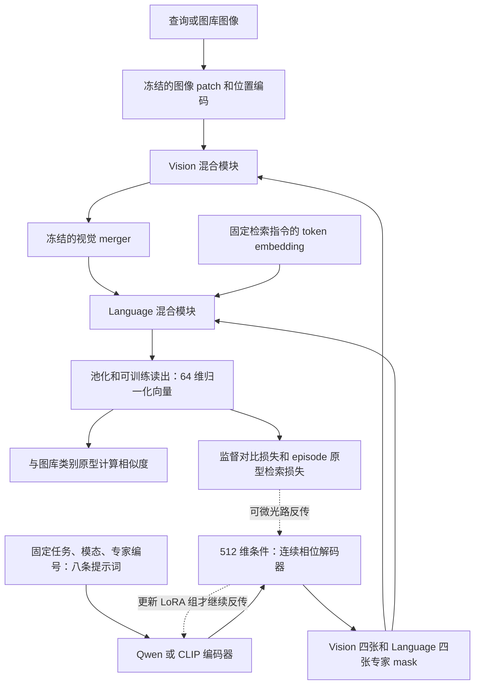
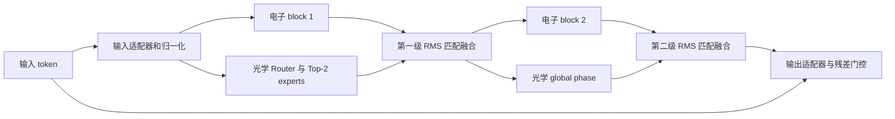

# 固定专家库：Qwen / CLIP 电光迁移实验说明

本文件对应已完成的 `control_v3` 协议：六组验证集开发实验、三数据集共 14 组正式实验，全部使用 RTX 4090。结果和导出专家已回传并校验 SHA256，训练进程已退出。可微生成固定 mask 的链路成立，局部对照有小幅收益；目前尚未证明预训练大模型更新具有稳定优势。完整数字见文中的结果表及 [自动生成的完整结果](完整结果.md)。

## 要回答什么

本轮分别检查三个问题：生成器能否通过可微光路学到有效的固定 mask；电子分支的更新是否影响光学学习；更新预训练编码器是否比直接优化相位、或只训练解码器更有收益。

“相位变了”“分数提高了”“大模型有优势”是三个不同结论。相位变化及梯度证明链路能训练；与初始 mask 的干预比较检验训练后专家的作用；Qwen/CLIP 与 direct、frozen 的比较才用于判断生成方式的收益。

各方法部署时仍是相同光路和八张 mask，比较考察的是 mask 的学习方式。生成器可能改变优化路径、初始化先验和泛化表现；更大的生成模型不会自动扩大最终固定光路的结构容量。因此可微链路跑通之后，还必须用同协议对照检验收益。

## 实际结构



每个模态内部均复用 LightGenV2 的 optical Router、Top-2/4 专家路由、expert 相位及 global phase。电子部分为 token mixer 和残差 MLP；两处模块融合均采用经过 RMS 尺度匹配的光电凸组合。本轮 Vision 两处、Language 两处的光学融合系数全部固定为 **0.6**，训练中不允许门控将光学分支压到下限。

单个模态的两级结构如下；Vision 使用二维 token mixing，Language 使用因果一维 token mixing。



外层输入残差连接仍保留；第一层融合结果也是第二层光学输入的一部分。因此固定内部 0.6 并不能保证全系统“60% 靠光”，也不能完全排除电子残差路径的影响。分支移除实验正是对这一点做功能检查。

系数 0.6 不代表 60% 的准确率来自光学。为判断实际依赖，训练完成后分别移除全部光学融合输出、全部电子融合输出、仅 Vision 光学、仅 Language 光学，再重新计算图库原型和查询结果。

这里没有让完整的 Qwen 视觉和语言 Transformer 在推理前先提取高级特征。student 模式以光电模块替换或旁路原主干，保留必要的 patch、token embedding、merger 等冻结组件。生成 mask 的 Qwen 是另外加载的模型，只在训练及导出时使用。
Language 指接收视觉 token 和固定文本指令的处理模块；本轮三个数据集都做图像检索，没有另外混入文本查询任务。

### “固定专家库”如何训练

固定的是任务内所有样本共用同一套八张 mask；训练过程中这些 mask 可以更新。生成器输入不含当前图像、标签或 batch。训练完成后保存 `expert_bank.pt`，推理时直接加载八张物理相位，不再调用生成器。
完整复现还需所选 checkpoint 中训练后的 Router、global phase、电子接口和读出权重；单独八张 mask 不是整个系统的全部参数。

生成式组用同一个随机初始相位作为锚点：

\[
u_\theta=u_0+D_\psi(E_\phi(c))-D_{\psi_0}(E_{\phi_0}(c)),\qquad
\varphi=2\pi\,\operatorname{sigmoid}(u_\theta).
\]

其中最后一项是训练前缓存的常量，不能反传；`u0` 也是固定 buffer。这样的初始化使各组起始的物理专家相位一致。生成式组没有额外独立训练的专家像素参数，mask 的变化必须经过编码器或解码器产生。导出验证在三张样本上检查生成路径与实体 mask 路径的 embedding 一致性。

### 各组含义

| 组名 | 专家 mask | 编码器更新 | 解码器更新 | Router / global / 电子部分 |
|---|---|---|---|---|
| fixed | 固定初始随机相位 | 无编码器 | 无解码器 | 按共同阶段训练 |
| direct | 直接优化相位像素参数 | 无编码器 | 无解码器 | 按共同阶段训练 |
| qwen_frozen | 冻结 Qwen 特征生成 | 不更新 | 更新 | 按共同阶段训练 |
| qwen_lora | Qwen 特征生成 | 只更新 LoRA | 更新 | 按共同阶段训练 |
| clip_frozen | 冻结 CLIP 特征生成 | 不更新 | 更新 | 按共同阶段训练 |
| clip_lora | CLIP 特征生成 | 只更新 LoRA | 更新 | 按共同阶段训练 |

fixed 仍有光学专家，并不是没有光路的空模型。frozen 指冻结编码器，解码器仍可学习，因此生成的 mask 仍会改变。两个 frozen 组安排在 CIFAR 十类，用于区分编码器学习和解码器学习。

Qwen 使用 Qwen3-VL-2B-Instruct 的语言分支；CLIP 使用 OpenAI ViT-B/16 的文本分支。两者使用相同八条提示词，LoRA 均接 q/v 投影、rank=8、alpha=16。Qwen 的 2048 维输出用无参数平均池化压到 512 维，CLIP 原生为 512 维；后接同构、同初始化的连续 patch 解码器，含八个独立专家输出头。基座参数冻结，LoRA 和解码器用 FP32 参数训练。
生成器的冻结基座精度并非完全相同：Qwen 沿用 BF16 加载，CLIP 沿用 FP32 文本权重；共同光电 student 使用 BF16 autocast。该差异与编码器规模、预训练任务差异一起属于本轮限制。因此主表比较的是两套明确配置的生成方法，不能把差距唯一归因于模型家族或预训练知识。

相位解码器具体将每个专家的 512 维条件投影到 128 维，与 14×14 个可学习位置向量相加，经 MLP 和该专家独立的输出头，得到每块 16×16 的连续数值，再拼成 224×224 mask。编码器通过八个全局条件向量影响空间图案，位置向量和输出头则直接参与生成空间细节。这一结构本身允许 decoder 承担相当多的学习，不能只凭 LoRA 存在就认定预训练知识已经迁移。

师姐的示例默认使用冻结的 CLIP RN50 **图像**特征，生成样本 mask 后做 batch 平均。本轮采用 CLIP **文本**条件以控制 Qwen/CLIP 的输入差异，保留真正固定的专家库；这不是师姐方案的原样复现。缓存 CLIP 权重经过官方 SHA256 校验，转换后的文本模型与原 `encode_text` 在检查提示词上数值一致。Qwen 与 CLIP 的模型规模和可训练参数量不同，报告另外列出参数量，不能视为相同计算成本的比较。

短跑实际参数组统计：电子模块 1,798,345，读出 25,408，Router 100,352，global phase 456,968；直接专家像素为 401,408。Qwen LoRA 为 1,605,632，CLIP LoRA 为 196,608；两者 decoder 均为 372,736。四个 fusion 参数全程不更新。参数量由每个 run 的 `architecture.json` 保留，正式表再次核对。

## 光学参数和训练步骤

光学传播直接复用已有实现，不复制后端：波长 532 nm、像素间距 17 μm、传播距离 0.1 m、专家相位 224×224，active 区域 478×478、计算画布 518×518。相位由 sigmoid 映射到 [0, 2π]。本轮使用理想光学仿真，关闭训练时采样的位移、相位 dropout、CCD 噪声等扰动，仍保留完整可微传播。此结果不能直接推断实验台鲁棒性。

正式训练每轮 120 个 batch，每个 batch 包含十类、每类三张图；30 轮合计 3,600 个 batch。固定 seed=42 和数据划分，不按测试结果调整类别。
这里的“轮”是固定长度的 PK 抽样训练轮，不是逐张遍历一次数据集。总计 108,000 次训练图像抽样，可能重复，约相当于 CIFAR 十类训练集大小的 22.74 倍、Imagenette 训练集的 11.84 倍；各方法预算相同，但不同数据集的覆盖倍数不同。

各组都从仓库已有的 Caltech warmstart 初始化 student；其 SHA256 为 `6a27f54d8c869cce46150583383a127b0ba47b3d34503f5753aa23974ac1e55d`。Router 按相同 seed 重置，expert 用上述共同随机锚点覆盖，融合改为 0.6，其他匹配权重沿用该初始化。CIFAR 和 Imagenette 也使用这一相同起点，没有各自额外的任务预训练。因此 Caltech 高分包含历史适配收益，不能全部归因于本轮生成器。

| 阶段 | 轮次 | 解锁的参数 | 目的 |
|---|---:|---|---|
| experts | 1–4 | direct 的 expert，或生成式组的 LoRA / decoder | 电子部分冻结，让专家先学习 |
| optics | 5–12 | 上述参数加 optical Router 和 global phase | 联合调整光路 |
| joint | 13–30 | 上述参数加电子 token mixer / MLP 和读出 | 完成光电联合适配 |

四个融合门控始终冻结在 0.6。fixed 在第一阶段没有可更新参数，故其总 optimizer 更新为 3,120；其他正式组为 3,600。两者都经历相同的 batch 机会及阶段顺序。

直接专家 LR=0.02，Router LR=0.01，global LR=0.006，decoder LR=0.0003；电子/读出与编码器 LoRA 的峰值 LR 由下述开发实验决定。AdamW 按参数组优化，电子/读出 weight decay=0.001，其他组为零。每阶段重启 20 步 warmup 和余弦调度，最低为峰值的 0.2；每组梯度范数裁剪阈值为 1。图像增强在 optics/joint 阶段启用，experts 阶段禁用。“冻结电子”指参数不更新，仍保留对应阶段共同的训练态和 dropout 设置。

任务损失为 supervised contrastive loss 加 episodic prototype retrieval loss，温度分别为 0.07、0.15，两项权重均为 1。附加 Router balance / importance / hard balance 正则权重为 0.08 / 0.02 / 0.5，CCD operating point 为 0.02，phase DC 为 0.005。本轮没有 teacher embedding 或蒸馏损失。

每轮只看 adaptation validation，按验证集 Top-1、再按 MRR 选 checkpoint。正式测试在训练结束后评估所选 live 权重和预先定义的干预；本协议不以 EMA 成绩挑选最终结果。`protocol.json` 和实际 optimizer groups 是本任务有效设置，继承的 backend `config.yaml` 中保留的历史学习率或扰动描述不能替代它们。

### 开发对照：电子是否太快、LoRA 是否太慢

开发只用 CIFAR 十类验证集，每组 16 轮×40 batch，阶段为 2/4/10 轮。decoder LR 始终 3e-4。

| 组 | 电子和读出 LR | LoRA LR | 额外变化 | 是否参与选 LR |
|---|---:|---:|---|---|
| base | 1e-4 | 1e-4 | 无 | 是 |
| slow_e | 1e-5 | 1e-4 | 无 | 是 |
| high_g | 1e-4 | 1e-3 | 无 | 是 |
| slow_e_high_g | 1e-5 | 1e-3 | 无 | 是 |
| frozen_e | 0 | 1e-3 | 全程冻结电子和读出 | 否，仅机制诊断 |
| encoder_focus | 1e-4 | 1e-3 | 第 2 轮后冻结 decoder | 否，仅机制诊断 |

从前四组按最后三轮验证 Top-1 均值、再按 MRR 均值选 LR，并将同一 LR 设置用于所有正式数据集与模型。不能按各方法测试结果分别选最有利学习率。该短网格是在 Qwen 上选择，因此也不能声称是 CLIP 的最佳调参上限。

本次实际选择为 base：电子/读出及 LoRA 的峰值 LR 均为 1e-4。四个候选组的最后三轮验证 Top-1 均值依次为 **37.33%、36.83%、35.83%、34.50%**。slow_e 的最好单轮为 39.5%，高于 base 的 38.5%，但不采用事后改换“最好单轮”规则来选择学习率。0.5 个百分点的均值差距较小，不能据此断言降低电子 LR 在一般情况下没有作用。

两个机制诊断中，全程冻结电子部分的最好验证 Top-1 为 36.5%；后期冻结 decoder 为 37.5%。后者关闭 LoRA 的相位 RMS 差达 0.16149 rad，说明可以迫使编码器适配器承担更多相位生成工作，但本次没有带来高于基准的验证分数。六组移除全部光学输出后 Top-1 下降 9–19.5 个百分点，均通过预先设定的 5 pp 参考；关闭 LoRA 的分数变化则小得多。这些都是开发验证结果，不混入正式测试表。

记录每轮首步的真实参数更新范数、相对更新范数、任务到 expert / LoRA 的梯度、逐专家相位 RMS 和路由计数。相对更新范数便于观察时间尺度，但不能直接当作各模块重要性；LoRA 零初始化的一部分参数也会影响这一比例的解读。最终关闭 LoRA、保留相同 decoder 的干预，用于检查编码器更新是否实际影响所选 mask 和检索。
全部 mask 的相位 RMS 包含未被路由选中的专家；这些专家也可能受 DC 正则和共享 decoder 的影响。报告因此同时保留逐专家变化、所选轮次的路由计数，以及按该轮选择次数加权的相位 RMS。该计数是在训练中累计，不能当成测试集路由分布。

首批混合 RTX 3090/4090 开发 run 仅作数值诊断，已在测试评估前排除出 LR 选择。正式开发与主实验要求 RTX 4090、严格确定性算法、固定 cuBLAS 工作区，以减少独立进程的随机数值路径差异；所有旧产物保留，不覆盖。

严格检查发现原生 CUDA 自适应平均池化反向不支持确定性。本任务保留其原生前向，将反向改为对应平均池化矩阵的转置运算。该数学等价实现通过整除、重叠和上采样输出尺寸测试，float64 梯度与原生 CPU 实现在 1e-12 容差内一致；不会改写共享光学后端文件。

## 数据集与指标

| 数据集 | 类别选择 | gallery | validation | test 来源 |
|---|---|---|---|---|
| Caltech101 十类 | 沿用原固定十类 | 每类 3 张 | 每类 10 张 | 原 200 张 test |
| CIFAR-100 十类 | bear / bus / butterfly / castle / cup / elephant / girl / streetcar / telephone / wardrobe | 每类 5 张 | 每类 20 张 | 官方 test，共 1,000 张 |
| Imagenette2-160 | 官方全部十类 | 每类 5 张 | 每类 30 张 | 官方 val 全部 3,925 张留作本实验 test |

Imagenette 的 gallery 和 adaptation validation 仅从官方 train 中留出；test 完全不参与参数或 checkpoint 选择。数据来源见 [Imagenette 官方仓库](https://github.com/fastai/imagenette)。CIFAR 十类沿用先前固定清单，没有重新筛出容易的类别。
Caltech 最终 train / validation / gallery / test 为 2,525 / 100 / 30 / 200；CIFAR 十类为 4,750 / 200 / 50 / 1,000；Imagenette 为 9,119 / 300 / 50 / 3,925。

Caltech 类别为 airplanes、Motorbikes、Faces、Leopards、accordion、grand_piano、scorpion、sunflower、watch、yin_yang。Imagenette 类别为 tench、English springer、cassette player、chain saw、church、French horn、garbage truck、gas pump、golf ball、parachute；对应官方 synset 编号保存在数据清单和适配器中。

任务是**图像到类别原型的检索**：图库每类的若干图像经当前 student 编码，再求均值原型；查询对十个原型排序。Top-1 表示第一名类别正确，Top-3 表示正确类别落在前三名，MRR 表示正确类别排名倒数的平均值。十类随机排序的参考 Top-1 为 10%，Top-3 为 30%。Top-3 更高符合其定义，不能将它写成 Top-1，也不能与标准 CIFAR 分类头排行榜直接比较。

## 最终数据与判断

每格为 **Top-1 / Top-3**，同一数据集各方法使用相同初始化、数据划分、30 轮预算与验证选择规则；每组一个优化 seed。fixed 仍训练 Router、global phase 和电子部分，只冻结 expert。

| 数据集 | 冻结专家 fixed | 直接训练相位 | Qwen LoRA＋解码器 | CLIP LoRA＋解码器 |
|---|---:|---:|---:|---:|
| Caltech 十类 | 79.50% / 91.50% | 81.50% / 94.50% | 81.00% / 94.00% | 81.00% / 94.50% |
| CIFAR-100 固定十类 | 50.00% / 81.10% | 50.30% / 83.10% | 50.10% / 80.60% | 52.30% / 81.70% |
| Imagenette 十类 | 39.97% / 68.43% | 37.68% / 66.39% | 40.97% / 67.44% | 37.83% / 66.65% |

Top-3 已达到约 66%–95%，但 CIFAR 和 Imagenette 的 Top-1 仍未到 60%。本轮没有为提高数字重新筛类，也没有把 Top-3 改名成 Top-1。

生成方式有局部正向结果：CLIP 在 CIFAR 的 Top-1 比 direct 高 2.00 pp，但 Top-3 低 1.40 pp；Qwen 在 Imagenette 的 Top-1 / Top-3 比 direct 高 3.29 / 1.04 pp。然而 Imagenette 的 fixed 已达 39.97% / 68.43%，Qwen 对它的 Top-1 只高 0.99 pp、Top-3 反而低 0.99 pp。因此本轮支持“可微生成固定专家可运行”，尚不支持“更新预训练大模型具有稳定优势”。

九个训练 expert 的主对照组，其 expert 环形相位 RMS 约为 0.98–1.26 rad，移除每张相位的常量项后仍接近这一量级；生成组与直接相位组的导出 bank 不相同。关闭 LoRA、保留同一 decoder 时，六个 LoRA 生成组的 Top-1 变化仅在下降 0.40 pp 到反而提高 0.50 pp 之间。这说明所选模型对编码器适配器的依赖较弱，不能把整个 mask 的变化都算作大模型更新的贡献。

CIFAR 的独立冻结编码器对照进一步区分了两部分学习：冻结 Qwen、只训 decoder 为 **48.60% / 80.00%**，加入 Qwen LoRA 后为 **50.10% / 80.60%**；冻结 CLIP、只训 decoder 为 **50.80% / 80.80%**，加入 CLIP LoRA 后为 **52.30% / 81.70%**。两者 Top-1 均提高 1.50 pp，是单 seed 下的小幅正向信号。独立重训与训练后关闭 LoRA 的干预不同：后者只能检查所选 checkpoint 当下的依赖，不能量化编码器更新在整个训练过程中的影响。

14 组的四路融合系数均固定为 0.6；移除全部光学融合输出后，Top-1 下降约 **13.96–36.00 pp**，均超过预先规定的 5 pp 参考。这证明模型实际依赖光学分支，不能据此推算光电贡献比例。fixed 组仍能学习 Router/global phase，因此其较高分数也不能全部归因于电子部分。

14 组的冻结参数审计均为零变化，导出固定 bank 的数值一致性比较误差均为零；所有训练进程的实际 GPU UUID 和 PyTorch 型号均已核验。原始审计见 [verification.json](verification.json)、[进程设备记录](20260908_v3_rtx_process_audit.json) 和 [完成队列](20260908_v3_formal_queue.json)。

Vision 在所选训练轮使用四个专家，Language 只使用两个。相位图、路由图与逐专家数值一起报告；它们显示当前专家利用仍不充分。图中的“0 training selections”指所选训练轮，不能当成测试集路由统计。

完整数据见 [14 组结果与干预](完整结果.md)、[总指标 CSV](metrics.csv)、[逐类指标 CSV](per_class_metrics.csv) 和 [原始更新量 CSV](parameter_updates.csv)。
对应图表为 [检索与光电干预](retrieval_and_branch_contribution.png)、[路由选择](selected_epoch_routing.png)、[开发学习曲线](development_training.png)，以及三个数据集的 [Caltech 相位](caltech_expert_phase_changes.png)、[CIFAR 相位](cifar100_expert_phase_changes.png)、[Imagenette 相位](imagenette_expert_phase_changes.png)。

预先规定的功能依赖参考为：移除全部光学融合输出后，Top-1 至少下降 5 个百分点。此标记不用于测试集选模型；未通过时保留结果并明确说明。移除电子融合输出仍保留必要电子编码、I/O、读出及尺度校准，不能描述为纯光网络。
“换回初始专家”会改变已经共同适配的模型，检验的是该 checkpoint 的依赖；它不等同于 fixed 组从训练开始就冻结专家、让其他参数重新适配。是否值得训练专家，还需要结合独立训练的 fixed 对照判断。

当前协议只有一个优化 seed，Caltech 还继承历史 warmstart 和已暴露的测试查询；理想仿真以及固定任务的八张 mask 也限制了外推范围。它能检查生成式参数化是否有效，尚不足以单独证明大模型预训练知识带来稳定优势。

## 后续从哪里下手

首先检查 Language Router 的有效利用率。本轮训练记录显示其持续选择前两个专家；应先记录所选 checkpoint 的逐样本探测器能量、概率、入射光场和路由相位梯度，再判断是输入几何偏置、概率饱和还是优化问题。共享 `encode_groups` 将有效 token 放在光场前面的行、其余行补零，因此短序列的照明分布是一个值得验证的候选原因；这只是从源码得到的假设，本轮尚未做因果验证。不要仅凭负载不均就继续放大正则或学习率。

其次检查生成器的必要性。本任务只有八条不随样本变化的条件，且每个专家有独立输出头；从结构上推断，解码器可以吸收大量任务适配。这解释了为什么需要 frozen 对照，但不能单凭这个推断断言编码器无用。后续若检验“预训练知识迁移”，应增加同维随机固定条件或随机初始化编码器对照，并在多个训练任务与未见任务之间检验共享生成器；这些实验本轮没有执行。

最后才是在固定协议下补充多个优化 seed 和更长预算。先确认专家确实被使用、生成器更新有独立收益，再投入大规模调参，比较会更容易解释。本轮测试结果只用于报告；后续协议应另建配置与 run ID，不能改写本轮结果。

## 文件与复现

代码和配置位于本任务，继承 LightGenV2 光学参数。服务器固定 Git SHA 的独立 worktree 运行；训练前验证完整 GPU UUID，训练后记录实际 PyTorch 型号。未使用 A100。

`runs/simulation/<唯一 run ID>/` 保存划分、初始化哈希、参数组、梯度、更新、验证曲线、最终指标、导出专家；best/last checkpoint 留在服务器。轻量数据和 `expert_bank.pt` 通过 SFTP 回传，并逐文件核对 SHA256，收据为 `transfer_manifest.json`。最终 `summary.json`、CSV 和图由 `report_control.py` 从完整 run 自动生成，证据清单追溯到原文件。
CSV 中 `elapsed_seconds` 包含训练、验证、最终干预和 checkpoint I/O，不含基座加载与来源哈希计算；`peak_memory_gib` 是 PyTorch 峰值已分配显存，不是整个进程的全部显存。共享服务器上的这些数字只作开销记录，不作为严格性能基准。

正式训练源码为 `dee34f07`，目录为服务器 `/DATA/DATA1/guest3/worktrees/static_control_v3`；开发重跑源码为 `14eb8e8d`，在另外的 `static_control_v3_deterministic` worktree。后续报告提交不会切换正在训练的 checkout。

复现单个正式组的命令如下。需在固定源码的 worktree 根目录、已准备数据与基座权重的 `xml` 环境执行；先查询显卡空余情况，再填入完整 RTX 4090 UUID 和新的唯一输出目录。

```bash
nvidia-smi --query-gpu=uuid,name,memory.free --format=csv
python -m TransferFromElectricity.tasks.t01_object_retrieval.launch_rtx \
  --gpu-uuid GPU-<verified-RTX-4090-UUID> \
  --method qwen_lora \
  --config TransferFromElectricity/tasks/t01_object_retrieval/configs/control_v3/formal_cifar.yaml \
  --steps-per-epoch 120 \
  --run-dir TransferFromElectricity/tasks/t01_object_retrieval/runs/simulation/<new-unique-run-id>
```

另外两个数据集使用 `formal_caltech.yaml`、`formal_imagenette.yaml`；方法名称对应前面的组别表。所有实际命令、GPU UUID、基座文件哈希均保存在每个 run 的元数据中，不依赖手写报告追忆。
