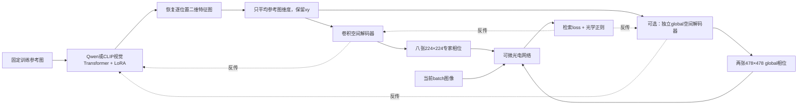

# 零相位初值、视觉空间生成与联合生成 global

本轮检验三件事：从零 raw 相位开始，视觉生成器能否学到有用的固定专家；保留逐位置视觉特征是否优于先做空间池化；将 global phase 也交给生成器是否带来收益。准确度与训练时间分别报告，不能用 mask 看起来更有结构替代检索成绩。

## 初始值：严格 raw=0，物理相位为 π

两侧共十二个可训练光学相位平面都先清零：Vision/Language 各四张 expert、一张 global、一张 optical Router。它们经 `phase = 2π sigmoid(raw)` 变为全 π 物理相位。专家间隙、画布保护区属于调制背景，仍为零物理相位，复调制为1。

Router 的参数名是 `raw_router_phase`，与 expert/global 的 `raw_phase` 不同。本轮两种名称都显式检查；每个 run 的 `zero_initialization.json` 必须包含十二层、raw 最大绝对值均为0、实际 `module.phase()` 的最小/最大值均为π。这个检查读取实际模块输出，不是仅按公式推测。

旧实验的随机专家初值、warmstart global 和四光点 Router 初值均不属于这一新协议。非相位的电子接口与读出仍沿用共同 Caltech warmstart，四路光学融合系数固定0.6；因此本轮没有把整个系统都变成全随机训练。

`config.yaml`还保留复用后端的原始`small_normal`初始化、扰动等默认描述；实际执行时，本任务的`static_expert_protocol`覆盖这些选项，warmstart后再显式清零，并关闭训练光学扰动。实际起点以`zero_initialization.json`和首次绑定校验为准，不能仅从后端默认字段推断。本轮不改写历史配置产物。

光路沿用LightGenV2：波长532 nm、逻辑像素间距17 μm、每段传播0.1 m、k空间最大角0.65°；每张expert为224×224，2×2排列的中心间距254像素、间隙30像素，478×478有效区外加20像素保护区形成518×518画布。Router按四个探测区能量选择top-2，使用幅度域的power-L2权重归一化与straight-through梯度；global级复用expert路由。CCD不做背景扣除，按帧均值缩放、clip/log1p及池化读出。本轮全部为理想传播仿真，配置中实验台SLM的8 μm物理像素规格不能替代上述逻辑仿真采样间距。

生成式专家定义为：

$$
r_E(\theta)=G_E(\theta;\mathcal S)-G_E(\theta_0;\mathcal S),
\quad \phi_E=2\pi\sigma(r_E).
$$

第二项是初始化时缓存、无梯度的常量。初始输出相减严格为0，后续变化来自当前生成器。生成头的权重不是全零，这样初始梯度仍能到达视觉编码器；被清零的是最终送进光路的 raw 相位。

约束函数的导数为`dφ/dr = 2π·sigmoid(r)·(1−sigmoid(r))`，在raw=0时等于π/2，因此零raw本身不会造成sigmoid梯度饱和。这并不保证每个像素都有任务梯度：实际光场覆盖、路由选择及生成器的导数仍会影响更新，所以另做任务梯度链和专家使用次数审计。

因此，本轮预训练视觉模型不会在第零步提供一张已经非均匀、可能更好的初始mask：这部分初始输出被共同零相位约束抵消。预训练的作用保留在特征表示以及参数更新如何映射到相位变化上。十五组的首次validation输出在各自数据集内完全相同，后续差异才来自训练。

## 旧方案与空间信息问题

旧 Qwen 路径用语言分支对固定提示词编码，每个专家只有一个512维汇总向量。随后加上14×14位置向量，逐位置MLP生成16×16小块，再重排成224×224。它有位置参数，因此不能说完全没有位置能力；但没有图像二维特征图，也没有解码器中的显式邻域卷积。拼接形状正确不等于保留了视觉空间信息。

新方案保留逐位置视觉 token，经正确的排列还原后，使用3×3卷积在邻域间传递信息。卷积和位置坐标提供空间结构约束；至于这是否有利于光学任务，需要本轮池化消融和最终成绩验证。参考图片的坐标也不天然等同于光学相位的物理功能坐标，仍由可微光路的任务损失学习这层映射。

这里存在两套坐标，不能混为一谈。**生成器**恢复的是参考图的14×14视觉网格；而沿用的**学生光路输入**由`encode_groups`把每个token投影为224个非负特征，按“一行一个token、一列一个投影通道”放入224×224幅度场，不足224个token时在底部补零。因此SLM行/列是token序号与特征通道，并非原图的y/x直接复制。新生成器保留二维视觉关系，但没有把整个学生光路改成原图坐标的一一映射。该编码在本轮五组间完全相同，未中途改变。

这一实现也意味着短Language序列只照亮每个输入aperture的前若干行；未照亮像素的expert相位不会通过该次理想乘法直接影响光场。图中Language相位变化区域受此几何条件影响，不能将大片近似常相位直接解释为“大模型没有梯度”。该补零布局对光学Router长期只选择两个专家的影响仍需单独验证，本轮未建立其因果关系。源码见 [学生幅度编码与fanout](../../../../../experiments/qwen3_vl_embedding_2b_grocery10_optical_retrieval/optics/moe.py) 和 [两级光路输入编码](../../../../../experiments/qwen3_vl_embedding_2b_caltech101_four_layer_optical_retrieval_10cm_robust/optical_blocks.py)；所读实现与正式训练SHA一致。

## 固定专家库如何使用视觉输入

每个数据集只从其**训练划分**预先选择每类一张图，共十张，选择由seed42和类别编号确定。图像统一中心裁剪为224×224，不加动态增强；十张参考图全程固定，保存样本ID和原文件SHA256。validation、gallery、test 不进入参考集。

所有训练 batch 都使用这套相同参考图生成同一个专家库。当前查询图像或 batch 标签不会送入生成器，所以这仍然是任务内所有样本共用的固定专家库；没有变回逐样本生成 mask。训练结束后固定导出，不再运行视觉生成器。

十张参考图分别编码，**只沿参考图维度求均值，保留每个位置的特征**。这保留了显式二维网格，但聚合会丢掉参考图之间的身份信息；通道压缩也有信息损失，不能将本方案描述为完全无损的视觉重建。

## Qwen：只执行视觉 Transformer

使用 Qwen3-VL-2B 的视觉权重，单独构造视觉模型并只读取权重文件中 `model.visual.*`；不加载到生成器中、也不执行语言 Transformer。当前2B版本的视觉隐藏宽度为1024；它与旧语言分支的2048维隐藏状态不同。

配置仍以完整Qwen checkpoint的`model_id`定位权重容器，不表示执行了完整语言模型。继承配置里的`task_description`和旧`clip_source`属于历史文本方法；本轮空间方法实际使用固定图像与`clip_vision_source`。实际加载文件、视觉结构及`language_tower_executed=false`分别记录在生成器manifest和`architecture.json`中。

“只用视觉分支”指新增的mask生成器；被训练的光电学生仍保留原来的Vision/Language两侧。八个输出通道分别负责这两侧的四个expert，相位由各自光路的任务梯度学习，生成Language侧相位并不要求生成器自身执行语言Transformer。

图像编码保留原生patch嵌入、位置嵌入、二维旋转位置编码和视觉注意力。去掉通向语言空间的 merger 和 DeepStack merger 输出，取得最后视觉层的 **merger之前** token。

```text
十张固定参考图                            [10, 3, 224, 224]
Qwen原生图像预处理                        patch=16，image_grid_thw=[1,14,14] × 10
视觉Transformer的pre-merger token          [1960, 1024]
逆转2×2分块排列                           [10, 1024, 14, 14]
参考图维度求均值                          [1, 1024, 14, 14]
每个xy位置独立做通道平均池化到512、LayerNorm  [1, 512, 14, 14]
```

**不能把pre-merger token直接reshape成14×14。**原实现按 `[H/2,W/2,2,2]` 分块排序；本轮显式逆转为 `[H/2,2,W/2,2]` 后再展平为空间网格。单元测试用非方形坐标编码检查像素位置、方向和梯度对应关系。

Qwen视觉注意力把Q/K/V放在同一个线性层中。本轮只为Q、V切片安装rank8、alpha16的FP32 LoRA，K切片和基座权重冻结。测试验证初始前向与原层一致，更新LoRA后只改变Q/V增量。基座采用BF16，生成头采用FP32。

实现依据是本地与服务器的 Transformers 4.57.3 实际源码；不同版本API返回类型可能不同，不能直接套用新版文档的字段名。参见 [官方Qwen3-VL文档](https://huggingface.co/docs/transformers/model_doc/qwen3_vl) 和 [官方实现](https://github.com/huggingface/transformers/blob/v4.57.3/src/transformers/models/qwen3_vl/modeling_qwen3_vl.py)。

## CLIP：同样保留视觉 patch token

CLIP使用OpenAI ViT-B/16视觉分支，去掉输出序列中的CLS token，取得 `[10,196,768]`，按原生行优先顺序还原为 `[10,768,14,14]`。之后使用同样的参考图均值、通道压缩到512、归一化和空间解码器。Q/V LoRA同样为rank8、alpha16，基座沿用FP32。

视觉权重从已有官方CLIP缓存转换到 `CLIPVisionModel`，先校验OpenAI发布文件的SHA256，再对**全部patch token**检查转换前后输出一致。当前检查最大误差为0。没有重新下载或改写原缓存。

它与此前的CLIP文本分支实验不同，也不是师姐的“逐样本生成后按当前batch平均”方案。这里固定的是训练参考集，当前batch不会改变生成器输入。Qwen与CLIP的预训练、宽度、参数量及基座精度仍不同，因此方法比较不能唯一归因于模型家族。

## 空间解码器



专家解码器的输入为 `[1,512,14,14]`，加上显式x/y坐标得到514通道。两层3×3卷积投影到64通道；随后四次2倍PixelShuffle上采样，空间尺寸依次为28、56、112、224，通道为32、24、16、8。每一级在上采样前后都包含3×3卷积，配合GroupNorm/GELU，最后3×3卷积输出8个相位通道，重排为 `[2,4,224,224]`。

PixelShuffle本身是确定的重排；跨原patch边界的信息通过前后卷积传递，因此输出并非独立16×16小块简单贴合。GroupNorm避免深层解码器把传到视觉LoRA的梯度过度衰减。它会引入更广泛的统计依赖，不能将整个解码器解释为严格局部操作。

Qwen池化消融在进入同样的解码器之前，把14×14特征平均成1×1再广播回14×14。它仍有同样的xy坐标、卷积、归一化和参数量，唯一改变的是是否保留显式逐位置视觉特征。这比直接比较旧文本MLP和新视觉卷积更接近空间信息的控制变量实验。

## 一起生成 global phase

Qwen双生成组共享一个视觉编码器，expert与global使用两个独立的空间解码分支。global分支先将**特征网格**用确定性自适应平均池化映射为15×15，五次2倍上采样得到480×480，再按两个空间维度的 `1:479` 中心裁剪为478×478。没有对最终光学相位图做插值。

global与expert属于不同光学级，分别注入各自模块，不能简单相加后当作单层相位。生成global时，原来的global自由像素参数被冻结并排除出优化器，避免重复更新。

experts阶段global必须保持raw零，即使共享视觉编码器正在更新。进入optics阶段时，缓存一次当时的global生成值作为参考：

$$
r_G=0\quad\text{（experts阶段）};\qquad
r_G(\theta)=G_G(\theta;\mathcal S)-G_G(\theta_{\mathrm{unlock}};\mathcal S)
\quad\text{（optics/joint阶段）}.
$$

这样解锁时不会因为编码器先前已更新而突然跳到非零global。参考缓存之后保持固定，任务梯度同时回到global头和共享视觉LoRA。checkpoint保存参考和解锁状态；恢复时按所选阶段重建，导出检查同时物化expert/global。

三个正式数据集已核对：Qwen专家生成组与Qwen双生成组前四轮的任务loss、验证结果、专家相位摘要、任务梯度和专家选择次数记录完全一致；双生成组的global在这四轮均保持raw零。组间差异从第五轮global解锁后才开始出现。

## 五个组和训练步骤

| 组名 | Expert | Global | 视觉条件 |
|---|---|---|---|
| direct | 直接优化像素raw | 直接优化像素raw | 无生成器 |
| clip_vision_lora | CLIP＋空间解码器 | 直接优化 | 固定参考图的空间特征 |
| qwen_vision_pooled_lora | Qwen＋同样解码器 | 直接优化 | 同样参考特征先做H/W池化 |
| qwen_vision_lora | Qwen＋空间解码器 | 直接优化 | 保留逐位置特征 |
| qwen_vision_global_lora | Qwen＋空间解码器 | Qwen＋独立global解码器 | 与上一组相同 |

全部组使用同一数据划分、seed42、零相位起点、光路、电子warmstart和0.6融合系数。

0.6是经过尺度匹配后的光学分支混合系数，不代表准确度贡献的60%，也不能单独证明电子分支没有主导任务。因此同时保留分阶段冻结及移除分支的功能干预；这些证据与系数约束一起判断。

可训练生成器参数分别为：CLIP空间组766,616，Qwen池化/空间组各1,258,136，Qwen双生成组1,732,354；其中expert解码器471,704，global解码器474,218。作为参照，直接expert有401,408个自由像素，直接global有456,968个。生成式参数化在本结构中并没有比自由相位使用更少的可训练参数，还增加了视觉编码与解码计算，因此不能仅凭“LoRA参数少”预先推断它训练更快。

从这套固定库实现可直接推得：任意生成出来的raw相位张量，也可以逐像素填入direct组；部署时的物理光路相同。因此生成器并未扩大可部署mask的可表示集合。可能的优势来自优化路径、预训练先验或正则化、数据效率等，须用准确度、收敛曲线和计时验证，不能由生成器规模更大直接推出。

| 阶段 | Epoch | 更新参数 |
|---|---:|---|
| experts | 1–4 | expert自由相位，或视觉LoRA＋expert解码器 |
| optics | 5–12 | 上述参数加光学Router、global自由相位或global生成头 |
| joint | 13–30 | 上述参数加电子模块和读出 |

每轮120个PK batch，每个batch十类×每类三图，共3,600次图像抽样；一个epoch不是完整遍历一次训练集。每组总计3,600个batch、108,000次训练图像抽样。生成器还会反复处理固定十张参考图；这部分额外计算计入实测时间，不计入上述学生训练batch抽样数。

AdamW学习率：直接expert 0.02、Router 0.01、直接global 0.006、expert/global解码器均3e-4、视觉LoRA和电子/读出均1e-4。分阶段20步warmup与余弦调度、每组梯度裁剪1、EMA等沿用共同协议；四路融合始终冻结0.6。训练损失仍为监督对比＋episode原型检索，附共同Router/CCD/DC正则，没有teacher蒸馏。

只根据validation Top-1、再根据MRR选择checkpoint。训练结束后才计算所选模型的test Top-1/Top-3等成绩，不根据test换类、挑轮次或更改结构。三个数据集仍是Caltech原十类、CIFAR-100原固定十类和Imagenette官方十类，任务是图像到类别原型检索。

| 数据集 | train图像 | validation图像 | gallery图像 | test查询 |
|---|---:|---:|---:|---:|
| Caltech原十类 | 2,525 | 100 | 30 | 200 |
| CIFAR-100固定十类 | 4,750 | 200 | 50 | 1,000 |
| Imagenette-160十类 | 9,119 | 300 | 50 | 3,925 |

数量来自正式run的`split.json`和`final_report.json`。各划分互不重叠；gallery每类图像的embedding取均值，构成十个类别原型。Caltech沿用每类三张gallery，另两套数据每类五张；数据集内五组完全一致，但不同数据集不是相同难度或相同gallery协议的横向排行榜。

CIFAR的train/validation/gallery来自官方train，test来自官方test。Imagenette沿用缓存的`imagenette2-160`版本：train/validation/gallery均从官方train划出，官方val作为本项目test，再按既定processor预算处理图像。它不是原始高分辨率版本的评测；“validation选模”指本项目预留的300张图，不是官方val中的3,925张测试查询。Caltech则沿用从类别图像集合划出的既定四分割。

## 时间口径与设备

每个epoch在CUDA同步后分别记录阶段设置、完整训练循环、验证/审计、checkpoint/主日志写入。完整训练循环包括数据处理、视觉生成、光学FFT仿真、反向、优化器、EMA和诊断；不把它称为纯GPU核函数时间。完整epoch是四项之和，模型加载、初始validation、训练结束后的干预/导出另在运行总时长中体现。

计时文件自身的写入和最终epoch标准输出在计时边界之后，也不计入该epoch；逐step输出在训练循环之内。精确包含/排除范围同步保存在每组`epoch_timing.json`，不以日志相邻行的时间差替代此计时。

`metrics.csv`还列出`run_wall_seconds`，覆盖进程启动到调度器确认退出，包含加载和训练后评估；它也包含退出轮询的延迟（进程采样间隔为5秒），精度口径与CUDA同步的epoch分项不同。

两种视觉生成器都使用eager attention和本轮确定性设置；Qwen基座BF16、CLIP基座FP32。这里比较的是这些具体实现的耗时，未进行专门的算子或缓存加速，也没有把不同精度当作完全相同的算术条件。固定mask导出后不再执行生成器，因此这些训练开销不会直接带入部署时的mask生成。

完整结果给出所有30轮的均值，`epoch_times.csv`保留全部逐轮值，`stage_times.csv`另外列出4/8/18三个阶段。阶段末含额外的初始专家验证，保存best也会造成I/O差异，所以同时列训练循环和完整epoch。

同一数据集五组固定在同一物理RTX卡上顺序执行；不同数据集可并行。空闲4090被其他任务占用时允许使用空闲3090，但数据集内不换卡，不能把不同数据集的绝对耗时直接横比。记录每个训练PID实际出现的GPU UUID、每五秒进程采样的外部PID集合和返回码。CPU/磁盘为共享资源，这不是完全独占主机的基准。

每轮更快和达到同一精度更快是不同问题。本轮同时保留validation曲线和每轮时间，并记录首次达到50/60/70/80% validation Top-1时累计的完整epoch时间；未达到的阈值保留为空，初始已达到时为epoch0、0秒。这个累计值不含模型加载和初始验证，只反映训练过程；首次越过阈值也不保证后续始终保持。只有一个优化seed，不能从单个最优点建立稳定收敛优势。

部分正式run在启动后遇到了同卡外部计算进程。GPU审计保存的是整个run的外部PID集合，没有逐PID时间戳，因此相关运行的全部时间统一标记，不能事后挑出所谓“无干扰epoch”。为补充计时，另设CIFAR固定十类的五组短复测：保持正式模型、数据、精度、学习率和每轮120个batch，仅将三个阶段缩短为各两轮，且只使用validation。预先指定每阶段第二轮（epoch 2/4/6）作对照，保留全部30条epoch记录。五组顺序使用同一张RTX，等待一套正式数据集实验全部释放显卡后再开始，不占用其组间间隙。

时间图的虚线表示该run记录过外部GPU计算PID；逐轮、分阶段及阈值时间CSV的`run_foreign_gpu_pids`同样是**整组**标记，不表示列出的PID在每一个epoch都同时存在。每张时间子图也标明实际显卡型号。

短复测的结果仅回答该实现各训练阶段的计算开销，不加入正式test准确度表，也不代替30轮的收敛比较。每阶段只有一个第二轮观测，共享CPU/磁盘和可能的外部GPU进程仍会影响计时；不能从很小的比值差异宣称稳定加速。

本次短计时分配到RTX 4090，正式CIFAR使用RTX 3090。直接组的配置、结构和初始化权重已核对一致，但两张卡上的初始validation Top-1/Top-3分别为20.0%/44.0%与20.5%/45.0%。这提示确定性设置不保证跨GPU型号逐位等价，具体差异来源尚未定位；短复测内部仍要求五组初始输出完全一致。两批validation成绩不混合用于收敛比较。

五组短计时已完成并通过全部协议核验，五组初始validation输出完全相同，GPU采样均未发现外部计算PID。epoch 2/4/6的训练循环秒数如下：

| 方法 | experts（2） | optics（4） | joint（6） | joint/direct |
|---|---:|---:|---:|---:|
| direct | 49.48 | 63.22 | 64.34 | 1.000× |
| CLIP空间 | 53.16 | 68.68 | 71.42 | 1.110× |
| Qwen池化 | 89.40 | 106.09 | 110.62 | 1.719× |
| Qwen空间 | 89.19 | 106.27 | 110.70 | 1.720× |
| Qwen空间＋global | 89.76 | 106.42 | 110.20 | 1.713× |

本轮具体实现没有显示每轮加速。联合阶段CLIP约多用11%的训练时间，Qwen三组约多用71%–72%；Qwen各组间很小的差异不能建立谁更快的稳定结论。完整epoch还包含验证/保存等额外时间，详见 [同卡短计时复测](同卡短计时复测.md) 和 [全部30轮分项时间](timing_recheck_epochs.csv)。这组结果仍不回答经过充分优化的其他实现或达到同一最终精度是否可能更快。

## 结果与证据

正式15组均完成30轮，共450个epoch；本节成绩来自validation所选checkpoint的test评估。每格为 **Top-1 / Top-3（%）**，每组只有seed42。

| 方法 | Caltech十类 | CIFAR-100固定十类 | Imagenette-160 |
|---|---:|---:|---:|
| 直接优化相位 | 82.00 / 94.50 | 50.60 / 81.70 | 39.16 / 67.08 |
| CLIP视觉空间生成 | 83.50 / 94.00 | 48.40 / 79.30 | 38.42 / 65.55 |
| Qwen视觉池化消融 | 80.50 / 93.00 | 50.00 / 81.20 | 39.13 / 66.96 |
| Qwen视觉空间生成 | 80.00 / 93.50 | 49.90 / 79.80 | 37.25 / 66.14 |
| Qwen空间生成expert和global | 80.50 / 92.50 | 47.10 / 78.10 | 36.36 / 64.56 |

**本轮没有证明稳定的生成优势。**CLIP相对直接优化的Top-1分别为+1.50、−2.20、−0.74个百分点，收益不一致；Qwen空间组在三套数据上均低于直接优化。CIFAR和Imagenette的Top-1仍未达到60%，不能用Top-3替代这一结论。

**保留空间是否有效：**Qwen空间组相对同预算、同参数量的池化消融，Top-1分别为−0.50、−0.10、−1.89个百分点。代码恢复了二维token邻接关系，但这个改动在本轮没有转化为更好的检索成绩。现有光学输入的token×特征坐标与生成器图像xy坐标并不相同，参考图之间也只做固定位置平均；这些仍是结构限制，尚未被单独实验定位为成绩偏低的原因。

**是否没有训动：**原始相位从严格零开始，任务梯度能够回到视觉LoRA和解码器，最终相位与预测均有变化。把Qwen空间组的expert换回初始平坦相位，Top-1从80.00/49.90/37.25%降为77.50/46.40/35.49%；因此生成expert确实影响任务。但关闭LoRA的干预并不总使成绩下降，不能把全部收益归因于预训练视觉模型更新。所有15组在所选epoch的Language路由都只使用两个专家；未用输出也可能被共享解码器或正则带动，不能凭拼图变化判断四个专家均被利用。

每轮速度的同卡复测见上一节。达到相同validation阈值也未显示可靠的生成优势：例如Caltech直接组首次达到80%用了11轮、累计12.10分钟，CLIP为27轮、37.59分钟，Qwen空间组30轮内未达到；这里只累计完整epoch时间，不含加载，首次达到也不等于稳定保持。全部预设阈值及共享GPU标记保存在CSV，不能只挑成功阈值报告。

成绩与时间详见 [完整结果](完整结果.md)、[450轮分项时间](epoch_times.csv)、[分阶段均值](stage_times.csv)、[validation阈值时间](validation_time_to_threshold.csv) 和 [学习/时间曲线](validation_and_epoch_time.png)。按实际光路间隔拼接的完整专家层与独立global层见 [Caltech](caltech_expert_global_layers.png)、[CIFAR](cifar_expert_global_layers.png)、[Imagenette-160](imagenette_expert_global_layers.png)，使用统一0–2π色标。

配对相位差与成绩差见 [method_comparisons.csv](method_comparisons.csv)，每类成绩见 [per_class_metrics.csv](per_class_metrics.csv)，分支干预见 [component_interventions.csv](component_interventions.csv)。文件与远端checkpoint证据见 [evidence_manifest.json](evidence_manifest.json)，六份队列/设备审计的独立回传校验见 [execution_transfer.json](execution_transfer.json)。复现步骤集中于 [唯一复现入口](../reproduction/README.md)。

**生成global是否有收益：**相对于Qwen只生成expert，同时生成global的Top-1/Top-3差值分别为：Caltech **+0.50/−1.00 pp**，CIFAR **−2.80/−1.70 pp**，Imagenette **−0.89/−1.58 pp**。这条可微链路能够训练并导出，但本轮没有跨数据集的一致收益。没有根据这些test结果修改学习率或追加轮次来覆盖原配对实验。

原始run位于 `runs/simulation/20260908_v4_formal_<dataset>_<method>_s42`，每组保留best/last checkpoint和独立 `expert_bank.pt`。后者同时包含两侧expert与global的raw及物理相位；完整系统还需要所选checkpoint中的Router、电子接口和读出参数。

`final_report.json`中的初始expert干预只替换expert，保留当前global；双生成组的 `lora_disabled_same_decoder` 则同时改变expert和global，因为二者共享视觉LoRA，不能将该干预的全部差值归因于expert。

本轮 `initial_experts` 和 `flat_pi_experts` 是同一个干预，因为初始raw本来就是0；它们不是两组独立实验。`component_interventions.csv` 保留去掉光学、去掉电子、替换初始expert和关闭LoRA的成绩；这些是所选模型上的干预，不能等同于重新训练一个纯光学或纯电子模型。

这里“去掉光学/电子”指融合处的对应分支干预，共同的预处理、接口和readout仍保留；不能把其中“去掉电子”的结果当作完全没有电子处理的硬件系统准确度。

`phase_and_gradient_diagnostics.csv` 同时保留每张expert的相位RMS、选中次数及梯度。未被router选中的直接expert可能始终为π；共享生成器也可能让未使用的输出通道随其他通道变化，所以“mask有变化”不能单独证明该expert参与了任务。

其中任务梯度链来自每轮第一个batch：单独对任务loss求梯度，检查其到expert、LoRA B及已解锁global的范数，尚未加入相位DC等正则；它不是整轮梯度均值。专家选择次数则累计整轮120个batch。这样可以区分“正则改变了相位”和“检索任务梯度确实到达生成器”。

`method_comparisons.csv` 将主要配对的Top-1/Top-3差值与expert/global相位差放在一起。相位差按固定物理位置计算，先用 `atan2(sin Δφ, cos Δφ)` 绕回到[-π,π]，再取RMS；不额外重排专家或对齐整体相位偏移。它描述的是相位配置差异，不能替代检索指标或光路功能干预。

结果脚本核对十二层零初始化、相同数据集五组初始validation输出一致、固定参考集仅来自train、阶段冻结、四路系数0.6、同GPU配对、全部30轮计时、expert/global物化输出误差，以及回传文件SHA256。源码经GitHub固定SHA worktree运行，结果经SFTP及独立SHA256验证回传，不覆盖旧run、原模型缓存或其他任务工作树。

仍需保留的限制：理想光学仿真尚未验证实验台扰动；只有一个优化seed；两种编码器的规模/预训练/精度不同；参考图只有每类一张；Caltech沿用了历史warmstart及已有测试查询，不能把其结果当作全新独立测试，也不能把全部性能提升归因于视觉预训练知识迁移。空间池化消融和global生成对照的具体差值，比肉眼观察mask更有判断价值。

测试集复用并不只发生在Caltech：CIFAR固定十类与Imagenette也沿用此前轮次已经查看过的test划分。本轮内部仍严格只按validation选模，且未依据本轮test结果改动既定实验；但从跨轮次研究过程看，三套数据都不是首次接触的盲测。Caltech还额外使用同域历史warmstart。这些限制需要与最终表格一起保留。
