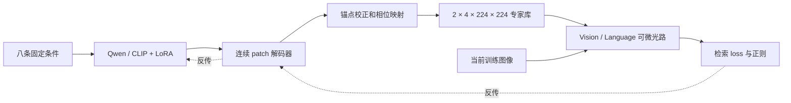

# 每轮训练时间、完整专家层与生成头说明

本文补充已完成的三数据集 `control_v3` 对照。三个主组是 **直接优化专家相位、Qwen LoRA＋相位解码器、CLIP LoRA＋相位解码器**。它们的光路、数据、损失及分阶段训练协议相同，区别在于专家相位的参数化方式。原来的专家完全冻结组是机制基线，不包含在这次三组速度比较中。

## 1. 每个 epoch 究竟测什么

本任务的一个 epoch 是 **120 个 PK batch，每个 batch 为十类×每类三张图，共 3,600 次图像抽样**，不等于完整遍历一次训练集。正式实验每组 30 个 epoch，阶段为 4 轮 experts、8 轮 optics、18 轮 joint。

新增的计时实验在 CIFAR-100 原固定十类上进行。三种方法在**同一张 RTX 4090 上顺序运行**，每阶段两轮，共六轮；仍为每轮 120 batch。初值、损失、图像处理、数值精度、峰值学习率与正式 CIFAR 配置一致，阶段长度及其学习率调度跨度缩短为 2/2/2。本次只评估 validation，不读取 held-out test 计算指标，也不替换此前的正式成绩。

训练源码固定为 `cc00af1b`；配置为 [timing_cifar.yaml](../../configs/control_v3/timing_cifar.yaml)。run ID 为 `20260908_v3_timing_cifar_{direct,qwen_lora,clip_lora}_s42`，位于任务的 `runs/smoke/`。绑定 GPU UUID `GPU-e8837b85-d55b-8e81-aaa5-ec1ac326932d`，未使用 A100。

在 CUDA 同步后使用 `perf_counter` 分别记录：

| 字段 | 包含的工作 |
|---|---|
| setup_seconds | 切换训练阶段、冻结快照、模式和生成状态等设置 |
| train_loop_seconds | 120 个 batch 的数据处理、生成 mask、光电前向、loss、反传、优化器、EMA、梯度与更新审计及训练步日志 |
| evaluation_and_audit_seconds | validation、相位统计、冻结检查；阶段末额外替换初始专家的 validation |
| checkpoint_and_logs_seconds | best（如更新）及 last checkpoint、history/steps/status 文件写入 |
| epoch_wall_seconds | 上述四项之和 |

模型加载、初始 validation、训练结束后的干预和导出，以及计时文件自身写入和最后一条 epoch stdout，不属于 epoch。这里测的是 **GPU 仿真训练循环及其配套开销**，不是纯 CUDA kernel 时间，也不是实验台光传播时间。参数冻结仍需完成相应前向及必要的梯度传播。

每阶段第二轮（epoch 2、4、6）用于避开阶段首次执行的开销，六轮原始值全部保留。第二轮同时也是本短实验的阶段末，完整 epoch 包含额外的初始专家干预验证，因此判断训练速度主要看 `train_loop_seconds`，不把阶段末总时长当成所有正式轮次的典型值。

三组均已完成。每格为 **训练循环秒数 / 完整 epoch 秒数**：

| 阶段与取样轮次 | 直接相位 | Qwen LoRA＋decoder | CLIP LoRA＋decoder |
|---|---:|---:|---:|
| 只更新 expert/生成器，epoch 2 | 41.67 / 48.91 | 72.62 / 80.93 | 49.23 / 56.82 |
| 加入 Router/global，epoch 4 | 57.10 / 64.07 | 87.48 / 95.88 | 66.06 / 73.36 |
| 加入电子/读出联合训练，epoch 6 | 60.13 / 67.24 | 92.86 / 102.61 | 67.97 / 75.17 |

**本次没有测到生成方式的每轮训练速度优势。**Qwen 三阶段训练循环耗时分别为 direct 的1.74、1.53、1.54倍；CLIP 为1.18、1.16、1.13倍。联合阶段，Qwen 多用约54.4%的时间，CLIP 多用约13.0%。这是当前具体实现和精度设置下、一次顺序实验的实测结果，不是重复实验的均值或方法家族的速度上限。

随着阶段解锁更多参数，direct 的训练循环由约42秒增加到57和60秒。生成组还需运行编码器/解码器及相关反传。额外开销是否能被更少的迭代数抵消，需要完整的收敛比较；本次短计时不测试这一问题，已有正式实验也尚未建立稳定的时间到精度优势。

原始结果：[逐 epoch 的精确计时](measured_epoch_timing.csv)、[分阶段比较](measured_stage_summary.csv)、[分项计时图](measured_epoch_timing.png)。运行顺序及每五秒 GPU 进程采样见 [执行审计](timing_execution.json)。它检查三组使用同一 UUID、各自训练 PID 实际出现、采样中无其他计算 PID、前一组退出后才启动下一组。共享服务器的 CPU、存储和未采样瞬间并没有因此变成完全独占资源。

### 原来三个数据集每轮的记录

旧源码没有上述分项计时，不能用最终运行总时长除以 30 冒充每轮训练时间。已恢复全部九个正式主组的 **270 个 epoch**：

| 数据集 | 直接相位 | Qwen LoRA | CLIP LoRA |
|---|---:|---:|---:|
| Caltech 十类 | 68.93 s | 98.05 s | 80.93 s |
| CIFAR-100 固定十类 | 66.88 s | 112.07 s | 77.84 s |
| Imagenette | 67.84 s | 105.17 s | 80.73 s |

本表是 **epoch 2–30 的相邻 history 记录间隔均值**，包含前一轮保存/日志和本轮设置、训练、验证，不能等同于新测的训练循环时间。第一轮前无对应时间戳，故其记录间隔留空。原训练可能共享 GPU/主机，这些值仅描述历史实际开销，不能独立证明方法的固有速度差异。

[历史逐轮 CSV](historical_epoch_timing.csv) 另外列出第 1 步到第 120 步日志之间实测的 119 步时间，及除以 119 再乘 120 的**估算**。该估算排除了首步额外梯度/更新审计，名称明确标为 estimated。没有把估算列改称精确 epoch 时间。

### 每轮快，与达到同样精度快

每轮时间回答计算成本；训练效率还要比较达到同一 validation 指标所需的累计时间。旧日志的 [验证精度—时间曲线](historical_epoch_time_and_validation.png) 及 [目标阈值记录](historical_time_to_validation_targets.csv) 保留全部方法，未达到记为空。阈值为事后描述性分析，并非训练前注册的验收标准，且受旧运行负载影响，不能拿单个有利阈值证明加速。

这次六轮实验检验每轮成本，不用于判断收敛优劣。要证明时间到精度的优势，应在同一硬件协议下运行完整训练、多次重复并交错方法顺序，预先固定 validation 阈值和预算，同时保留未达标结果。目前没有这样的新证据。

## 2. 初始专家相位是多少

**当前 direct 并非从全零物理相位开始。三种方法从同一组随机相位开始，每个模态/专家的图案各不相同。**实现见 [common_anchor](../../protocol.py) 与 [训练时初始化](../../train_staged.py)。如果把现有实验理解成“direct 零初值，对比大模型自然输出初值”，那与实际代码不符。

直接优化并没有必须从零初始化的数学要求；零相位是可以单独检验的一种初始化选择。当前随机初值是既有对照协议的一部分，本次只核实和展示，没有改写已完成实验的起点。

正式配置的 `seed=42`、`initial_expert_dc_power=0.25`，构造方式为：

\[
\phi_0\sim U(\pi-a,\pi+a),\quad (\sin a/a)^2=0.25,\quad
r_0=\operatorname{logit}(\phi_0/(2\pi)).
\]

其中 \(a\approx1.89549\) rad。八张专家的实际物理初相位范围为 **1.24610–5.03708 rad**，均值 **3.14083 rad**，标准差 **1.09464 rad**。`0.25` 是该初始化分布的期望 mask DC 功率，不是相位值，也不是光学融合系数；本轮四路融合系数保持 0.6。

底层实际优化的是 raw 参数 \(r\)，通过 \(\phi=2\pi\sigma(r)\) 转成物理相位。因此 **raw=0 对应物理相位 π，而不是 0**。这也解释了旧报告中的 `flat_pi_experts`。若希望新做“全零物理相位”对照，需要明确改为可从零正常求导的物理相位参数化，或明确使用近零近似；在现有 sigmoid 映射中精确零对应负无穷，不能简单将 raw 填零后声称是零相位实验。新初始化应在所有比较方法中一致，并使用新的配置/run ID。

生成组具体使用：

\[
G_\theta(c)=D_\theta(E_\theta(c)),\qquad
r_t=r_0+G_{\theta_t}(c)-G_{\theta_0}(c),\qquad
\phi_t=2\pi\sigma(r_t).
\]

`initial_reference = Gθ0(c)` 在训练前计算并缓存，是固定、无梯度的 buffer；不是每一步重新计算一个会抵消当前输出的参考。初始时两项相减为零，所以生成组与 direct 的物理相位一致；之后模型更新，输出差值改变 mask，梯度正常回传到当前生成器。

因此，你说的“初值由大模型第一次输出决定”适用于**不带上述锚点校正的自然生成方式**。若直接定义 `phase = 2π sigmoid(decoder(encoder(prompt)))`，初值确实由第一次前向决定，而且同时取决于预训练编码器和**新随机初始化的相位解码器**。现有 Qwen/CLIP 并没有预训练好的光学相位输出头，不能将解码器的第一次随机输出视为现成的高质量光学设计。

目前采用锚点是为了控制初值这个变量，主要考察训练中的生成参数化。后续若检验“自然生成初值”的价值，可以先保存自然生成的 bank，再让 direct 从同一个 bank 开始比较优化方式；另设零/随机/生成初值的对照检验初始化收益，不把两种因素混在一起。

Global phase 则沿用共同 student warmstart 的权重，然后按阶段直接优化；它没有被上述专家随机锚点覆盖，当前也不是生成器输出。

## 3. 生成头到底长什么样

输入是任务内固定的八条提示词：`任务描述 + vision/language + Expert 0/1/2/3`。没有当前图片、batch 标签或逐样本条件；也不让模型通过离散文本逐像素输出数字。模型给出连续隐藏向量，再由可微解码器生成整个固定专家库。

| 位置 | Qwen 路径 | CLIP 路径 |
|---|---|---|
| 编码器 | Qwen3-VL-2B 的语言分支 | OpenAI CLIP ViT-B/16 的文本分支 |
| 条件输出 | 每条最后一个非 padding token，`[8,2048]` | 文本 EOS pooled hidden state，`[8,512]` |
| 条件统一 | 无参数平均池化为 `[8,512]` | 已为 `[8,512]`，不经过 CLIP 最终 text_projection |
| 可更新编码器参数 | q/v 上的 rank=8、alpha=16 LoRA | q/v 上的 rank=8、alpha=16 LoRA |
| 下游解码器 | 与 CLIP 同构、同初始化 | 与 Qwen 同构、同初始化 |

师姐原示例使用冻结的 **CLIP RN50 图像特征**，生成样本 mask 后对 batch 求平均；当前 CLIP 文本条件版本是为了与 Qwen 保持输入一致的固定库实验，不是该图像特征方案的原样复现。

[PatchDecoder 的实际源码](../../models/generator.py) 可写成：

```text
8 条 context                            [8, 512]
LayerNorm(512) → Linear(512,128)          [8, 128]
增加位置维，与可学习 positions 相加         [8, 196, 128]
  positions: [196,128]，对应 14×14 patch
LayerNorm(128) → Linear(128,128) → GELU   [8, 196, 128]
8 个独立 Linear(128,256) 输出头           [8, 196, 256]
  权重 [8,256,128]，偏置 [8,256]
重排 14×14 个 16×16 patch                [2, 4, 224, 224]
共同锚点 + 当前输出 − 固定初始输出          [2, 4, 224, 224] raw
2π × sigmoid                            [2, 4, 224, 224] rad
```

最终两个维度分别对应 **2 个模态、每模态 4 个专家**，没有图像 batch 维；总计 401,408 个相位像素。位置向量、中间网络共享，最后投影按八个专家身份独立。解码器共 372,736 个可训练参数；它没有 patch 间自注意力层，而是对“条件＋位置”执行共享 MLP，再用独立输出头生成每块像素。



LoRA 组每个训练 batch 都重新生成 bank，因为 LoRA/decoder 更新后输出会变化；不能把 context 永久缓存而仍声称训练了编码器。冻结基座权重也不等于省掉经过这些层的 LoRA 反向传播。与 direct 直接更新像素相比，生成组增加编码器/解码器计算；参数化带来的潜在收敛收益需用实测时间到精度检验。

训练结束后只需导出固定 bank，部署时可移除生成器。direct 同样部署这八张 mask 和相同光路，因此这并不会自动产生相对 direct 的额外推理加速。

## 4. 完整单层 mask 如何拼接

已将三数据集正式所选 checkpoint 的八张专家相位按真实几何组装。每个数据集的图中，上排为 Vision，下排为 Language；四列依次为共同初始值、direct、Qwen、CLIP。统一色标为绝对物理相位 0–2π，便于横向比较。

- [Caltech 完整专家层](caltech_assembled_expert_layers.png)
- [CIFAR 完整专家层](cifar_assembled_expert_layers.png)
- [Imagenette 完整专家层](imagenette_assembled_expert_layers.png)

每张完整 canvas 是 **518×518**；中间 active 区域为 478×478，外围每侧 20 像素；专家224×224，中间间隙30像素。按数组 `[y,x]`、左闭右开切片：

| 专家 | 行 y | 列 x |
|---|---|---|
| E0 左上 | 20:244 | 20:244 |
| E1 右上 | 20:244 | 274:498 |
| E2 左下 | 274:498 | 20:244 |
| E3 右下 | 274:498 | 274:498 |

这不是把四张图紧贴成 448×448。间隙与保护区填**零相位，复调制为 exp(i×0)=1**，与当前 backend 的专家调制一致；图中的颜色不代表遮光或振幅为零。这里的坐标沿用仿真张量，不新增实验台旋转/镜像、灰度 LUT 或 SLM 标定。

精确张量保存在任务 [assembled masks 产物目录](../../runs/smoke/20260908_v3_assembled_masks/)，每个 dataset/method 一个 `.pt`，共 12 个。`phase_canvas_rad` 为 `[2,518,518]`，`phase_active_rad` 为 `[2,478,478]`。从完整层切回四个专家与原导出 bank 逐元素一致，最大误差为 0；间隙/保护区相位为 0。文件 SHA256 和来源 bank SHA256 见 [拼接清单](mask_assembly_manifest.json)。原始 run 和专家文件均保留。

初始列按 seed=42 公式在本地重建，并额外核对三组正式 fixed bank：raw 最大差约1.19e-7，物理相位最大差约9.54e-7 rad，来自本地/服务器数值计算的微小差异；正式训练方法之间的初始对齐是在服务器同一实现中检查的。拼接自身的切片重建误差与这项初始化重建差异分开记录。

这些完整专家层与 global phase 是**不同的光学级**；不能把 expert 与 global 简单叠加成一个相位图并认为光路等价。绝对相位图案不同，也不直接等于性能更好；相关检索结果与干预结果仍见原正式报告。

## 5. Global phase 能不能一起生成

**可以，梯度链路上没有原则障碍；当前代码尚未实现或训练这一扩展。**现在两侧 global 共 `2×478×478=456,968` 个相位参数，仍用普通梯度下降。若一起生成，需要扩展实际计算图及导出，不能只改一个现有开关。

一个与当前结构一致的实现方案：

1. 共享同一个 Qwen 或 CLIP 编码器，固定条件从八条增加为十条：八个 expert 身份加 Vision-global、Language-global。
2. expert 分支保持输出 `[2,4,224,224]`；新增 global 解码分支，接收两个512维条件。
3. global 分支采用30×30个16×16 patch，先输出 `[2,480,480]`，对两个空间维取 `1:479`，得到 `[2,478,478]`。478不能被16整除，明确中心裁剪，避免暗中插值改变像素几何。
4. 使用共同 warmstart global 作为锚点，同样减去初始化生成值，保证扩展组初始 global 与对照一致；路由仍直接训练。
5. 将输出接入两侧 global 的可微相位层，冻结并从优化器排除旧 global 像素参数，避免“生成值＋可训练自由像素”同时更新。训练完成后同时导出 expert 与 global。

当前 `PatchDecoder` 和 `ExpertLinear` 硬编码八个专家，因此新增分支需要支持两张输出或独立 global decoder，并新增注入与导出检查。应验证初值完全对齐、loss 到两类 mask/LoRA 的梯度非零、冻结参数不变、生成路径与物化相位路径输出一致。

后续比较至少保持三组：A 直接训练 expert＋global；B 生成 expert、直接训练 global（当前）；C 同时生成 expert＋global。若要完整区分两级的生成作用，再加 D 直接训练 expert、只生成 global，形成 2×2 因素对照。光学系数仍固定0.6，其他条件和预算一致，并继续记录分阶段耗时。

这是可执行的后续设计，不能据此预先声称同时生成 global 会更快或更准。本次已完成的速度比较没有将这个额外变量混入其中。

## 6. 复现与证据

从仓库根目录运行：

```bash
python -m TransferFromElectricity.tasks.t01_object_retrieval.inspect_training --timing
```

脚本核对正式 bank SHA256、真实 aperture 的切片重建、三组计时配置/Git SHA/GPU UUID 一致、每轮分项之和、validation-only、导出一致性和冻结检查；同时核对从服务器独立 SHA256 验证回传的关键文件。缺少原始完成 run 或执行审计时直接报错，不生成伪造数值。

原始 best/last checkpoint 留在服务器对应 run；本地保留轻量日志、专家导出与传输清单。源码经 GitHub 固定 SHA worktree 运行，产物经 SFTP 加 SHA256 回传，未用文件传输覆盖源码。新报告和图位于单一报告目录；精确相位产物位于 task 的 `runs/smoke/`，不提交大型权重。
