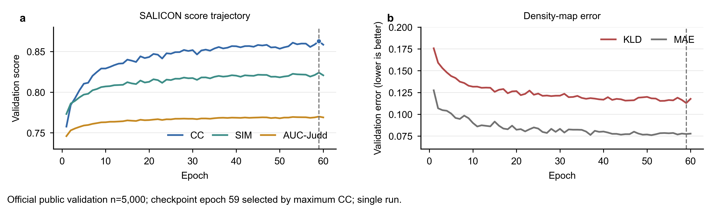
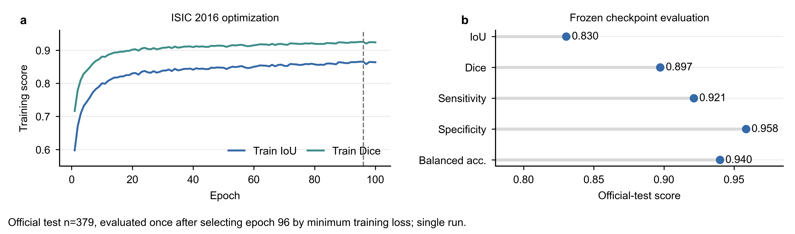
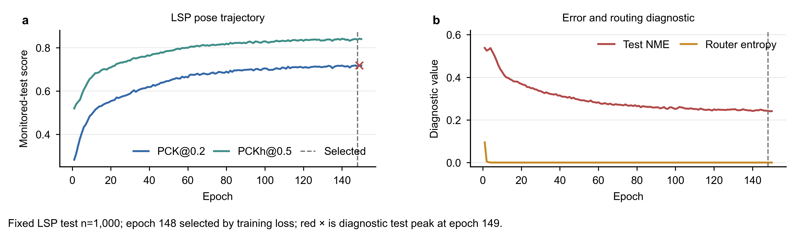
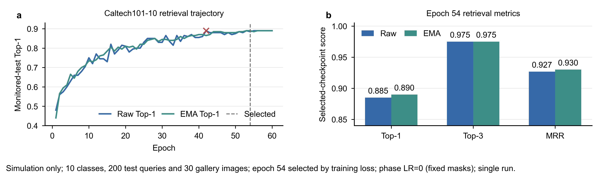

# Vision2 光电融合任务：结果与交接索引

本目录冻结并整理 2026-08-17 至 2026-08-18 完成的四项单次训练：SALICON 显著性、ISIC 2016 病灶分割、LSP 人体姿态和 Caltech101-10 图像检索。前三项使用同一套 Vision2 光电融合主干并连接任务专用 decoder；Caltech101 使用扩展的 Vision2 + Language2 四级光电融合检索架构。

三项稠密任务训练对应代码版本为 `aaa346a452df7f4176134f0c55f90d306a22b39c`。Caltech101 的 run artifact 没有记录 git SHA，配置和模型报告已完整冻结，仓库历史中对应四层工程的引入提交为 `b8d50017`，但后续引用时不应把该提交号当成 artifact 内部验证过的 provenance。原始运行目录仍保留在服务器 `experiments/*/runs/*`；本目录中的 `evidence/` 是用于论文整理的只读快照，后续绘图应优先读取这里，而不是读取可能被覆盖的 live run。

## 一句话结论

- 四项训练均正常完成，历史记录分别完整覆盖 60、100、150、60 个 epoch，未发现 NaN/Inf。
- SALICON 在官方公开 validation 上达到 CC `0.86274`，最优点位于 epoch 59。
- ISIC 2016 在完全不看逐轮 test 指标的情况下，以训练损失选择 epoch 96，正式 test IoU `0.83028`、Dice `0.89730`。
- LSP 按训练损失选择的 epoch 148 达到 PCK@0.2 `0.71300`、PCKh@0.5 `0.83750`；逐轮 test 观察峰值在 epoch 149，但该峰值只能作为诊断值。
- Caltech101-10 仿真按训练总损失选择 epoch 54：raw Top-1 `0.88500`、EMA Top-1 `0.89000`；这是固定 phase mask（`phase_learning_rate=0`）的四级光电融合结果，不含真实光路数据。

## 可正式引用的当前单次运行结果

| 任务 | 选模规则 | 选中 epoch | 评估划分 | 主指标 | 次指标 | 说明 |
|---|---|---:|---|---:|---:|---|
| SALICON | validation CC 最大 | 59 | 官方公开 validation，n=5,000 | CC 0.86274 | AUC-Judd 0.77000 | validation 可参与选模 |
| ISIC 2016 | training loss 最小 | 96 | 官方 test，n=379 | mean IoU 0.83028 | mean Dice 0.89730 | test 在选模后只评一次 |
| LSP | training loss 最小 | 148 | 固定 LSP test，n=1,000 | PCK@0.2 0.71300 | PCKh@0.5 0.83750 | test 每 epoch 被监控，存在观察偏差风险 |
| Caltech101-10 | training total loss 最小 | 54 | 固定 test query，n=200 | raw Top-1 0.88500 | EMA Top-1 0.89000 | 纯仿真；test 每 epoch 监控；phase 固定 |

补充结果：

- SALICON epoch 59：KLD `0.11287`、SIM `0.82411`、NSS `0.97200`、MAE `0.07731`。epoch 60 的 CC 为 `0.85845`，说明最后一轮略有回落，但没有明显崩溃。
- ISIC epoch 96 官方 test：MAE `0.05777`、pixel accuracy `0.94797`、sensitivity `0.92123`、specificity `0.95846`、balanced pixel accuracy `0.93984`。
- LSP epoch 148：mean pixel error `15.9506 px`、torso-normalized mean error `0.24339`。epoch 149 的观察峰值为 PCK `0.71850`、PCKh `0.84214`；不得把它写成独立 validation 选择结果。
- Caltech101 epoch 54：raw Top-3 `0.97500`、MRR `0.92676`；EMA Top-3 `0.97500`、MRR `0.93009`。数据为 10 类、2625 张 train、每类 3 张 gallery（共 30）、每类 20 张 test query（共 200）。raw Top-1 逐轮观察峰值为 `0.89000`（首次出现在 epoch 42），不能据此重新选模。

## 初步论文图

四张图均为 `183 mm × 54 mm`，字体为 Arial 7 pt，保持在要求的 4–6 cm 高度范围内。每张图均输出：

- `SVG`：文字保持可编辑，建议交给 Illustrator/Inkscape 的同学继续排版；
- `PDF`：矢量排版稿；
- `PNG`：600 dpi 预览；
- `TIFF`：600 dpi、LZW 压缩投稿备选。

预览：









## 目录结构

```text
18_vision2_hybrid_dense_tasks/
├── README.md                     # 本索引与结果口径
├── ARCHITECTURE_AND_PROTOCOL.md  # 网络、loss、数据与选模流程
├── METRIC_DEFINITIONS.md         # 指标定义及方向
├── FIGURE_HANDOFF.md             # 给后续绘图同学的字段映射和版式说明
├── QA_REPORT.md                  # 数据、尺寸、字体和视觉检查记录
├── SOURCE_MANIFEST.csv           # 每个冻结源文件的服务器路径、大小和 SHA-256
├── evidence/
│   ├── experiment_summary.csv    # 一行一个任务的简表
│   ├── summary.json              # 结构化完整摘要
│   ├── salicon/                  # 60-epoch 历史、配置、数据和模型报告
│   ├── isic2016/                 # 100-epoch 历史、正式 test 与逐样本结果
│   ├── lsp/                      # 150-epoch 历史、配置、数据和模型报告
│   └── caltech101/               # 四层仿真 60-epoch 历史及冻结运行报告
├── figures/                      # SVG/PDF/600-dpi PNG/TIFF
└── scripts/build_report.py       # 数据校验、摘要和图片复现入口
```

## 复现绘图与数据校验

在仓库根目录运行：

```powershell
python document/18_vision2_hybrid_dense_tasks/scripts/build_report.py
```

脚本会先检查 epoch 是否连续、数值是否有限、ISIC 正式 test 是否对应训练损失最小的 checkpoint，以及 Caltech101 的选模记录和固定 phase 状态是否与 history 一致，再重建汇总文件和四组图片。为避免交接后无意换字体，系统缺失 Arial 时脚本会直接报错，而不会静默换成其他字体。

## 原训练命令

```bash
CUDA_VISIBLE_DEVICES=1 python -m experiments.qwen3_vl_embedding_2b_salicon_vision_optical_saliency \
  --config experiments/qwen3_vl_embedding_2b_salicon_vision_optical_saliency/configs/salicon_vision2_hybrid.yaml \
  --phase student_train

CUDA_VISIBLE_DEVICES=3 python -m experiments.qwen3_vl_embedding_2b_isic2016_skin_lesion_optical_segmentation \
  --config experiments/qwen3_vl_embedding_2b_isic2016_skin_lesion_optical_segmentation/configs/isic2016_vision2_hybrid.yaml \
  --phase train

CUDA_VISIBLE_DEVICES=4 python -m experiments.qwen3_vl_embedding_2b_lsp_pose_optical_moe16 \
  --config experiments/qwen3_vl_embedding_2b_lsp_pose_optical_moe16/configs/lsp_pose_vision2_hybrid.yaml \
  --phase student_train

CUDA_VISIBLE_DEVICES=3 python -m experiments.qwen3_vl_embedding_2b_caltech101_four_layer_optical_retrieval \
  --config experiments/qwen3_vl_embedding_2b_caltech101_four_layer_optical_retrieval/configs/release/caltech101_four_layer_optical_joint.yaml \
  --phase train
```

注意：上面的 Caltech101 当前源码配置已将 phase LR 写为 `2e-5`，而本次冻结 run 的 resolved `config.yaml` 是 `0.0`。复现本次结果必须以 `evidence/caltech101/config.yaml` 为准；直接运行当前 release 配置会得到新的、可学习 phase 的实验，不能覆盖本快照。

## 论文使用边界

1. 当前都是单次运行，只能画点估计和真实训练轨迹，不能虚构误差条。
2. SALICON 只有公开 validation 标注，不能把结果称为私有 test 性能。
3. ISIC 的 100 个 epoch 中 `test_* = 0` 是“未执行测试”的占位符，不是模型性能为零；正式结果只认 `test_metrics.json`。
4. LSP test 被逐轮监控，因此 epoch 149 峰值仅用于诊断。当前可辩护的 checkpoint 是不依赖 test 指标选择的 epoch 148。
5. Caltech101 的 test query 在每个 epoch 被监控；正式值按 training loss 选模。`0.89000` 的 observed raw peak 不能描述为独立 validation 选择结果。
6. Caltech101 本次仅为仿真，不含 CCD 实测；相位虽有非零梯度，但 LR 为 0、run-level phase displacement 为 0，因此不能声称 phase mask 被优化。
7. 四个任务的指标定义和量纲不同，禁止把 CC、IoU、PCK、Top-1 直接放在同一纵轴上比较高低。
8. 当前结果能证明该架构在四个任务上的单次运行可行性，但尚不能证明统计显著性；正式论文仍需要多 seed 和匹配参数量的电子 baseline。

<!-- FIVE_TASK_SAMPLE_ATLAS_BEGIN -->
## 五任务逐样本可视化图谱（2026-08-18 补充）

OpenMoji instruction editing 已作为第五项仿真任务纳入 `evidence/openmoji/`。完整逐样本图谱位于 `visualization_gallery_20260818/sample_atlas/index.html`，共 `880` 张带指标案例图：SALICON `160`、ISIC 2016 `160`、LSP `160`、Caltech101-10 `200`、OpenMoji `200`。

每张图内已写入该样本的核心指标，任务页支持按样本/类别/操作搜索、按 strong/typical/weak 筛选和按主指标排序。分层标签只表示图集内部的相对分位，不能当作新的模型评价指标。`sample_atlas/ATLAS_INDEX.csv` 是统一选图索引，各任务 `manifest.csv` 保存未四舍五入的逐样本数值。

OpenMoji 正式口径为 epoch 20 最终 EMA：test `n=1000`，scene exact match `0.6640`、object F1 `0.9016`、edit-grid IoU `0.7629`。该 test 每轮仅监控、没有参与 checkpoint 选择；数据没有单独 validation 或 unseen-distribution split，因此不能把结果写成跨分布泛化性能。
<!-- FIVE_TASK_SAMPLE_ATLAS_END -->
