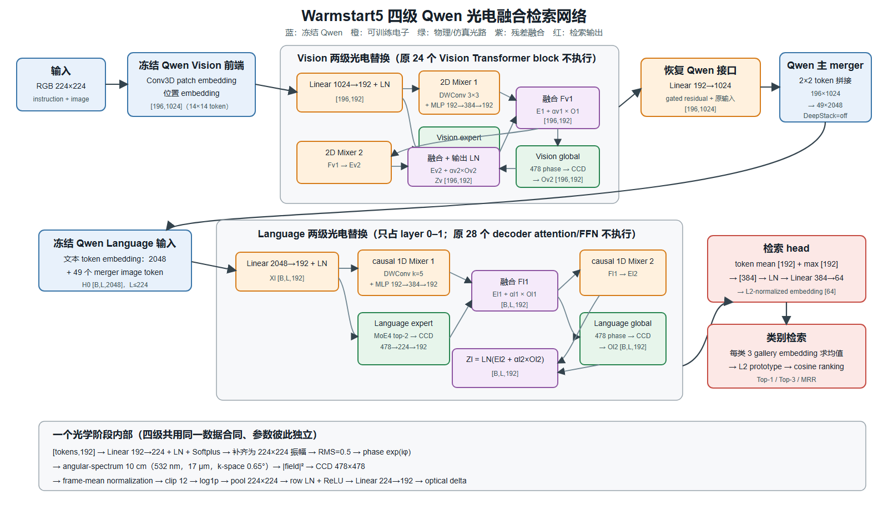

# 四级 Qwen 光电融合网络：给老师的结构说明

本文件夹说明两套工程：

1. 我们的 Caltech101-10 四级光电检索模型：
   `qwen3_vl_embedding_2b_caltech101_four_layer_optical_retrieval_10cm_warmstart5`；
2. 师姐的推理工程：`teams/inference`。

建议先看下图，再看两份分项说明。PNG 可直接放进汇报，SVG 是可编辑矢量版：

- [完整数据流图（PNG）](figures/fig01_warmstart5_complete_dataflow.png) / [SVG](figures/fig01_warmstart5_complete_dataflow.svg)
- [两套工程对照图（PNG）](figures/fig02_project_comparison.png) / [SVG](figures/fig02_project_comparison.svg)
- [我们模型的逐步数据变化](WARMSTART5_COMPLETE_DATAFLOW.md)
- [师姐 inference 工程说明](SISTER_INFERENCE_DATAFLOW.md)
- [代码与结论对应表](SOURCE_AUDIT.md)



## 一句话结论

我们的模型不是“完整 Qwen 跑完以后再接四层光”，而是：

> 保留并冻结 Qwen 的图像 patch embedding、位置编码、主 merger、文本 token embedding
> 和接口；跳过 Qwen 原来的 24 个视觉 Transformer block 与 28 个语言 decoder
> block，用两级 Vision 光电 Mixer 和两级 Language 光电 Mixer 代替，再把最终
> Language 的 192 维 token 特征池化成 64 维检索向量。

## 给老师口头说明时可以这样讲

> 一张 224×224 图像先由冻结的 Qwen 前端切成 196 个 1024 维视觉 token。我们不执行
> Qwen 原来的 24 层视觉 Transformer，而是把 token 压到 192 维，依次经过 Vision
> expert 和 Vision global 两次“电子 Mixer 与光学分支并行、CCD 回读后残差融合”。
> 随后，冻结的 Qwen 主 merger 把 196 个视觉 token 合成 49 个 2048 维 image token，
> 放进文本 prompt。原来的 28 层语言 decoder 同样被跳过，改由 Language expert 和
> Language global 两级光电模块处理。最后对有效语言 token 同时做均值池化和最大池化，
> 从 384 维投影成 64 维单位向量，再与每类 gallery prototype 做余弦相似度检索。

四个物理光学阶段依次为：

```text
Vision expert → Vision global → Language expert → Language global
```

每个阶段都不是把 `478×478` CCD 图直接加到 token 上，而是先经过统一的电子
CCD readout，把 CCD 还原为与电子分支同形状的 `[...,192]` 增量，再做有下限的
可学习残差融合。

## 老师最容易混淆的五件事

### 1. “使用 Qwen3-VL-Embedding-2B”不等于完整执行 2B 参数

原 Qwen 权重被冻结，但学生路径把原生视觉/语言 block 换掉了。实际仍参与前向的
冻结 Qwen 参数为 `340,274,176`，其中约 3.11 亿来自词表 embedding；embedding
是查表，不等同于每次做一个 3.11 亿参数的全矩阵乘法。

### 2. Vision 的 196 个 token 如何进入 Language

`224×224` 图像以 `16×16` patch 划分，得到 `14×14=196` 个、每个 1024 维的
视觉 token。Vision 光电模块不改变 token 数量。Qwen 主 merger 每 `2×2` 相邻
token 合成一个，因此：

```text
196×1024 → 49×2048
```

这 49 个 image token 被填入文本 prompt 的 image-token 位置，与普通文本 token
共同组成 Language 序列。

### 3. DeepStack 已关闭，但主 merger 保留

原生 Qwen 有 3 个 DeepStack 辅助视觉注入点（原索引 5、11、17）。本模型全部关闭，
只保留最后的主 merger。DeepStack 不是四级光路的一部分。

### 4. “四层光”是四次完整的光电闭环

每一级都是：

```text
电子 token → 振幅场 → 相位调制 → 10 cm 衍射 → CCD 强度
→ 归一化/压缩/readout → 192 维 optical delta → 与电子分支融合
```

上一层融合后的电子特征会重新编码并播放到振幅 SLM，才进入下一层；不是四张相位
板连续传播且中间完全没有 CCD/电子处理。

### 5. 5% 是融合系数下限，不是能量占比

四个门均为：

```text
alpha = 0.05 + 0.95 × sigmoid(raw_gate)
fused = electronic + alpha × optical_delta
```

`alpha≥0.05` 只约束 optical delta 的数值系数；它不保证 CCD 能量、特征范数或最终
判别贡献恰好占 5%。正式 checkpoint 的四个 alpha 约为 0.055。

## 两套工程的核心区别

| 项目 | 我们的 warmstart5 | 师姐 `teams/inference` |
|---|---|---|
| 任务 | Caltech101-10，图像检索图像类别 | ABO easy100，图像检索商品英文标题 |
| 查询/候选 | 200 query；每类 3 张 gallery，共 30 张 | 2400 query image；100 个 title |
| 四级光电主体 | Vision expert/global + Language expert/global | 复用同一主体和同一实现 |
| 普通图像 | 执行四个光学阶段 | 执行四个光学阶段 |
| 纯标题 | 不使用 | 跳过 Vision，仅执行两个 Language 光学阶段 |
| 最终 readout | `LN(384)→Linear(384,64)→L2` | `LN(384)→Linear(384,128)→GELU→Linear(128,64)→L2` |
| 64 维后处理 | 无 | 图像、文本各一个 rank-32 残差适配器 |
| 最终打分 | query 与类别 prototype 的 cosine | image adapter 与 text adapter 输出点积 |
| 当前目录能力 | 训练、仿真、导出、逐层硬件替换/微调 | inference-only；不提供训练入口 |
| 目录内声明结果 | 封存测试 Top-1 81.00% | README 声明完整集 R@1 83.21% |

二者最重要的共同点是：光学传播、CCD readout、Vision/Language 两级 Mixer 和四级
硬件顺序没有在师姐工程里重新发明。师姐工程主要改变了任务数据、最终 readout 和
跨模态对齐头。

## 模型输出究竟是什么

我们的模型对每张图输出一个长度为 64、L2 范数为 1 的向量。它不是直接输出类别
概率。每类 3 张 gallery 图的向量先求均值、再 L2 归一化为类别 prototype；query
与 10 个 prototype 做点积（即 cosine similarity），最大者为 Top-1。

师姐模型也输出 64 维单位向量，但分别经过 image adapter 和 text adapter，再形成
`2400×100` 的图像—标题相似度矩阵并排序。

## 已核对的正式结果口径

- warmstart5 使用 10 类、30 张 gallery、200 张互不重叠 query；
- 固定 Stage-B epoch 8 EMA/train-loss-best checkpoint；
- test 不参与逐 epoch 选模；
- 仿真 Top-1 `0.8100`、Top-3 `0.9300`、MRR `0.876345`；
- 师姐目录中的 `R@1=0.8321` 是其 README 给出的复现目标，目录没有附独立 metrics
  文件，因此本文不把它表述为重新审计得到的数值。
