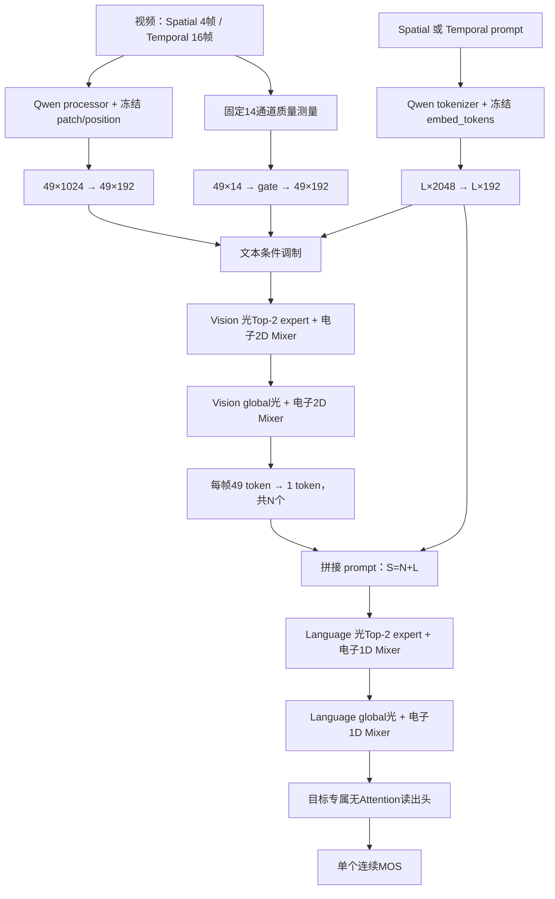

# LGVQ 单指标、文本条件、Spatial-4 / Temporal-16 光电网络

## 1. 先明确模型在做什么

Spatial 与 Temporal **不是一个模型的两个输出**。它们是两次互相独立的实验：

- Spatial 模型只读取 Spatial prompt，只回归一个连续 Spatial MOS；
- Temporal 模型只读取 Temporal prompt，只回归一个连续 Temporal MOS；
- 两者有各自的训练参数、电子读出头、四层特征相位、两层 Router 相位和 checkpoint；
- 二者不共享 Vision 缓存：Spatial 抽 4 帧，Temporal 抽 16 帧；文本缓存也因 prompt
  不同而独立。

采用连续 MOS，而不是把标签硬离散成五分类。`Excellent / Good / Fair / Poor / Bad`
仍作为 Qwen 文本提示的语义锚点；连续输出与师姐 LGVQ 评价脚本中的
SRCC/KRCC/PLCC/RMSE/MAE 口径一致。

## 2. 完整数据流与维度



```text
原始视频
  └─ 10%...90% 时间位置等间隔抽帧：Spatial 4 帧，Temporal 16 帧
       └─ 每帧中心裁剪短边的 65%，缩放为 RGB 448×448
            │
            ├─ Qwen3-VL 官方 processor
            │    └─ 冻结 patch_embed + 官方二维位置嵌入
            │         [N, 784, 1024]
            │         └─ 按 Qwen 2×2 merge 顺序做均值：784→196
            │              └─ 再做二维 2×2 均值：14×14→7×7
            │                   Qwen tokens [N, 49, 1024]
            │
            └─ 固定质量测量旁路（无可训练参数）
                 [N, 49, 14]

Qwen tokens: LayerNorm + Linear 1024→192
Quality 14:  LayerNorm + Linear 14→192 + sigmoid 可学习门控
  └─ 相加并 LayerNorm，得到视觉输入 [B,N,49,192]

目标专属文本 prompt
  └─ Qwen chat template → tokenizer → 冻结 embed_tokens
       [B,L,2048] → LayerNorm + Linear 2048→192
       ├─ 无 Attention 的 FiLM 条件调制进入首层视觉输入
       └─ 后续与 N 个图像摘要 token 拼接

Vision Layer 1: 电子二维 Mixer 与 Optical Top-2 expert 并行 → RMS 同尺度凸融合
Vision Layer 2: 电子二维 Mixer 与 Optical global 并行      → RMS 同尺度凸融合
  └─ 每帧 49 token 的 mean/max 拼接后 Linear，得到 N 个图像 token

[N 个图像 token ; L 个 prompt token] → [B,S=N+L,192]，S≤96
  └─ 加可学习序列位置参数

Language Layer 1: 电子因果 DWConv1D 与 Optical Top-2 expert 并行 → 融合
Language Layer 2: 电子因果 DWConv1D 与 Optical global 并行      → 融合

目标专属无 Attention 读出头
  └─ 一个 normalized score → 训练集 mean/std 反归一化 → 一个连续 MOS
```

这里没有执行 Qwen 的 24 层 Vision Transformer、Vision merger、28 层 Language
Transformer 或 LM head，也没有任何 self-attention。Qwen 被保留的是输入最前端：

1. 官方图像预处理；
2. 冻结视觉 patch embedding；
3. 官方视觉位置 embedding；
4. chat template 与 tokenizer；
5. 冻结语言词 embedding。

正式训练前将这些结果缓存一次，训练和光路部署不反复加载完整 2B 模型。

### 2.1 patch 与位置编码具体如何产生

Qwen3-VL-2B-Instruct 的视觉 patch 层是一层冻结的 `Conv3D`：输入通道为 3，
`kernel=stride=(temporal_patch_size=2, patch_size=16, patch_size=16)`，输出通道
1024。官方 processor 为每张静态抽样帧形成时间深度 2 的 patch 输入，因此
448×448 变成 `grid_thw=[1,28,28]`，共有 `1×28×28=784` 个 patch；每个 patch
由 Conv3D 直接投影成 1024 维。这里只执行这一层，不执行后面的 Vision block。

位置不是手工 x/y 相加。Qwen 自带一个冻结的二维 learned `pos_embed` 表；
`fast_pos_embed_interpolate([1,28,28])` 在该表中对 28×28 坐标做双线性插值，
并按 Qwen 后续 2×2 spatial merge 的块顺序重新排列。所得位置张量也是
`[784,1024]`，与 patch embedding **逐元素相加**，形状不变：

```text
patch = frozen Conv3D(pixel patches)       [784,1024]
pos   = frozen interpolated pos_embed      [784,1024]
front = patch + pos                        [784,1024]
```

随后仅做无参数均值池化：连续四个同一 2×2 block 的 token 求均值得
`196×1024`，再按 14×14 网格做一次 2×2 均值得 `49×1024`。因此位置在池化后
仍已包含在 token 数值内；49 表示 7×7 空间位置，不是凭空生成的 49 个 token。

## 3. 14 个质量通道到底是什么

它们不是 14 个类别，也不是 Qwen token。对每个 448×448 帧计算后池化到同一
个 7×7 网格：

| 通道 | 数量 | 含义 |
|---|---:|---|
| R/G/B | 3 | 原始颜色与亮度分布 |
| luminance | 1 | 灰度亮度 |
| Sobel x/y | 2 | 横、纵边缘响应 |
| gradient magnitude | 1 | 边缘强度 |
| absolute Laplacian | 1 | 高频/模糊敏感响应 |
| local std 5×5 | 1 | 局部对比度与纹理 |
| saturation | 1 | 颜色饱和度 |
| previous-frame luminance difference | 1 | 与上一抽样帧的亮度变化 |
| x/y/time coordinate | 3 | 网格位置与帧时间位置 |

合计 14。它们只通过有界的 sigmoid gate 补充 Qwen 前端。Qwen `1024→192`
始终是主路，质量通道不能覆盖或替换它。Spatial/Temporal 会分别学出自己的 gate。

## 4. 文本不是被删掉了

两个正式 prompt 分别是：

```text
Please evaluate the spatial quality of this video and rate it using one of the
following five levels: Excellent, Good, Fair, Poor, or Bad.
```

```text
Please evaluate the temporal quality of this video and rate it using one of the
following five levels: Excellent, Good, Fair, Poor, or Bad.
```

文本首先经 Qwen tokenizer 与冻结 `embed_tokens` 变成 `[B,L,2048]`，再投影到
`[B,L,192]`。它有两条作用路径：

- prompt 汇总生成 scale/shift，在第一层光学传播前调制视觉特征；
- prompt token 与 N 个图像 token 拼接，完整经过两层 Language 光电处理并进入读出头。

这里要区分“词 embedding”和“位置编码”：Qwen 语言主干原本在 Attention 内用
RoPE，但本模型不执行 Attention，所以不会假装调用那一段 RoPE。chat template
产生的 token 顺序先由因果 depthwise Conv1D 保留；在 N 个图像 token 与 L 个
文本 token 拼成 `[B,N+L,192]` 后，再加本模型自己的可学习一维位置表
`[1,96,192]` 的前 `N+L` 行。相加只改变数值，不改变形状。

一个需要如实说明的统计事实是：同一个 Spatial 模型内 prompt 对所有视频相同，
所以它提供“当前要评 Spatial 还是 Temporal”的任务条件，而不是视频之间的额外
判别信息。真正的视频间排序信息来自 4/16 帧视觉特征。将两个任务分开训练可避免
共享读出头和共享相位之间的目标冲突。

## 5. Spatial 2×2 与 Temporal 4×4 帧复用

物理合同保持：逻辑 canvas `518×518`、有效区 `478×478`、17 µm、传播 10 cm。

并行 Vision 平面有两份固定合同：

| 目标 | 抽帧 | lane 布局 | 每 lane | 单专家 | 专家总数 |
|---|---:|---:|---:|---:|---:|
| Spatial | 4 | 2×2 | 232×232，pitch 246 | 109×109，pitch 123 | 16 |
| Temporal | 16 | 4×4 | 114×114，pitch 120 | 54×54，pitch 60 | 64 |

Optical Router 对每帧产生四个区域能量，经 softmax 后只保留 Top-2。Spatial 的
4 帧/16 专家与 Temporal 的 16 帧/64 专家都在各自的一次相位加载中并行完成。

Temporal 的 4×4 lane pitch 只有 120，10 cm 下若保留 1° 空间频率，理论最大横向传播约
103 个逻辑像素，容易串到相邻 lane。正式 16 帧配置把原有 k-space 限制收紧为
0.5°（约 51 像素），这是对同一光路有效孔径的仿真约束，不改变 518/478、像素
尺寸、传播距离或 2×2 专家拓扑。

后半段 Language 不使用逐帧独立 lane，保持串行 `109×109` 单输入与 2×2 四专家，
pitch `123`。只有 Temporal 为同时装入 16 帧而把 Vision 专家缩到 54×54；Spatial
仍保留 109×109 Vision 专家。

## 6. 四层光电融合

每层电子特征 `E` 和光学 CCD 读出特征 `O` 先分别做样本内 RMS 尺度统一：

```text
E_n = E / rms(E)
O_n = O / rms(O)
M   = (1-alpha) E_n + alpha O_n
F   = rms(E) * M / rms(M)
```

四层各有一个独立 alpha，正式范围为 `[0.50,0.90]`，初值 0.57。这样电子明确
带 `(1-alpha)`，光也不会因为数值尺度较小而被淹没。`optical off` 只在同一个
已训练 checkpoint 上旁路四条光分支，不另训一套纯电子模型。

每个相位调制面还显式加入相干未调制场：

```text
U = sqrt(1-eta) * exp(i*phase) + sqrt(eta)
```

`eta` 是名义未调制**功率**比例。训练时 `eta~Uniform(0.20,0.35)`，测试时固定
`eta=0.20`。由于两路场相干叠加，CCD 某个像素实际看到的强度比例不等于简单的
20%；这是物理干涉，不是实现错误。

## 7. 两个读出头为何不同

Spatial 读出关注单帧空间统计：每帧对 49 token 取 mean/std/max，再跨 4 帧取
mean/std/max，并和最终 prompt 序列统计拼接，回归一个 Spatial MOS。

Temporal 读出先把每帧压成 mean/max，再用 depthwise Conv1D `k=3` 与 `k=5`
提取短时变化，同时显式统计一阶、二阶帧差，和 prompt 序列统计拼接，回归一个
Temporal MOS。两者都没有 attention 或 Transformer。

## 8. 公平对照与选模

- 每 5 epoch 在完整 558 个 test 视频上评估一次；
- 按当前单任务 SRCC 最高的 epoch 保存最佳 checkpoint；
- 不划 validation，明确记录 `test_used_for_selection=true`；
- 最终同时报告正常光电与同一 checkpoint 的四层去光结果；
- SRCC/KRCC/PLCC 越高越好，RMSE/MAE 越低越好；
- Spatial 与 Temporal 结果不能混成一个平均数掩盖弱项。

## 9. 参数到底放在哪里

真实 `Qwen3-VL-2B-Instruct` 权重核查得到，本工程实际调用的冻结输入前端为：

| 冻结前端 | 形状 | 参数量 |
|---|---:|---:|
| Vision Conv3D patch weight+bias | `[1024,3,2,16,16] + [1024]` | 1,573,888 |
| Vision learned 2D position table | `[2304,1024]` | 2,359,296 |
| Language token embedding table | `[151936,2048]` | 311,164,928 |
| 合计 |  | 315,098,112 |

这些参数全部冻结。固定 LGVQ 数据集训练时先把其输出缓存，随后学生训练进程不再常驻
完整 Qwen，也不把这 3.15 亿参数复制进学生 checkpoint；这与每个 epoch 重算冻结前端
数值等价。对于新的未缓存视频，仍需调用同一份 patch+position 前端；两个固定 prompt
则可直接复用各自已经过官方 tokenizer/embedding 得到的缓存。

正式学生可训练参数为 Spatial `3,435,791`、Temporal 基准 `3,871,206`；Temporal
accuracy 候选因电子读出头加宽为 `6,689,382`，但光路完全相同。真正可导出到相位
SLM 的六阶段相位参数为 Spatial `753,993`、Temporal `749,653`。Spatial 对应：Vision
router 47,524、Vision experts 190,096、Vision global 228,484、Language router 11,881、
Language experts 47,524、Language global 228,484。Temporal 对应：Vision router
46,656、Vision experts 186,624，其余四项相同。其余可训练参数是边界投影、电子
Mixer、CCD 电读出、凸融合、位置表和目标专属回归头。
