# 数据处理说明 — qwen3_vl_embedding_2b_caltech101_object10_optical_retrieval

本文档说明该工程的数据来源、数据集划分、图像预处理与数据管线。核心代码：

- `prepare_caltech101_retrieval_subset.py` — 数据下载、划分、manifest 生成
- `cache_teacher_embeddings.py` — teacher 特征缓存与切分
- `configs/model_moe4.yaml`、`configs/caltech101_101class_pretrain.yaml`、`configs/caltech101_10class_finetune.yaml` — 数据相关配置

---

## 1. 任务定义

Caltech-101 只提供**物体类别标签**，不提供同一物体实例的多视角 ID。因此本工程执行**类别级图像检索**：

- **匹配规则**：query 与 gallery 图像属于同一类别即视为匹配；
- **身份单元**：object category（类别），而非实例；
- **gallery 聚合**：`mean_prototype`（每类 gallery 图像 embedding 的均值作为类原型），支持配置 `max_similarity`；
- **评测口径**：Student query 对 Student gallery（主部署结果），另有 Student query × Teacher gallery 诊断口径。

`BACKGROUND_Google` 不是物体类别，**始终排除**；第一阶段恰好使用其余 101 个类别。

---

## 2. 数据来源与获取

| 项目 | 值 |
|---|---|
| 数据集 | Caltech-101 |
| 官方记录 | CaltechDATA record 20086, version 1.0 |
| 来源 URL | `https://data.caltech.edu/records/mzrjq-6wc02` |
| 归档大小 | 约 137.4 MB（`caltech-101.zip`） |
| 归档 MD5 | `3138e1922a9193bfa496528edbbc45d0` |
| 图片总量 | 约 8,677 张（101 个物体类别） |
| 每类规模 | 约 40–800 张，多数类别约 50 张 |

程序自动获取流程（`_ensure_dataset`）：

1. 在 `dataset_root` 下查找 `101_ObjectCategories`（支持多层嵌套自动识别）；
2. 未找到且 `dataset.download=true` 时，**断点续传**下载官方 ZIP；
3. 校验 ZIP 的 MD5，不一致则报错并要求删除重试；
4. **安全解压**（逐条目校验路径，防 Zip Slip）并解包嵌套的 `101_ObjectCategories.tar.gz`；
5. 解压完成后默认删除归档（`delete_archive_after_extract: true`）。

也可手动放置数据（二选一）：

```
data/Caltech101/101_ObjectCategories/<class>/*.jpg
data/Caltech101/caltech-101/101_ObjectCategories/<class>/*.jpg
```

---

## 3. 数据集划分（核心）

### 3.1 划分策略

划分算法标识：`sha256_per_class_gallery_query_train_v1`，**在每个类别内部独立执行**，两阶段训练开始前即固定：

1. **稳定排序**：对该类全部图像，按
   `SHA256(f"{split_algorithm}|{seed}|{class_name}|{relative_path}")`
   的哈希值升序排列（`seed = 42`，路径为相对 `101_ObjectCategories` 的正斜杠路径）；
2. **gallery**：排序后前 `gallery_images_per_class = 3` 张；
3. **query/test**：排序后紧接着的
   `round(该类总张数 × test_fraction)`，`test_fraction = 0.20`；
4. **train**：其余全部图像；
5. 可选的每类上限：`train_limit_per_class = null`、`test_limit_per_class = null`（本次不设限）。

关键特性：

- **确定性**：固定 seed + SHA256 排序，任何机器重新运行得到完全相同的划分；
- **互不重叠**：train / gallery / query 在阶段开始前即确定且两两不相交；
- **query 永不参与训练**：test 图像在两个阶段均被排除在训练集之外；
- **无验证集**：`validation_split_created: false`，每 epoch 的 test 仅作为观察（仅 `caltech101_101class_pretrain` 阶段每 epoch 不评测，最终 checkpoint 显式评测一次）。

### 3.2 类别选择

- **第一阶段（预训练）**：`use_all_classes: true`，全部 101 个物体类别；
- **第二阶段（微调）**：`use_all_classes: false`，仅以下 10 类：

  `airplanes`、`Motorbikes`、`Faces`、`Leopards`、`accordion`、`grand_piano`、`scorpion`、`sunflower`、`watch`、`yin_yang`

  该校验要求 `minimum_images_per_class = 10`（须留出至少 1 张 train 与 1 张 query）。

### 3.3 防泄漏校验

`_validate_partition` 在持久化前强制执行：

- 每个 split（train/test/gallery）都包含全部目标类别；
- 任意两两 split 之间**零图像重叠**（train∩test、train∩gallery、test∩gallery 均为空），发现泄漏直接报错。

### 3.4 实际统计（Target-10）

来自 `dataset.json`（`source_data_final_compromise/dataset.json`，10 类切片）：

| Split | 数量 |
|---|---:|
| train | 2,253 |
| test / query | 572 |
| gallery | 30（每类 3 张） |
| 合计（10 类源图） | 2,855 |

各类别明细（train / test / gallery）：

| 类别 | train | test | gallery |
|---|---:|---:|---:|
| airplanes | 637 | 160 | 3 |
| Motorbikes | 635 | 160 | 3 |
| Faces | 345 | 87 | 3 |
| watch | 188 | 48 | 3 |
| Leopards | 157 | 40 | 3 |
| grand_piano | 76 | 20 | 3 |
| sunflower | 65 | 17 | 3 |
| scorpion | 64 | 17 | 3 |
| yin_yang | 45 | 12 | 3 |
| accordion | 41 | 11 | 3 |

> 全 101 类划分：源图 8,677 张，train / test / gallery 比例规则相同（每类 3 张 gallery、20% query、其余 train）。

### 3.5 样本标识与 manifest

- `sample_id` 格式：`f"{split}:{class_name}:{相对路径}"`，如 `test:airplanes:airplanes/image_0517.jpg`；
- 每次划分生成全量 manifest CSV（字段：`sample_id, image_path, class_id, class_name, class_index, split, source_split, is_gallery`）；
- 记录 `manifest_sha256`（全部样本记录排序后整体哈希），用于 teacher cache 与后续产物的**身份绑定**。

---

## 4. 图像预处理

### 4.1 推理 / 评测预处理（无增强）

`ImageOps.fit((224, 224), BICUBIC, centering=(0.5, 0.5))`：等比缩放并中心裁剪到 224×224。

### 4.2 训练增强（`augmentation`）

| 增强 | 预训练 (101 类) | 微调 (10 类) |
|---|---|---|
| 随机裁剪缩放范围 | 0.80–1.00 | 0.75–1.00 |
| 水平翻转概率 | 0.5 | 0.5 |
| 旋转角度 | ±8° | ±10° |
| 亮度抖动 | ±0.15 | ±0.20 |
| 对比度抖动 | ±0.15 | ±0.20 |

处理顺序：随机裁剪 → 缩放 224×224 → 水平翻转 → 旋转 → 亮度 → 对比度。

> 注意：train 增强与 gallery/query 无关。gallery 与 query 使用同一套无增强预处理，保证检索时图像口径一致。

---

## 5. 数据管线

### 5.1 Teacher 特征缓存（Qwen 只跑一次）

- **模型**：`Qwen/Qwen3-VL-Embedding-2B`，`bfloat16`、`sdpa`；
- **指令**：`"Represent this object image for image-to-image category retrieval."`；
- **预处理**：`processor_min_pixels = processor_max_pixels = 50176`（固定 token 预算）；
- **低维嵌入**：取最后一个有效 token 的 Matryoshka 前 64 维，L2 归一化
  （`last_valid_token_first_64_matryoshka_dimensions_l2_normalized`），`embedding_dim = 64`。

流程：

1. 第一阶段在全 101 类划分上运行 Qwen 一次，生成全量 cache
   （`runs/caltech101_101class_pretrain/teacher_cache/teacher_embeddings.pt`）；
2. 第二阶段**不重跑 Qwen**：按严格身份字段（`cache_version`、`manifest_sha256`、类别、模型、指令、像素预算、维度）从全量 cache 中**按 manifest 切出目标 10 类**；
3. 身份校验失败即拒绝复用并报错，防止缓存与划分错配。

### 5.2 采样与批处理

- **PK 采样器**：每 batch 采样 `P = 10` 类 × `K = 3` 张 = `batch_size = 30`，用于监督对比损失；
- 校验：`batch_size == P × K`，`K ≥ 2`；
- 每 epoch 步数：预训练 250 步（约 7,500 张/epoch，接近一遍物体图）；微调 100 步；
- 读取：`num_workers = 4`，`DataLoader` 返回 `{images, samples, dataset_indices}`。

---

## 6. 两阶段数据流

```mermaid
flowchart LR
    A[Caltech-101 官方归档<br/>137.4MB / 8,677 张 / 101 类] --> B[下载·MD5校验·安全解压]
    B --> C[发现 101_ObjectCategories<br/>排除 BACKGROUND_Google]
    C --> D[SHA256 稳定排序划分<br/>每类 3 gallery + 20% query + 其余 train]
    D --> E[全 101 类 manifest + dataset.json]
    E --> F[Qwen3-VL-Embedding-2B<br/>全 101 类 teacher cache]
    F --> G[10 类微调划分 manifest<br/>train 2,253 / query 572 / gallery 30]
    G --> H[按 manifest 身份切出 10 类 teacher cache]
    H --> I[阶段一: 101 类光学预训练 30 epoch]
    I --> J[阶段二: 10 类微调 20 epoch<br/>epoch-30 EMA 续训]
```



- 阶段一（`caltech101_101class_pretrain`）：101 类预训练 30 epoch，epoch 内不逐轮评测；
- 阶段二（`caltech101_10class_finetune_epoch50`）：从阶段一 epoch-30 EMA checkpoint 续训 20 epoch（绝对 epoch 50）；
- 两次运行共用同一份固定划分，query 全程不进入训练。

---

## 7. 输出产物

所有运行结果写入工程目录 `runs/`（本机为服务器路径）：

| 产物 | 说明 |
|---|---|
| `manifests/caltech101_{variant}_subset.csv` | 固定划分样本清单（train/gallery/test） |
| `dataset.json` | 数据集元数据：来源、划分策略、seed、各 split 计数、逐类计数、manifest_sha256 |
| `teacher_cache/teacher_embeddings.pt` | teacher 64D L2 归一化嵌入 + 记录 + 身份元数据 |
| `runs/caltech101_101class_pretrain/` | 101 类预训练 checkpoint / EMA / 历史 / 指标 |
| `runs/caltech101_10class_finetune_epoch50/` | 10 类微调 checkpoint / 指标 / 逐 query 结果 / 混淆矩阵 |

论文绘图所需的冻结数据由 `export_paper_analysis` 导出至
`document/17_caltech101_retrieval/source_data*`（见该目录 README）。

---

## 8. 复现命令

```bash
# 一键两阶段（首次自动下载数据）
CUDA_VISIBLE_DEVICES=4 python -m experiments.qwen3_vl_embedding_2b_caltech101_object10_optical_retrieval.run_two_stage

# 仅准备 101 类划分并检查
python -m experiments.qwen3_vl_embedding_2b_caltech101_object10_optical_retrieval \
  --config experiments/qwen3_vl_embedding_2b_caltech101_object10_optical_retrieval/configs/caltech101_101class_pretrain.yaml \
  --phase prepare_data
```

完整命令见 `RUN_COMMANDS.md`。
